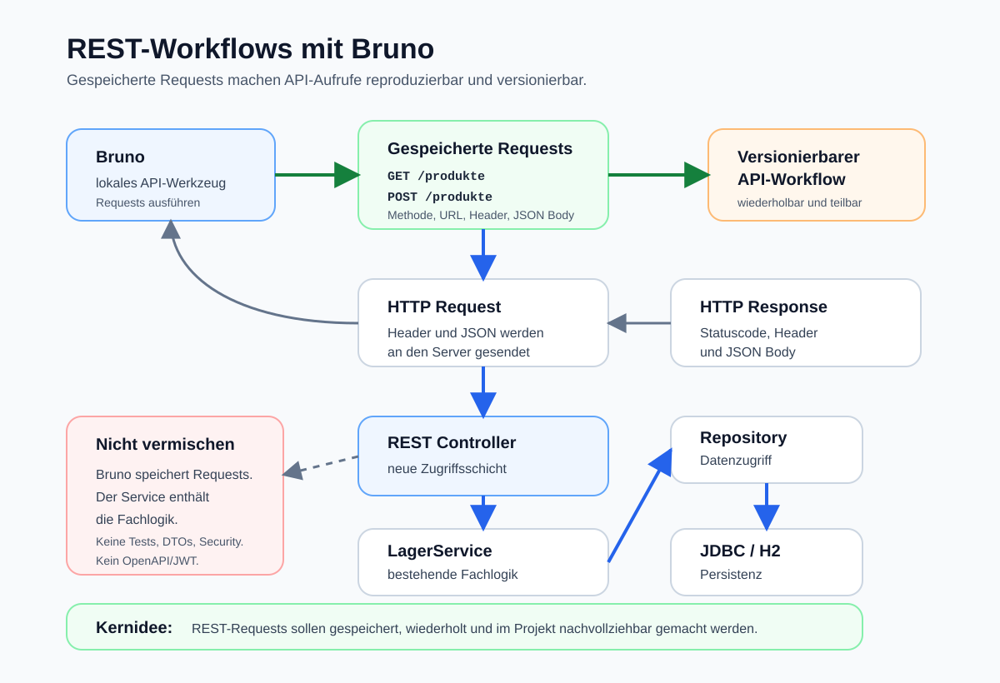

# Arbeitsblatt – REST-Workflows mit Bruno

## Lernziele

- erklären, warum gespeicherte API-Requests hilfreicher sind als lose Terminalbefehle
- Bruno als lokales Werkzeug für REST-Aufrufe einordnen
- eine Collection für die bestehende REST-Lagerverwaltung beschreiben
- `GET`- und `POST`-Requests für `localhost:8080` in Bruno speichern
- Header und JSON-Body in einem gespeicherten Request unterscheiden
- gespeicherte Requests erneut ausführen und die Response analysieren
- erklären, warum API-Requests reproduzierbar und versionierbar sein können
- Bruno klar von Fachlogik, automatischen Tests, OpenAPI und Security abgrenzen

---

## Ausgangslage

Die bekannte Lagerverwaltung ist bereits über REST erreichbar:

```text
curl Client
-> HTTP / JSON
-> REST Controller
-> LagerService
-> ProduktRepository
-> JDBC / H2
```

Mit `curl` hast du einzelne HTTP-Aufrufe technisch sichtbar gemacht.

Jetzt kommt ein lokales API-Werkzeug dazu:

```text
Bruno
-> gespeicherter HTTP Request
-> REST Controller
-> LagerService
-> ProduktRepository
-> JDBC / H2
```

Wichtig:

```text
Die REST-Schnittstelle bleibt gleich.
Die Fachlogik bleibt im LagerService.
Bruno speichert und ordnet nur API-Requests.
```



---

## Warum API-Werkzeuge?

Ein REST-Endpoint kann mit verschiedenen Werkzeugen aufgerufen werden:

```text
Browser
curl
Bruno
andere API-Tools
```

`curl` ist sehr direkt. Der ganze Request steht als Befehl im Terminal.

Beispiel:

```bash
curl -i http://localhost:8080/produkte
```

Das ist gut zum Verstehen von HTTP. Im Alltag entstehen aber schnell mehrere Requests:

- Produkte anzeigen
- Produkt erfassen
- Produkt mit falschem JSON testen
- Header prüfen
- Statuscode beobachten

Wenn diese Aufrufe nur im Terminal-Verlauf stehen, gehen sie leicht verloren. Ein API-Werkzeug hilft, Requests zu speichern, zu ordnen und später wieder gleich auszuführen.

---

## curl vs. Bruno

`curl` und Bruno senden HTTP-Requests. Der Server sieht keinen grundlegend anderen Fachfall.

| Werkzeug | Stärke |
|---|---|
| `curl` | HTTP-Aufruf als klarer Terminalbefehl |
| Bruno | Requests speichern, ordnen und wiederholen |

Beide Werkzeuge können denselben Endpoint aufrufen:

```text
GET http://localhost:8080/produkte
```

Der Unterschied liegt nicht in der Fachlogik. Der Unterschied liegt in der Arbeitsweise.

---

## Lokale API-Tools

Bruno ist ein lokales API-Werkzeug. Lokal bedeutet hier:

```text
Die Requests liegen auf deinem Rechner oder im Projektordner.
```

Das passt gut zum Lernen:

- Requests sind sichtbar.
- Requests können wieder geöffnet werden.
- Requests können im Projekt mitgeführt werden.
- Änderungen an Requests können nachvollziehbar werden.

In dieser Einheit verwenden wir Bruno nicht für automatische Tests. Wir verwenden Bruno als Werkzeug zum sauberen Ausführen und Dokumentieren von REST-Aufrufen.

---

## Collections

Eine Collection bündelt zusammengehörige API-Requests.

Für die Lagerverwaltung kann die Collection zum Beispiel so heissen:

```text
Lagerverwaltung API
```

Darin können Requests liegen wie:

```text
GET Produkte
POST Produkt erfassen
POST Produkt mit fehlerhaftem JSON
```

Eine Collection hilft, API-Aufrufe fachlich zu ordnen. Sie ersetzt keine Java-Klasse und keinen Service.

---

## Requests speichern

Ein gespeicherter Request enthält die wichtigsten Teile eines HTTP-Aufrufs:

| Teil | Beispiel |
|---|---|
| Methode | `GET` oder `POST` |
| URL | `http://localhost:8080/produkte` |
| Header | `Content-Type: application/json` |
| Body | JSON-Daten bei `POST` |

Beispiel für `GET`:

```text
GET http://localhost:8080/produkte
```

Beispiel für `POST`:

```text
POST http://localhost:8080/produkte
Content-Type: application/json

{
  "name": "Maus",
  "preis": 24.9
}
```

Wenn ein Request gespeichert ist, muss er nicht jedes Mal neu aus dem Gedächtnis geschrieben werden.

---

## GET- und POST-Requests

Für diese Einheit reichen zwei Methoden:

| Methode | Bedeutung in der Lagerverwaltung |
|---|---|
| `GET /produkte` | Produktliste lesen |
| `POST /produkte` | Produktdaten an den Server senden |

`GET` braucht normalerweise keinen JSON-Body.

`POST` sendet Daten im Body. Bei JSON muss der Header passen:

```text
Content-Type: application/json
```

Fehlt dieser Header, versteht der Server die Daten je nach Anwendung nicht richtig.

---

## JSON bearbeiten

In Bruno kann der JSON-Body sichtbar bearbeitet werden.

Beispiel:

```json
{
  "name": "Maus",
  "preis": 24.9
}
```

Danach kann derselbe Request mit anderen Daten erneut ausgeführt werden:

```json
{
  "name": "Monitor",
  "preis": 199.0
}
```

Wichtig:

```text
JSON ist der Inhalt des Request Body.
JSON ist nicht die Fachlogik.
```

Die Fachlogik bleibt im `LagerService`.

---

## Header konfigurieren

Header beschreiben technische Zusatzinformationen zum Request.

Für JSON ist dieser Header wichtig:

```text
Content-Type: application/json
```

Er bedeutet:

```text
Der Body enthält JSON.
```

Header sind nicht für Preisregeln, Lagerregeln oder Datenbankzugriff zuständig. Sie helfen Client und Server, die HTTP-Nachricht richtig zu verstehen.

---

## Reproduzierbare API-Workflows

Ein Workflow ist eine wiederholbare Abfolge von Schritten.

Beispiel:

```text
1. Spring Boot starten
2. GET Produkte ausführen
3. POST Produkt erfassen ausführen
4. GET Produkte erneut ausführen
5. Response vergleichen
```

Wenn die Requests gespeichert sind, kann diese Abfolge später wieder gleich durchgeführt werden. Das hilft beim Entwickeln, beim Debugging und beim Erklären einer Schnittstelle.

---

## Requests als Teil der Entwicklungsarbeit

Gespeicherte API-Requests sind nicht nur persönliche Notizen.

Sie können zeigen:

- welche Endpoints vorhanden sind
- welche Methode verwendet wird
- welche Header nötig sind
- wie ein gültiger JSON-Body aussieht
- welche Response erwartet werden kann

Damit werden Requests zu einem kleinen Teil der technischen Dokumentation.

Wenn Bruno-Requests als Dateien im Projektordner liegen, können sie versionierbar werden. Dann ist nachvollziehbar, wann sich ein Request geändert hat.

In dieser Einheit führen wir keine Git-Schritte aus. Wichtig ist nur die Idee:

```text
Was als Datei gespeichert ist, kann grundsätzlich versioniert werden.
```

---

## Typische Fehler

- Requests werden nur ausprobiert, aber nicht gespeichert
- Collection und Requests heissen unklar
- `localhost:8080` ist falsch geschrieben
- Spring Boot läuft nicht
- `GET` und `POST` werden verwechselt
- `Content-Type: application/json` fehlt bei `POST`
- JSON ist ungültig
- Response wird angeschaut, aber Statuscode ignoriert
- Bruno wird mit Fachlogik verwechselt
- Repository oder Service werden geändert, obwohl nur Requests dokumentiert werden sollen

---

## Nicht-Ziele

In dieser Einheit behandeln wir bewusst nicht:

- automatische API-Tests
- Test-Assertions in Bruno
- OpenAPI
- Swagger
- Security
- OAuth
- JWT
- komplexe Environments
- GraphQL
- API-Mocking
- DTOs
- Validation
- JPA
- komplexe Fehlerbehandlung

---

## Reflexion

Beantworte kurz:

1. Warum ist ein gespeicherter Bruno-Request besser reproduzierbar als ein verlorener Terminalbefehl?
2. Was bleibt in der bestehenden Lagerverwaltung unverändert?
3. Welche Teile eines HTTP-Requests kannst du in Bruno direkt sehen?
4. Warum ist Bruno kein Ersatz für den `LagerService`?
5. Warum können gespeicherte Requests zur Entwicklungsarbeit gehören?
