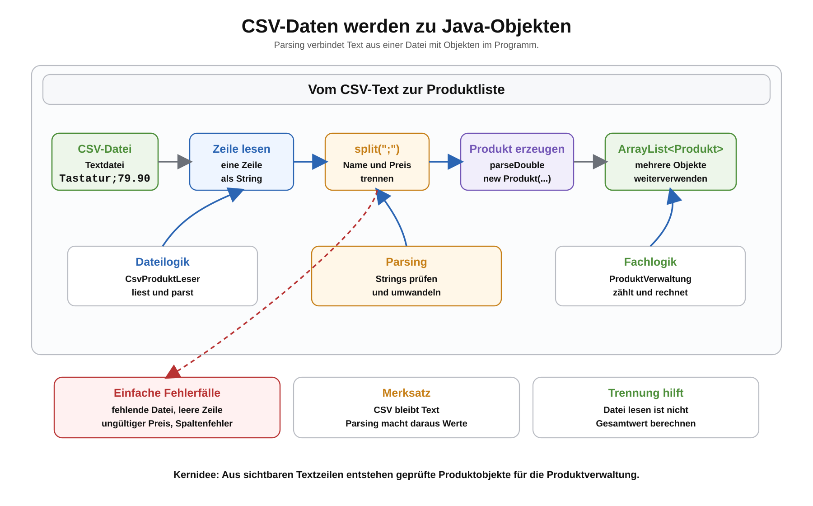

# Arbeitsblatt – Produktdaten aus CSV-Dateien laden

## Lernziele

- Persistenz als dauerhafte Speicherung ausserhalb des Programms erklären
- CSV-Dateien als einfache strukturierte Textdateien verstehen
- eine CSV-Zeile mit `split(";")` in einzelne Werte zerlegen
- aus Textwerten ein `Produkt`-Objekt erzeugen
- mehrere geladene Produkte in einer `ArrayList<Produkt>` speichern
- einfache Fehlerfälle beim Laden erkennen und ruhig behandeln
- Dateilogik und Fachlogik als unterschiedliche Verantwortlichkeiten einordnen

---

## Ausgangslage

Bisher wurden Produkte direkt im Programm erstellt:

```java
Produkt tastatur = new Produkt("Tastatur", 79.90);
Produkt monitor = new Produkt("Monitor", 249.00);
```

Diese Daten existieren nur, solange das Programm läuft. Nach dem Beenden sind sie weg.

Bei Persistenz werden Daten ausserhalb des Programms gespeichert, zum Beispiel in einer Datei. Beim nächsten Programmstart können sie wieder geladen werden.

---

## CSV-Grundidee

CSV ist eine einfache Textdatei. Jede Zeile beschreibt einen Datensatz.

Für die Produktverwaltung verwenden wir dieses Format:

```text
Name;Preis
```

Beispiel:

```text
Tastatur;79.90
Monitor;249.00
Maus;39.50
```

Das Semikolon trennt die Spalten. Eine Zeile kann mit `split(";")` zerlegt werden.



```java
String zeile = "Tastatur;79.90";
String[] teile = zeile.split(";");

String name = teile[0];
double preis = Double.parseDouble(teile[1]);
```

Wichtig: `Double.parseDouble(...)` erwartet hier einen Punkt als Dezimalzeichen.
Vor dem Zugriff auf `teile[1]` muss bei echten Dateien geprüft werden, ob die Zeile wirklich zwei Spalten enthält.

---

## Von der Zeile zum Objekt

Aus einer CSV-Zeile entsteht wieder ein normales Objekt:

```java
String zeile = "Tastatur;79.90";
String[] teile = zeile.split(";");

String name = teile[0];
double preis = Double.parseDouble(teile[1]);

Produkt produkt = new Produkt(name, preis);
```

Danach kann das Produkt wie gewohnt in der Produktverwaltung verwendet werden.

---

## Mehrere Produkte sammeln

Mehrere geladene Produkte werden in einer `ArrayList` gesammelt:

```java
ArrayList<Produkt> produkte = new ArrayList<>();

produkte.add(new Produkt("Tastatur", 79.90));
produkte.add(new Produkt("Monitor", 249.00));
produkte.add(new Produkt("Maus", 39.50));
```

Die Fachlogik bleibt gleich. Die Produktverwaltung kann weiterhin zählen, suchen oder den Gesamtwert berechnen.

---

## Datei zeilenweise lesen

In einem Maven-Projekt kann eine einfache Datei zum Beispiel unter `data/produkte.csv` liegen.

Beispielstruktur:

```text
produktverwaltung-maven/
  pom.xml
  data/
    produkte.csv
  src/main/java/
    ch/allianz/youngoitv/produktverwaltung/
      Main.java
      CsvProduktLeser.java
      model/Produkt.java
      service/ProduktVerwaltung.java
```

Ein einfacher Leser kann die Zeilen laden:

```java
ArrayList<String> zeilen = new ArrayList<>();

try {
    zeilen = new ArrayList<>(Files.readAllLines(Path.of("data/produkte.csv")));
} catch (IOException e) {
    System.out.println("Datei nicht gefunden: data/produkte.csv");
}
```

Zum Lesen werden diese Imports benötigt:

```java
import java.nio.file.Files;
import java.nio.file.Path;
import java.io.IOException;
import java.util.ArrayList;
```

Wenn die Datei fehlt, entsteht ein Fehler. Für den Einstieg reicht eine einfache Fehlermeldung. Komplexe Exception-Strukturen werden hier noch nicht benötigt.

---

## Dateilogik und Fachlogik trennen

Die Verantwortlichkeiten sollen langsam klarer werden:

| Klasse | Aufgabe |
|---|---|
| `Produkt` | speichert Name und Preis |
| `CsvProduktLeser` | liest CSV-Zeilen und erzeugt Produkte |
| `ProduktVerwaltung` | arbeitet fachlich mit Produkten |
| `Main` | startet den Ablauf |

`CsvProduktLeser` soll nicht den Gesamtwert berechnen. Das bleibt Aufgabe der Produktverwaltung.

`ProduktVerwaltung` soll nicht wissen, wie eine CSV-Datei gelesen wird. Das bleibt Aufgabe des CSV-Lesers.

---

## Einfache Fehlerfälle

Dateien enthalten nicht immer perfekte Daten.

Beispiele:

```text
Tastatur;79.90

Monitor;abc
Maus
Kabel;9.90;Aktion
```

Mögliche Behandlung:

- leere Zeilen ignorieren
- Zeilen mit fehlenden Spalten überspringen
- Zeilen mit zusätzlichen Spalten überspringen
- ungültige Preise melden und überspringen
- bei fehlender Datei eine klare Fehlermeldung ausgeben

Für diese Einheit reicht:

```text
Fehlerhafte Zeile wird nicht geladen. Das Programm läuft weiter.
```

---

## Typische Fehler

- `split(",")` statt `split(";")` verwenden
- `Double.parseDouble(...)` vergessen und den Preis als `String` behalten
- `ArrayList<Produkt>` nicht initialisieren
- leere Zeilen nicht prüfen
- Zeilen nicht mit `trim()` bereinigen
- auf `teile[1]` zugreifen, obwohl nur eine Spalte vorhanden ist
- Datei aus dem falschen Ordner laden
- die gesamte Dateilogik in `main` schreiben

---

## Reflexion

Beantworte kurz:

1. Warum ist CSV für den Einstieg in Persistenz praktisch?
2. Warum sind Daten in einer Datei dauerhafter als Daten in einer Variable?
3. Warum soll `CsvProduktLeser` nicht den Gesamtwert aller Produkte berechnen?
4. Welche Fehler können beim Lesen einer Datei auftreten?
5. Welche bisherigen Themen werden beim CSV-Laden kombiniert?

---

## Ausblick

In dieser Einheit werden Produktdaten aus einer CSV-Datei geladen.

In einer späteren Persistenz-Einheit können Produkte wieder in eine CSV-Datei geschrieben werden. Dann entsteht der vollständige Ablauf:

```text
CSV laden -> Produkte bearbeiten -> CSV speichern
```
