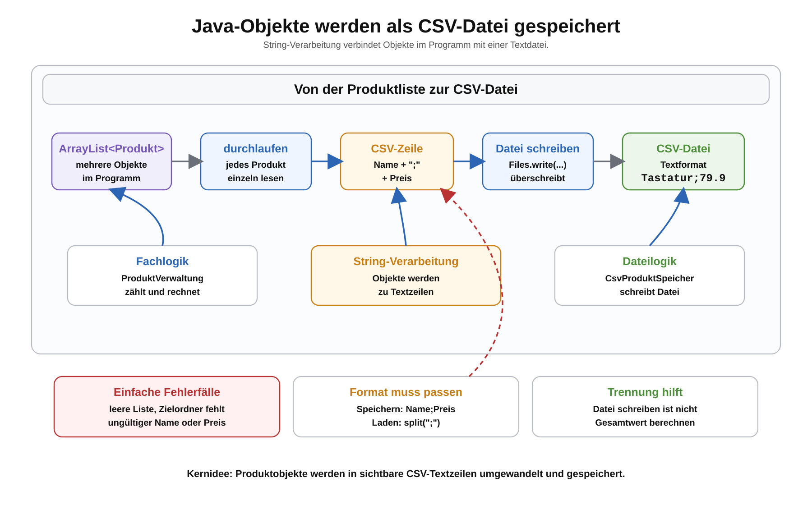

# Arbeitsblatt – Produktdaten als CSV-Dateien speichern

## Lernziele

- erklären, dass Persistenz auch das Speichern von Daten umfasst
- ein `Produkt`-Objekt in eine CSV-Zeile umwandeln
- mehrere Produkte aus einer `ArrayList<Produkt>` in Textzeilen umwandeln
- eine CSV-Datei mit einfachen Java-Mitteln schreiben
- verstehen, dass eine Datei beim Speichern überschrieben werden kann
- gespeicherte Produkte erneut laden und fachlich prüfen
- Dateilogik und Fachlogik weiterhin getrennt halten

---

## Ausgangslage

In der vorherigen Einheit wurden Produktdaten aus einer CSV-Datei geladen.

Jetzt wird der umgekehrte Weg ergänzt:

```text
Produktobjekte -> CSV-Zeilen -> CSV-Datei
```

Damit wird Persistenz vollständiger. Daten können nicht nur aus einer Datei gelesen, sondern auch wieder in eine Datei gespeichert werden.



---

## Vom Objekt zur CSV-Zeile

Ein Produkt besteht in dieser Einheit weiterhin aus:

- `name`
- `preis`

Beispiel:

```java
Produkt produkt = new Produkt("Tastatur", 79.90);
```

Daraus entsteht eine CSV-Zeile:

```java
String zeile = produkt.getName() + ";" + produkt.getPreis();
```

Ergebnis:

```text
Tastatur;79.9
```

Dass aus `79.90` bei der Ausgabe oft `79.9` wird, ist hier in Ordnung. Wichtig ist, dass der gespeicherte Preis später wieder mit `Double.parseDouble(...)` gelesen werden kann.

Wichtig: Das Trennzeichen muss zum Ladeformat passen. Wenn mit `split(";")` geladen wird, muss auch mit `;` gespeichert werden.

---

## Mehrere Produkte speichern

Mehrere Produkte werden zuerst in CSV-Zeilen umgewandelt.

```java
ArrayList<String> zeilen = new ArrayList<>();

for (Produkt produkt : produkte) {
    String zeile = produkt.getName() + ";" + produkt.getPreis();
    zeilen.add(zeile);
}
```

Diese Schleife bedeutet: Jedes `Produkt` aus der Liste wird einmal verarbeitet. Wer lieber mit `get(i)` und Index arbeitet, kann denselben Ablauf auch mit einer normalen `for`-Schleife schreiben.

Die `ArrayList<Produkt>` bleibt die Fachliste. Die `ArrayList<String>` ist nur für die Datei-Ausgabe gedacht.

---

## CSV-Datei schreiben

In einem Maven-Projekt kann die Datei zum Beispiel unter `data/produkte.csv` gespeichert werden.

```java
try {
    Files.write(Path.of("data/produkte.csv"), zeilen);
} catch (IOException e) {
    System.out.println("Datei konnte nicht gespeichert werden: data/produkte.csv");
}
```

Benötigte Imports:

```java
import java.io.IOException;
import java.nio.file.Files;
import java.nio.file.Path;
import java.util.ArrayList;
```

Für diese Einheit reicht eine einfache Fehlermeldung. Komplexe Exception-Strukturen werden noch nicht benötigt.

---

## Überschreiben verstehen

`Files.write(...)` schreibt die übergebenen Zeilen in die Datei.

Wenn die Datei bereits existiert, wird ihr bisheriger Inhalt ersetzt.

Beispiel:

```text
Vorher:
Tastatur;79.90
Monitor;249.00

Nach dem Speichern einer neuen Liste:
Maus;39.50
```

Danach steht nur noch die neue Liste in der Datei.

Das ist für den Einstieg sinnvoll, weil der Speicherprozess klar nachvollziehbar bleibt. Anhängen an bestehende Dateien wird hier noch nicht behandelt.

---

## Speichern und erneut laden

Ein vollständiger Ablauf kann so aussehen:

```text
Produkte in ArrayList erfassen
-> Produkte als CSV speichern
-> CSV-Datei erneut laden
-> Anzahl und Gesamtwert prüfen
```

Dadurch wird sichtbar, ob Speicher- und Ladeformat zusammenpassen.

Beispiel:

```text
Tastatur;79.90
Monitor;249.00
Maus;39.50
```

Nach dem erneuten Laden sollen wieder drei Produkte vorhanden sein.

---

## Dateilogik und Fachlogik trennen

Die Verantwortlichkeiten bleiben getrennt:

| Klasse | Aufgabe |
|---|---|
| `Produkt` | speichert Name und Preis |
| `CsvProduktLeser` | liest CSV-Zeilen und erzeugt Produkte |
| `CsvProduktSpeicher` | wandelt Produkte in CSV-Zeilen um und schreibt die Datei |
| `ProduktVerwaltung` | arbeitet fachlich mit Produkten |
| `Main` | startet den Ablauf |

`CsvProduktSpeicher` soll nicht den Gesamtwert berechnen.

`ProduktVerwaltung` soll nicht wissen, wie eine Datei geschrieben wird.

---

## String-Verarbeitung

Für zwei Felder reicht einfache String-Verkettung:

```java
String zeile = produkt.getName() + ";" + produkt.getPreis();
```

Bei mehr Feldern kann später auch ein `StringBuilder` helfen.

Für diese Einheit ist wichtig:

- Reihenfolge der Werte bleibt gleich
- Trennzeichen bleibt gleich
- Lade- und Speicherformat passen zusammen

---

## Einfache Fehlerfälle

Beim Speichern können einfache Fehler auftreten:

- Datei kann nicht geschrieben werden
- Zielordner existiert nicht
- Produktname ist leer
- Preis ist ungültig
- leere Produktliste wird gespeichert
- Speicher- und Ladeformat passen nicht zusammen

Für diese Einheit reicht:

```text
Fehlerhafte Produkte nicht speichern oder mit klarer Meldung überspringen.
Das Programm läuft weiter.
```

Eine leere Liste darf gespeichert werden. Die Datei ist danach leer.

---

## Typische Fehler

- Trennzeichen `;` vergessen
- anderes Trennzeichen speichern als beim Laden erwartet
- Zeilenumbruch vergessen, wenn ein einziger grosser Text gebaut wird
- Datei nicht korrekt schreiben oder schliessen
- alles weiterhin in `main` schreiben
- Preis als Text formatieren, der später nicht mehr mit `Double.parseDouble(...)` gelesen werden kann
- Produkte doppelt speichern, weil alte Daten unbewusst angehängt werden
- `ArrayList<Produkt>` nicht mit einer Schleife durchlaufen

---

## Reflexion

Beantworte kurz:

1. Warum gehört Speichern ebenfalls zu Persistenz?
2. Warum sind CSV-Dateien für den Einstieg praktisch?
3. Warum müssen Speicher- und Ladeformat zusammenpassen?
4. Warum soll `CsvProduktSpeicher` nicht den Gesamtwert berechnen?
5. Welche Fehler können beim Schreiben einer Datei auftreten?

---

## Ausblick

Mit Laden und Speichern entsteht ein einfacher Persistenzablauf:

```text
CSV laden -> Produkte bearbeiten -> CSV speichern
```

Später kann dieser Ablauf erweitert werden, zum Beispiel mit klareren Services, besseren Prüfungen oder anderen Speicherformen. Datenbanken und komplexe Frameworks werden erst behandelt, wenn die Grundidee der Persistenz sicher verstanden ist.
