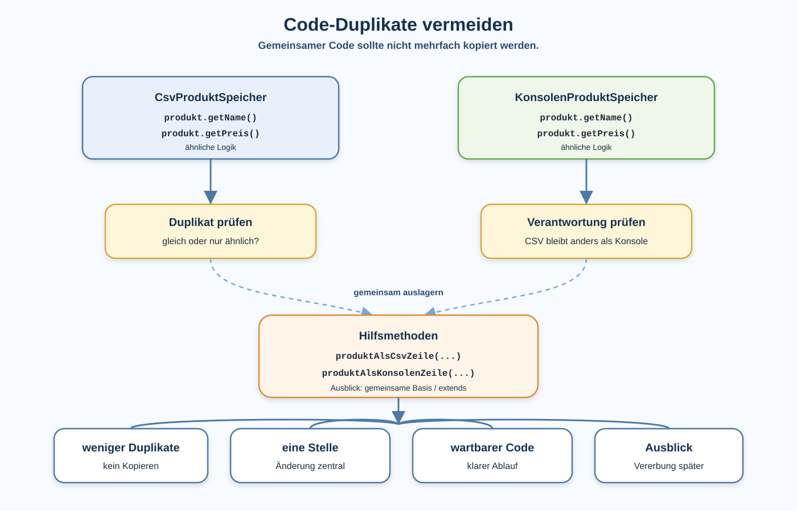

# Arbeitsblatt – Code-Duplikate vermeiden und gemeinsamen Code wiederverwenden

## Lernziele

- doppelte oder sehr ähnliche Codeabschnitte in Klassen erkennen
- erklären, warum kopierter Code Änderungen erschwert
- `CsvProduktSpeicher` und `KonsolenProduktSpeicher` auf Gemeinsamkeiten vergleichen
- kleine Hilfsmethoden erstellen, um Code verständlicher zu machen
- Wiederverwendung einsetzen, ohne das Programm unnötig komplex zu machen
- prüfen, ob das Verhalten nach einer Änderung gleich geblieben ist
- Vererbung vorsichtig als spätere Möglichkeit einordnen

---

## Ausgangslage

Die Produktverwaltung kennt bereits das Interface `ProduktSpeicher` und zwei konkrete Implementierungen:

```java
public interface ProduktSpeicher {
    void speichern(ArrayList<Produkt> produkte, String dateipfad);
}
```

Diese Einheit verwendet dieselbe Signatur wie die vorherigen Interface-Einheiten.

```java
public class CsvProduktSpeicher implements ProduktSpeicher {
    @Override
    public void speichern(ArrayList<Produkt> produkte, String dateipfad) {
        ArrayList<String> zeilen = new ArrayList<>();

        for (Produkt produkt : produkte) {
            zeilen.add(produkt.getName() + ";" + produkt.getPreis());
        }

        // Datei schreiben
    }
}
```

```java
public class KonsolenProduktSpeicher implements ProduktSpeicher {
    @Override
    public void speichern(ArrayList<Produkt> produkte, String dateipfad) {
        for (Produkt produkt : produkte) {
            System.out.println(produkt.getName() + ": " + produkt.getPreis());
        }
    }
}
```

Für vollständigen Java-Code brauchst du passende Imports für `ArrayList` und `Produkt`.

Beide Klassen machen etwas Unterschiedliches:

| Klasse | Verhalten |
|---|---|
| `CsvProduktSpeicher` | schreibt CSV-Zeilen |
| `KonsolenProduktSpeicher` | gibt Produkte auf der Konsole aus |

Trotzdem gibt es ähnliche Schritte.



---

## Problem: Ähnlicher Code an mehreren Stellen

In beiden Klassen wird über die Produktliste iteriert:

```java
for (Produkt produkt : produkte) {
    // etwas mit produkt machen
}
```

In beiden Klassen werden Name und Preis gelesen:

```java
produkt.getName()
produkt.getPreis()
```

Das ist noch nicht automatisch schlecht. Es wird aber problematisch, wenn gleiche Logik mehrfach kopiert wird.

Beispiel:

```java
produkt.getName() + ": " + produkt.getPreis()
```

Wenn dieses Format an drei Stellen steht und später geändert wird, müssen drei Stellen angepasst werden. Eine Stelle wird leicht vergessen.

Merksatz:

```text
Kopierter Code bedeutet oft: dieselbe Änderung muss später mehrfach gemacht werden.
```

---

## Theorie: Duplikat oder nur ähnlich?

Nicht jeder ähnliche Code soll sofort zusammengelegt werden.

| Beobachtung | Entscheidung |
|---|---|
| genau gleiche Berechnung an mehreren Stellen | Auslagern prüfen |
| gleiche Schleife, aber anderes Verhalten im Schleifenkörper | vorsichtig prüfen |
| nur ähnliche Namen oder ähnliche Struktur | nicht automatisch zusammenlegen |
| unterschiedliche Verantwortung | getrennt lassen |

Wichtig:

```text
Wiederverwendung ist gut, wenn sie den Code klarer macht.
Wiederverwendung ist schlecht, wenn sie Unterschiede versteckt.
```

---

## Kleine Lösung: Hilfsmethode

Bevor man über grössere OOP-Konzepte nachdenkt, reicht oft eine kleine Methode.

Vorher:

```java
for (Produkt produkt : produkte) {
    System.out.println(produkt.getName() + ": " + produkt.getPreis());
}
```

Nachher:

```java
for (Produkt produkt : produkte) {
    System.out.println(formatiereProdukt(produkt));
}
```

```java
private String formatiereProdukt(Produkt produkt) {
    return produkt.getName() + ": " + produkt.getPreis();
}
```

Das ist ein erster Zwischenschritt: Die Formatierung steht nun an einer Stelle.

Vorteil:

- Der Schleifenablauf bleibt gut lesbar.
- Die Formatierung hat einen Namen.
- Eine spätere Änderung am Format passiert an einer Stelle.

---

## Gemeinsame Formatierung bewusst prüfen

CSV und Konsole brauchen nicht dasselbe Format:

| Ziel | Format |
|---|---|
| CSV-Datei | `Maus;34.9` |
| Konsole | `Maus: 34.9` |

Darum wäre diese Methode zu unklar:

```java
private String formatiereProdukt(Produkt produkt) {
    // Für CSV? Für Konsole? Für beides?
}
```

Besser sind klare Namen, die zum jeweiligen Ziel passen:

```java
private String produktAlsCsvZeile(Produkt produkt) {
    return produkt.getName() + ";" + produkt.getPreis();
}
```

```java
private String produktAlsKonsolenZeile(Produkt produkt) {
    return produkt.getName() + ": " + produkt.getPreis();
}
```

Nicht alles, was ähnlich aussieht, gehört in dieselbe Methode.

---

## Verhalten muss gleich bleiben

Code wiederverwenden ist oft ein Refactoring.

Das bedeutet:

```text
Die Struktur wird verbessert.
Das gewünschte Verhalten bleibt gleich.
```

Darum nach kleinen Änderungen prüfen:

```bash
mvn test
```

Wenn keine Tests vorhanden sind:

```bash
mvn package
```

Zusätzlich kann `Main` ausgeführt werden, wenn das im Projekt bereits vorgesehen ist.

---

## Wann lohnt sich Wiederverwendung?

Wiederverwendung lohnt sich eher, wenn:

- dieselbe Logik mehrfach vorkommt
- dieselbe Änderung sonst mehrfach nötig wäre
- der neue Methodenname den Code verständlicher macht
- das Verhalten nach der Änderung gleich bleibt

Wiederverwendung lohnt sich eher nicht, wenn:

- Code nur zufällig ähnlich aussieht
- die Verantwortung der Klassen unterschiedlich ist
- die neue Methode sehr allgemein und unklar wird
- das Programm dadurch schwerer verständlich wird

---

## Typische Fehlerbilder

| Fehlerbild | Warum es problematisch ist |
|---|---|
| Vererbung wird zu früh eingeführt | das eigentliche Duplikat ist noch nicht verstanden |
| Unterschiede zwischen Klassen werden ignoriert | CSV-Datei und Konsole haben unterschiedliche Aufgaben |
| gemeinsame Methode wird zu allgemein | niemand weiss mehr genau, wofür sie gedacht ist |
| Verhalten ändert sich beim Aufräumen | Refactoring soll das Verhalten nicht unabsichtlich ändern |
| Duplikate werden nur umbenannt | der Code ist danach nicht wirklich einfacher wartbar |
| alles wandert in eine Hilfsklasse | die Verantwortlichkeiten werden wieder unklar |
| Wiederverwendung wird mit Kopieren verwechselt | kopierter Code ist keine echte Wiederverwendung |

---

## Nicht Ziel dieser Einheit

Bewusst nicht behandelt werden:

- tiefe Vererbungshierarchien
- abstrakte Klassen
- Mehrfachvererbung
- `instanceof`
- Downcasting
- UML-Formalismus
- komplexe OOP-Theorie
- Frameworks

Diese Einheit bleibt bei kleinen Hilfsmethoden und klaren Verantwortlichkeiten.

---

## Reflexion

Beantworte am Ende schriftlich:

1. Warum sind Code-Duplikate problematisch?
2. Wann lohnt sich Wiederverwendung?
3. Warum sollte nicht alles in dieselbe Hilfsklasse verschoben werden?
4. Was könnte eine gemeinsame Basisklasse später vereinfachen?
5. Warum führen wir Vererbung noch nicht sofort vollständig ein?

---

## Vorsichtiger Ausblick auf `extends`

Wenn mehrere Klassen dauerhaft denselben Code brauchen, kann später eine gemeinsame Basisklasse helfen.

Die Idee:

```text
Gemeinsamer Code liegt an einer gemeinsamen Stelle.
Konkrete Klassen ergänzen ihr eigenes Verhalten.
```

Das ist eine mögliche Motivation für `extends`.

Wichtig:

```text
Vererbung ist kein Selbstzweck.
Sie ist nur sinnvoll, wenn wirklich gemeinsamer Code oder ein klares gemeinsames Konzept vorhanden ist.
```

In dieser Einheit reicht es, Duplikate zu erkennen und kleine Hilfsmethoden sinnvoll einzusetzen.
