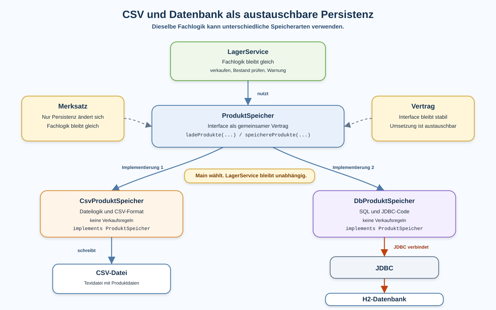

# Arbeitsblatt – DbProduktSpeicher mit JDBC und H2

## Lernziele

- erklären, warum `DbProduktSpeicher` eine alternative Persistenz zu `CsvProduktSpeicher` ist
- `ProduktSpeicher` als bestehenden Interface-Vertrag weiterverwenden
- begründen, warum Fachlogik unabhängig von der konkreten Persistenz bleiben soll
- `DbProduktSpeicher` als Klasse mit JDBC-Code einordnen
- eine H2-Embedded-Datenbank über JDBC verwenden
- eine Tabelle `PRODUKT` für Produktdaten lesen und erklären
- CRUD-Operationen mit `PreparedStatement` und `ResultSet` nachvollziehen
- typische Fehler bei JDBC, SQL und Verantwortlichkeiten erkennen

---

## Ausgangslage

Die bekannte Lagerverwaltung ist bereits in mehrere Verantwortlichkeiten aufgeteilt.

| Teil | Verantwortung |
|---|---|
| `Produkt` | hält Produktdaten |
| `LagerService` | enthält Fachlogik, zum Beispiel Verkauf und Bestandsprüfung |
| `ProduktSpeicher` | beschreibt den Vertrag für Laden und Speichern |
| `CsvProduktSpeicher` | speichert Produkte in einer CSV-Datei |
| `Main` | startet den Ablauf und verbindet die Klassen |

Jetzt kommt eine zweite echte Persistenzimplementierung dazu:

```text
ProduktSpeicher
├── CsvProduktSpeicher
└── DbProduktSpeicher
```

Die Kernidee:

```text
Persistenz ist austauschbar.
Das Interface bleibt gleich.
Die Fachlogik bleibt gleich.
Nur die konkrete Speicherklasse ändert sich.
```



---

## Warum alternative Persistenz?

CSV war ein guter Einstieg, weil eine Datei sichtbar und einfach kontrollierbar ist.

Beispiel:

```text
name;preis;bestand
Maus;24.9;10
Tastatur;79.9;5
```

Eine Datenbank speichert dieselben Informationen strukturierter in Tabellen.

Beispiel:

```text
ID | NAME     | PREIS | BESTAND
1  | Maus     | 24.9  | 10
2  | Tastatur | 79.9  | 5
```

Beides ist Persistenz. Der Unterschied liegt in der konkreten Technik.

---

## CSV vs. Datenbank

| Frage | `CsvProduktSpeicher` | `DbProduktSpeicher` |
|---|---|---|
| Wo liegen die Daten? | in einer Textdatei | in einer H2-Datenbankdatei |
| Wie werden Daten gelesen? | Datei lesen und Zeilen parsen | `SELECT` mit JDBC |
| Wie werden Daten geschrieben? | CSV-Zeilen erzeugen und Datei schreiben | `INSERT`, `UPDATE`, `DELETE` |
| Welche Struktur schützt die Daten? | vereinbartes CSV-Format | Tabellenschema |
| Was ist einfach sichtbar? | Dateiinhalt | Tabelle und SQL-Ergebnis |
| Was ist technisch anspruchsvoller? | Parsing und Dateifehler | Verbindung, SQL und Ressourcen |

Für kleine Übungen ist CSV übersichtlich. Eine Datenbank wird interessant, wenn Daten gezielter gelesen, aktualisiert oder gelöscht werden sollen.

---

## Das Interface bleibt gleich

Ein mögliches Interface aus der bekannten Lagerverwaltung:

```java
import ch.allianz.youngoitv.lager.model.Produkt;
import java.util.ArrayList;

public interface ProduktSpeicher {
    ArrayList<Produkt> ladeProdukte(String quelle);

    void speichereProdukte(ArrayList<Produkt> produkte, String ziel);
}
```

`quelle` und `ziel` sind bewusst allgemein benannt. Bei CSV ist das ein Dateipfad. Bei H2 kann es eine JDBC-URL sein.

Wichtig:

- Das Interface enthält keine CSV-Logik.
- Das Interface enthält keine SQL-Logik.
- Das Interface enthält keine Fachlogik.
- Es beschreibt nur, welche Methoden eine Speicherklasse anbieten muss.

---

## `DbProduktSpeicher` als neue Implementierung

`DbProduktSpeicher` erfüllt denselben Vertrag wie `CsvProduktSpeicher`.

```java
import ch.allianz.youngoitv.lager.model.Produkt;
import java.util.ArrayList;

public class DbProduktSpeicher implements ProduktSpeicher {
    @Override
    public ArrayList<Produkt> ladeProdukte(String jdbcUrl) {
        // Produkte aus H2 laden
        return new ArrayList<>();
    }

    @Override
    public void speichereProdukte(ArrayList<Produkt> produkte, String jdbcUrl) {
        // Produkte in H2 speichern
    }
}
```

Der Code ist noch nicht fertig. Er zeigt zuerst nur die wichtigste Struktur:

```text
DbProduktSpeicher implementiert ProduktSpeicher.
```

`Main` muss dadurch nicht direkt mit JDBC arbeiten.

---

## JDBC-Verbindung

JDBC verbindet Java mit einer relationalen Datenbank.

Für H2 Embedded reicht eine lokale JDBC-URL:

```text
jdbc:h2:./data/lager
```

Eine Verbindung wird über `DriverManager` erstellt:

```java
import java.sql.Connection;
import java.sql.DriverManager;
import java.sql.SQLException;

private Connection verbindungHerstellen(String jdbcUrl) throws SQLException {
    return DriverManager.getConnection(jdbcUrl);
}
```

Die Verbindung muss wieder geschlossen werden. Deshalb wird sie später in `try-with-resources` verwendet.

---

## Produkt-Tabelle

Für die Lagerverwaltung reicht zuerst eine Tabelle.

```sql
CREATE TABLE IF NOT EXISTS PRODUKT (
    ID INT AUTO_INCREMENT PRIMARY KEY,
    NAME VARCHAR(100) NOT NULL,
    PREIS DOUBLE NOT NULL,
    BESTAND INT NOT NULL
);
```

| Spalte | Bedeutung |
|---|---|
| `ID` | technische eindeutige Nummer |
| `NAME` | Produktname |
| `PREIS` | Produktpreis |
| `BESTAND` | Lagerbestand |

Die `ID` wird von H2 automatisch erzeugt. Darum soll man in Übungen nicht blind erwarten, dass IDs immer wieder bei `1` beginnen.

---

## Tabelle im `DbProduktSpeicher` erstellen

```java
private void tabelleErstellen(Connection connection) throws SQLException {
    String sql = """
            CREATE TABLE IF NOT EXISTS PRODUKT (
                ID INT AUTO_INCREMENT PRIMARY KEY,
                NAME VARCHAR(100) NOT NULL,
                PREIS DOUBLE NOT NULL,
                BESTAND INT NOT NULL
            )
            """;

    try (PreparedStatement statement = connection.prepareStatement(sql)) {
        statement.executeUpdate();
    }
}
```

`CREATE TABLE IF NOT EXISTS` ist für Übungen praktisch: Die Tabelle wird nur erstellt, wenn sie noch nicht vorhanden ist.

---

## CRUD mit JDBC

CRUD steht für die vier Grundoperationen auf Daten.

| Operation | SQL-Beispiel | Bedeutung |
|---|---|---|
| Create | `INSERT` | neues Produkt speichern |
| Read | `SELECT` | Produkte lesen |
| Update | `UPDATE` | Produktdaten ändern |
| Delete | `DELETE` | Produkt löschen |

Diese Operationen gehören in `DbProduktSpeicher`, nicht in `Main`.

---

## Produkte speichern

Eine einfache Variante: Beim Speichern wird die Tabelle zuerst geleert und danach wird die aktuelle Produktliste neu eingefügt.

```java
@Override
public void speichereProdukte(ArrayList<Produkt> produkte, String jdbcUrl) {
    try (Connection connection = verbindungHerstellen(jdbcUrl)) {
        tabelleErstellen(connection);
        datenbankLeeren(connection);

        for (Produkt produkt : produkte) {
            produktEinfuegen(connection, produkt);
        }
    } catch (SQLException exception) {
        throw new IllegalStateException("Produkte konnten nicht gespeichert werden.", exception);
    }
}
```

Das ist für den Einstieg einfacher als eine komplizierte Synchronisation zwischen Liste und Datenbank.

---

## PreparedStatement

Ein `PreparedStatement` verwendet Platzhalter.

```java
private void produktEinfuegen(Connection connection, Produkt produkt) throws SQLException {
    String sql = "INSERT INTO PRODUKT (NAME, PREIS, BESTAND) VALUES (?, ?, ?)";

    try (PreparedStatement statement = connection.prepareStatement(sql)) {
        statement.setString(1, produkt.getName());
        statement.setDouble(2, produkt.getPreis());
        statement.setInt(3, produkt.getBestand());
        statement.executeUpdate();
    }
}
```

Nicht so:

```java
String sql = "INSERT INTO PRODUKT (NAME) VALUES ('" + produkt.getName() + "')";
```

Besser:

```java
String sql = "INSERT INTO PRODUKT (NAME) VALUES (?)";
statement.setString(1, produkt.getName());
```

So bleibt SQL klarer und Werte werden sauber eingesetzt.

---

## Produkte laden und `ResultSet` lesen

```java
@Override
public ArrayList<Produkt> ladeProdukte(String jdbcUrl) {
    ArrayList<Produkt> produkte = new ArrayList<>();

    try (Connection connection = verbindungHerstellen(jdbcUrl)) {
        tabelleErstellen(connection);

        String sql = "SELECT NAME, PREIS, BESTAND FROM PRODUKT ORDER BY ID";

        try (PreparedStatement statement = connection.prepareStatement(sql);
             ResultSet resultSet = statement.executeQuery()) {

            while (resultSet.next()) {
                String name = resultSet.getString("NAME");
                double preis = resultSet.getDouble("PREIS");
                int bestand = resultSet.getInt("BESTAND");

                produkte.add(new Produkt(name, preis, bestand));
            }
        }
    } catch (SQLException exception) {
        throw new IllegalStateException("Produkte konnten nicht geladen werden.", exception);
    }

    return produkte;
}
```

Wichtig:

- `executeQuery()` wird für `SELECT` verwendet.
- `resultSet.next()` bewegt den Cursor zur nächsten Zeile.
- Am Anfang steht das `ResultSet` vor der ersten Zeile.
- Ohne `next()` darf man keine Spaltenwerte lesen.

---

## Produkte aktualisieren

Das Interface muss für den Einstieg nicht erweitert werden. `DbProduktSpeicher` darf aber zusätzliche Methoden anbieten.

```java
public void bestandAktualisieren(String jdbcUrl, int id, int neuerBestand) {
    String sql = "UPDATE PRODUKT SET BESTAND = ? WHERE ID = ?";

    try (Connection connection = verbindungHerstellen(jdbcUrl);
         PreparedStatement statement = connection.prepareStatement(sql)) {

        statement.setInt(1, neuerBestand);
        statement.setInt(2, id);
        statement.executeUpdate();
    } catch (SQLException exception) {
        throw new IllegalStateException("Bestand konnte nicht aktualisiert werden.", exception);
    }
}
```

`WHERE ID = ?` ist wichtig. Ohne `WHERE` würden alle Zeilen geändert.

Diese Methode zeigt das technische Aktualisieren in der Datenbank. Fachliche Regeln, zum Beispiel ob ein negativer Bestand erlaubt ist, gehören weiterhin in den `LagerService`.

---

## Produkte löschen

```java
public void produktLoeschen(String jdbcUrl, int id) {
    String sql = "DELETE FROM PRODUKT WHERE ID = ?";

    try (Connection connection = verbindungHerstellen(jdbcUrl);
         PreparedStatement statement = connection.prepareStatement(sql)) {

        statement.setInt(1, id);
        statement.executeUpdate();
    } catch (SQLException exception) {
        throw new IllegalStateException("Produkt konnte nicht gelöscht werden.", exception);
    }
}
```

Auch hier ist `WHERE ID = ?` entscheidend. Ohne diese Einschränkung würden alle Produkte gelöscht.

---

## Datenbank leeren

```java
private void datenbankLeeren(Connection connection) throws SQLException {
    String sql = "DELETE FROM PRODUKT";

    try (PreparedStatement statement = connection.prepareStatement(sql)) {
        statement.executeUpdate();
    }
}
```

Diese Methode ist für die einfache Speicherstrategie nützlich:

```text
alte Zeilen löschen
aktuelle Produktliste neu speichern
```

Für eine erste Lerneinheit ist das nachvollziehbarer als komplexe Abgleiche.

---

## `Main` auf `DbProduktSpeicher` umstellen

Vorher:

```java
ProduktSpeicher speicher = new CsvProduktSpeicher();
String ziel = "data/produkte.csv";
```

Nachher:

```java
ProduktSpeicher speicher = new DbProduktSpeicher();
String ziel = "jdbc:h2:./data/lager";
```

Der Ablauf bleibt gleich:

```java
ArrayList<Produkt> produkte = speicher.ladeProdukte(ziel);

LagerService lagerService = new LagerService();
// Fachlogik ausführen

speicher.speichereProdukte(produkte, ziel);
```

Wichtig:

```text
JDBC-Code gehört nicht in Main.
Main wählt nur die konkrete Speicherklasse aus.
```

Startdaten in `Main` sind nur für kurze Demos sinnvoll. In der eigentlichen Struktur soll `Main` nicht dauerhaft die Verantwortung für Produktdaten übernehmen.

---

## Persistenz weiterhin getrennt halten

| Frage | Passende Klasse |
|---|---|
| Wie wird ein Verkauf geprüft? | `LagerService` |
| Wie wird ein Bestand verändert? | `LagerService` |
| Wie wird die Anwendung gestartet? | `Main` |
| Wie wird CSV gelesen? | `CsvProduktSpeicher` |
| Wie wird SQL ausgeführt? | `DbProduktSpeicher` |
| Welche Methoden muss ein Speicher anbieten? | `ProduktSpeicher` |

Merksatz:

```text
SQL gehört in DbProduktSpeicher.
Fachlogik gehört in LagerService.
Der Ablauf gehört in Main.
```

---

## Typische Fehlerbilder

| Fehlerbild | Warum es problematisch ist |
|---|---|
| JDBC-Code steht in `Main` | `Main` wird unübersichtlich und kennt zu viele Details |
| SQL und Fachlogik werden vermischt | Speicherklasse entscheidet plötzlich fachlich |
| `Connection` wird nicht geschlossen | Ressourcen bleiben unnötig offen |
| `Statement` statt `PreparedStatement` wird verwendet | Werte werden unsauber in SQL eingebaut |
| `ResultSet` wird ohne `next()` gelesen | die Abfrage steht noch vor der ersten Zeile |
| `DbProduktSpeicher` implementiert das Interface nicht korrekt | Austauschbarkeit funktioniert nicht |
| doppelte Fachlogik in CSV- und DB-Implementierung | Regeln sind verteilt und schwer wartbar |
| Exceptions werden leer abgefangen | Fehler verschwinden und sind schwer zu finden |
| `WHERE` bei `UPDATE` oder `DELETE` fehlt | zu viele Daten werden verändert |
| Datenbankdatei liegt an einem anderen Pfad | Daten scheinen verschwunden |

---

## Reflexion

Beantworte kurz:

1. Welche Teile der Anwendung mussten beim Wechsel zu `DbProduktSpeicher` nicht geändert werden?
2. Warum hilft `ProduktSpeicher` beim Austauschen der Persistenz?
3. Welche Unterschiede bestehen zwischen CSV und Datenbank?
4. Welche Verantwortung besitzt `DbProduktSpeicher`?
5. Warum bleibt der `LagerService` unverändert?
6. Warum soll JDBC-Code nicht in `Main` stehen?

---

## Ausblick

Später könnten weitere Persistenzarten entstehen:

- JSON-Datei
- XML-Datei
- andere relationale Datenbank
- REST-Service
- einfache Test-Implementierung im Arbeitsspeicher

Die Idee bleibt gleich:

```text
Ein gemeinsamer Vertrag.
Mehrere konkrete Implementierungen.
Fachlogik bleibt unabhängig von der Speichertechnik.
```

Bewusst nicht behandelt werden:

- ORM
- Hibernate
- JPA
- Spring Data
- Repository Pattern formal
- Connection Pooling
- komplexe SQL-Joins
- Migrationstools
- Dependency Injection
