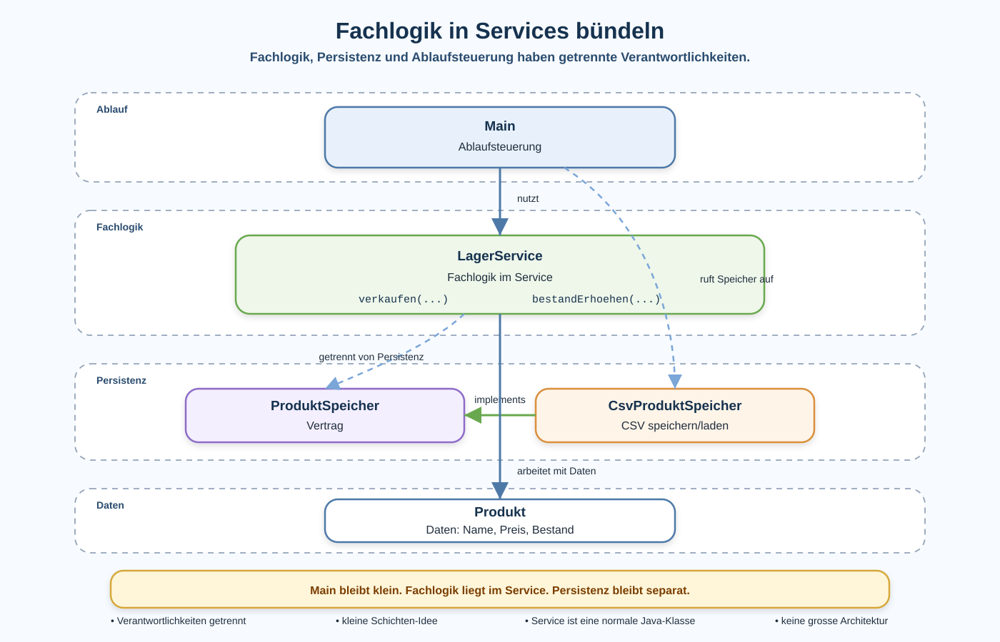

# Arbeitsblatt – Fachlogik in Services bündeln

## Lernziele

- erklären, warum Fachlogik nicht überall verteilt sein sollte
- `Main` als Ort für Ablaufsteuerung erkennen
- eine einfache Service-Klasse für fachliche Aufgaben verwenden
- `Produkt`, `LagerService`, `ProduktSpeicher`, `CsvProduktSpeicher` und `Main` nach Verantwortung unterscheiden
- Persistenz und Fachlogik trennen
- kleine Schichten als Hilfe für Verständlichkeit und Testbarkeit einordnen

---

## Ausgangslage

Aus der Lagerverwaltung kennst du bereits Produkte, CSV-Speicherung, Interfaces, mehrere Implementierungen, Wiederverwendung und eine vorsichtige Einführung in Vererbung.

Jetzt wird die Anwendung fachlich etwas grösser:

- Produkte haben einen Namen
- Produkte haben einen Preis
- Produkte haben einen Lagerbestand
- Produkte können verkauft werden
- der Bestand kann erhöht werden
- bei tiefem Bestand soll eine Warnung möglich sein

Wenn diese Regeln direkt in `Main` stehen, wird `Main` schnell unübersichtlich.

```java
public class Main {
    public static void main(String[] args) {
        Produkt produkt = new Produkt("Maus", 24.90, 10);

        int menge = 3;

        if (menge > 0 && produkt.getBestand() >= menge) {
            produkt.setBestand(produkt.getBestand() - menge);
        }

        if (produkt.getBestand() < 5) {
            System.out.println("Warnung: tiefer Bestand");
        }

        ProduktSpeicher speicher = new CsvProduktSpeicher();
        // Produkte speichern
    }
}
```

Der Code funktioniert vielleicht. Aber mehrere Verantwortlichkeiten sind vermischt:

| Codeanteil | Verantwortung |
|---|---|
| Produkt erzeugen | Daten vorbereiten |
| Verkauf prüfen | Fachlogik |
| Bestand ändern | Fachlogik |
| Warnung prüfen | Fachlogik |
| `CsvProduktSpeicher` verwenden | Persistenz |
| Programm starten | Ablaufsteuerung |

---

## Kernidee

Eine Service-Klasse bündelt fachliche Aufgaben.

In dieser Einheit bedeutet Service einfach:

```text
Eine normale Java-Klasse für fachliche Regeln und Abläufe.
```

Keine Magie. Kein Framework. Keine grosse Architektur.

Die Verantwortung wird klarer:

| Klasse | Verantwortung |
|---|---|
| `Produkt` | Daten: Name, Preis, Bestand |
| `LagerService` | Fachlogik: verkaufen, Bestand erhöhen, Warnung prüfen |
| `ProduktSpeicher` | Vertrag für Persistenz |
| `CsvProduktSpeicher` | Produkte als CSV speichern und laden |
| `Main` | Ablauf starten und Klassen zusammen verwenden |



Merksatz:

```text
Main steuert den Ablauf.
LagerService entscheidet fachlich.
ProduktSpeicher speichert Daten.
Produkt hält Daten.
```

---

## Beispielklasse `Produkt`

Ein Produkt hält Daten. Es soll nicht die ganze Lagerverwaltung steuern.

```java
public class Produkt {
    private String name;
    private double preis;
    private int bestand;

    public Produkt(String name, double preis, int bestand) {
        this.name = name;
        this.preis = preis;
        this.bestand = bestand;
    }

    public String getName() {
        return name;
    }

    public double getPreis() {
        return preis;
    }

    public int getBestand() {
        return bestand;
    }

    public void setBestand(int bestand) {
        this.bestand = bestand;
    }
}
```

Diese Klasse ist bewusst klein. Sie speichert Werte und bietet kontrollierten Zugriff.

---

## Beispiel: Fachlogik in `LagerService`

Der `LagerService` enthält fachliche Regeln.

```java
public class LagerService {
    public boolean bestandPruefen(Produkt produkt, int menge) {
        return menge > 0 && produkt.getBestand() >= menge;
    }

    public boolean verkaufen(Produkt produkt, int menge) {
        if (!bestandPruefen(produkt, menge)) {
            return false;
        }

        produkt.setBestand(produkt.getBestand() - menge);
        return true;
    }

    public void bestandErhoehen(Produkt produkt, int menge) {
        if (menge <= 0) {
            return;
        }

        produkt.setBestand(produkt.getBestand() + menge);
    }

    public boolean warnungPruefen(Produkt produkt, int grenze) {
        return produkt.getBestand() < grenze;
    }
}
```

Wichtig:

- `LagerService` schreibt keine CSV-Datei.
- `LagerService` liest keine CSV-Datei.
- `LagerService` enthält keine langen Konsolenmenüs.
- `LagerService` bündelt fachliche Regeln rund um den Lagerbestand.
- `LagerService` gibt möglichst Werte zurück, statt direkt Meldungen auszugeben.

---

## `Main` nach dem Umbau

`Main` soll sichtbar machen, was grob passiert. Die Details liegen in passenden Klassen.

```java
public class Main {
    public static void main(String[] args) {
        Produkt produkt = new Produkt("Maus", 24.90, 10);
        LagerService lagerService = new LagerService();

        boolean verkauft = lagerService.verkaufen(produkt, 3);

        if (verkauft) {
            System.out.println("Verkauf erfolgreich");
        } else {
            System.out.println("Zu wenig Bestand");
        }

        if (lagerService.warnungPruefen(produkt, 5)) {
            System.out.println("Warnung: tiefer Bestand");
        }

        ProduktSpeicher speicher = new CsvProduktSpeicher();
        // Produkte speichern
    }
}
```

`Main` enthält weiterhin den Ablauf. Die Verkaufsregel steht aber nicht mehr direkt in `Main`.

---

## Fachlogik und Persistenz trennen

Speichern ist nicht dieselbe Verantwortung wie Fachlogik.

| Frage | Passende Klasse |
|---|---|
| Darf dieses Produkt verkauft werden? | `LagerService` |
| Wie wird der Bestand verändert? | `LagerService` |
| Ist der Bestand tief? | `LagerService` |
| Wie wird eine CSV-Zeile geschrieben? | `CsvProduktSpeicher` |
| Welche Speichermethode muss vorhanden sein? | `ProduktSpeicher` |
| In welcher Reihenfolge läuft das Programm? | `Main` |

Ein häufiger Fehler ist, Speichern und Fachlogik zu vermischen:

```java
public class CsvProduktSpeicher {
    public boolean verkaufenUndSpeichern(Produkt produkt, int menge) {
        // verkauft Produkt
        // schreibt CSV-Datei
        // gibt Meldung aus
        return true;
    }
}
```

Diese Methode macht zu viel. Eine Änderung an der Verkaufsregel würde dann die Speicherklasse betreffen.

---

## Kleine Schichten-Idee

Eine einfache Lagerverwaltung kann grob so gedacht werden:

```text
Main
-> LagerService
-> Produkt

Main
-> ProduktSpeicher
-> CsvProduktSpeicher
```

Das ist keine grosse Architektur. Es ist nur eine einfache Ordnung:

- oben: Ablauf starten
- Mitte: fachliche Regeln ausführen
- unten: Daten halten oder speichern

Diese Ordnung hilft beim Lesen, Testen und Ändern.

---

## Typische Fehlerbilder

| Fehlerbild | Warum es problematisch ist |
|---|---|
| Fachlogik bleibt in `Main` verteilt | `Main` wird unübersichtlich und schwer testbar |
| Persistenz und Fachlogik werden vermischt | Speicherklassen bekommen fachliche Regeln |
| `LagerService` übernimmt zu viele Aufgaben | der Service wird selbst unklar |
| `Produkt` enthält Verkaufsabläufe | die Datenklasse wird überladen |
| Speicherklassen prüfen Verkaufsregeln | Speichern und Entscheiden werden vermischt |
| unnötig viele Services entstehen | die Struktur wird schwerer statt klarer |
| Tests nach dem Refactoring werden vergessen | Verhalten kann sich unbemerkt ändern |

---

## Nicht Ziel dieser Einheit

Bewusst nicht behandelt werden:

- Frameworks
- Datenbanken
- komplexe Architekturmodelle
- automatische Erzeugung von Objekten
- Web-Anwendungen
- grosse Paketstrukturen

Diese Einheit bleibt bei einer kleinen Service-Klasse und klaren Verantwortlichkeiten.

---

## Verhalten nach dem Umbau prüfen

Das Verschieben von Logik ist ein Refactoring.

Das Ziel ist:

```text
Die Struktur wird klarer.
Das Verhalten bleibt nachvollziehbar.
```

Prüfe deshalb nach kleinen Schritten:

```bash
mvn test
```

Wenn noch keine Tests vorhanden sind:

```bash
mvn package
```

Sinnvolle manuelle Prüfungen:

- Verkauf mit genügend Bestand reduziert den Bestand.
- Verkauf mit zu hoher Menge wird abgelehnt.
- Bestandserhöhung erhöht den Bestand.
- Warnung wird bei tiefem Bestand erkannt.
- Speichern bleibt Aufgabe des `ProduktSpeicher`.

---

## Reflexion

Beantworte am Ende schriftlich:

1. Welche Logik gehört in den `LagerService`?
2. Welche Verantwortung bleibt bei `ProduktSpeicher`?
3. Warum wird `Main` einfacher?
4. Welche Vorteile bringt die Trennung?
5. Wann wäre diese Struktur zu komplex?
