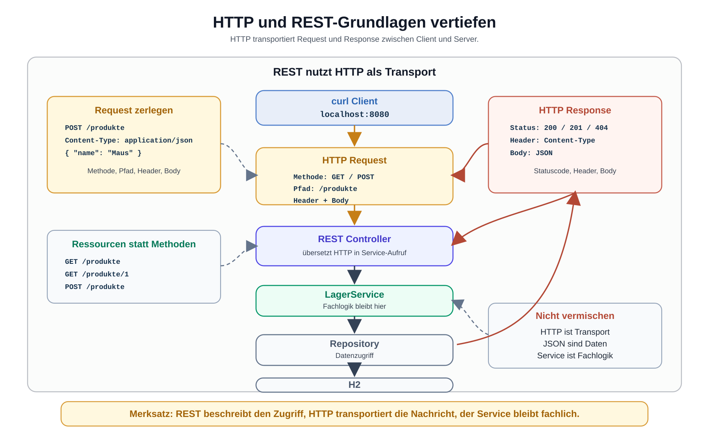

# Arbeitsblatt – HTTP und REST-Grundlagen vertiefen

## Lernziele

- HTTP als Transport zwischen Client und Server erklären
- einen HTTP Request in Methode, URL, Header und Body zerlegen
- eine HTTP Response in Statuscode, Header und Body zerlegen
- `GET` und `POST` an bekannten REST-Endpunkten einordnen
- einfache Statuscodes wie `200`, `201`, `400`, `404` und `500` erklären
- URL und Endpoint unterscheiden
- Header und Body voneinander unterscheiden
- JSON als Datenformat im Request Body und Response Body erkennen
- Ressourcen wie `/produkte` und `/produkte/1` fachlich einordnen
- REST von Fachlogik im `LagerService` unterscheiden
- `curl` zum Analysieren von HTTP-Aufrufen verwenden

---

## Ausgangslage

In der letzten Einheit wurde die bekannte Lagerverwaltung über REST erreichbar gemacht:

```text
curl Client
-> HTTP / JSON
-> REST Controller
-> LagerService
-> ProduktRepository
-> JDBC / H2
```

Die bestehende Architektur bleibt weiterhin erhalten. In dieser Einheit schauen wir genauer auf HTTP.

Kernidee:

```text
REST basiert auf HTTP.
HTTP transportiert Requests und Responses zwischen Client und Server.
```



---

## Client und Server

Der Client sendet eine Anfrage. Der Server verarbeitet die Anfrage und sendet eine Antwort zurück.

In unserer Lagerverwaltung:

```text
Client: curl im Terminal
Server: Spring Boot auf localhost:8080
```

Beispiel:

```bash
curl -i http://localhost:8080/produkte
```

Der Client entscheidet nicht über Fachregeln. Er sendet nur eine Anfrage. Der Server ruft über den REST Controller den bestehenden `LagerService` auf.

---

## HTTP Request

Ein HTTP Request ist die Anfrage vom Client an den Server.

Beispiel:

```text
POST /produkte HTTP/1.1
Host: localhost:8080
Content-Type: application/json

{
  "name": "Maus",
  "preis": 24.9
}
```

Die Teile:

| Teil | Beispiel | Bedeutung |
|---|---|---|
| Methode | `POST` | was der Client tun will |
| Pfad/Endpoint | `/produkte` | welche Ressource gemeint ist |
| Header | `Content-Type: application/json` | Zusatzinformation zur Anfrage |
| Body | JSON-Objekt | Nutzdaten der Anfrage |

Wichtig:

```text
Nicht der ganze Request ist JSON.
JSON ist nur der Inhalt im Body.
```

---

## HTTP Response

Eine HTTP Response ist die Antwort vom Server an den Client.

Beispiel:

```text
HTTP/1.1 200 OK
Content-Type: application/json

[
  {
    "id": 1,
    "name": "Tastatur",
    "preis": 49.9
  }
]
```

Die Teile:

| Teil | Beispiel | Bedeutung |
|---|---|---|
| Statuscode | `200 OK` | Ergebnis der Anfrage |
| Header | `Content-Type: application/json` | Zusatzinformation zur Antwort |
| Body | JSON-Liste | Nutzdaten der Antwort |

Mit `curl -i` werden Statuscode und Header sichtbar.

---

## URL und Endpoint

Eine URL ist die vollständige Adresse:

```text
http://localhost:8080/produkte
```

Der Endpoint ist der fachlich interessante Pfad:

```text
/produkte
```

Im HTTP Request steht normalerweise dieser Pfad. Die vollständige URL brauchst du vor allem beim Aufruf mit `curl`.

Bei einem einzelnen Produkt:

```text
http://localhost:8080/produkte/1
```

Endpoint:

```text
/produkte/1
```

---

## Header

Header enthalten Zusatzinformationen zur Anfrage oder Antwort.

Beispiele:

```text
Content-Type: application/json
Accept: application/json
```

`Content-Type` beschreibt den Inhalt des Body:

```text
Dieser Body enthält JSON.
```

Header sind nicht die Fachlogik. Sie helfen Client und Server, die Nachricht technisch richtig zu verstehen.

---

## Body und JSON

Der Body enthält Nutzdaten. Bei REST-Schnittstellen sind diese Daten oft JSON.

Request Body bei `POST /produkte`:

```json
{
  "name": "Maus",
  "preis": 24.9
}
```

Response Body bei `GET /produkte`:

```json
[
  {
    "id": 1,
    "name": "Tastatur",
    "preis": 49.9
  }
]
```

JSON ist ein Austauschformat. Es ist nicht Java-Code, nicht SQL und nicht die Fachlogik.

---

## GET und POST

Für diese Einheit reichen zwei HTTP-Methoden:

| Methode | Typischer Einsatz | Beispiel |
|---|---|---|
| `GET` | Daten lesen | `GET /produkte` |
| `POST` | Daten senden oder neue Ressource anlegen | `POST /produkte` |

Beispiele:

```text
GET /produkte
GET /produkte/1
POST /produkte
```

Wichtig:

```text
GET soll keine Daten verändern.
POST sendet Daten im Body.
```

---

## Statuscodes

Statuscodes zeigen, wie der Server die Anfrage beantwortet hat.

| Statuscode | Bedeutung im Einstieg |
|---|---|
| `200 OK` | Anfrage erfolgreich |
| `201 Created` | neue Ressource wurde erstellt |
| `400 Bad Request` | Anfrage ist fehlerhaft, zum Beispiel ungültiges JSON |
| `404 Not Found` | Endpoint oder Ressource wurde nicht gefunden |
| `500 Internal Server Error` | unerwarteter Fehler im Server |

Noch wichtig:

```text
Ein Statuscode ist Teil der HTTP Response.
Er ist nicht automatisch eine Java-Exception.
```

In dieser Einheit beobachten wir Statuscodes. Wir bauen noch keine komplexe Fehlerbehandlung.

---

## REST-Grundidee: Ressourcen statt Methoden

REST denkt in Ressourcen. In der Lagerverwaltung sind Produkte eine Ressource.

```text
/produkte      -> Sammlung von Produkten
/produkte/1    -> einzelnes Produkt
```

Die HTTP-Methode beschreibt die Aktion:

```text
GET /produkte      -> Produktliste lesen
GET /produkte/1    -> ein Produkt lesen
POST /produkte     -> neues Produkt an die Sammlung senden
```

Besser:

```text
POST /produkte
```

Schlechter:

```text
POST /produktSpeichern
```

Der zweite Pfad beschreibt eine Methode. REST bevorzugt Ressourcen.

---

## REST und Fachlogik trennen

REST beschreibt den Zugriff von aussen:

```text
Welche URL?
Welche Methode?
Welche Header?
Welcher Body?
Welcher Statuscode?
```

Fachlogik beschreibt Regeln der Lagerverwaltung:

```text
Darf ein Preis negativ sein?
Darf ein Produkt ohne Namen gespeichert werden?
Wie wird Bestand verändert?
```

Diese Regeln bleiben im `LagerService`.

Der REST Controller übersetzt HTTP-Aufrufe in Service-Aufrufe. Er soll die Fachlogik nicht neu implementieren.

---

## `curl` analysieren

`curl` kann mehr als nur eine URL aufrufen. Mit `-i` sehen wir Statuscode und Header.

GET analysieren:

```bash
curl -i http://localhost:8080/produkte
```

POST analysieren:

```bash
curl -i -X POST http://localhost:8080/produkte \
  -H "Content-Type: application/json" \
  -d '{"name":"Maus","preis":24.9}'
```

Falschen Pfad analysieren:

```bash
curl -i http://localhost:8080/falscher-pfad
```

Fragen dazu:

- Welche Methode wird verwendet?
- Welche URL wird aufgerufen?
- Welche Header werden gesendet?
- Gibt es einen Body?
- Welcher Statuscode kommt zurück?
- Ist der Response Body JSON?

---

## Typische Fehler

| Fehler | Problem |
|---|---|
| Methode und Ressource werden verwechselt | `/produktSpeichern` statt `POST /produkte` |
| falsche HTTP-Methode | `GET` verändert Daten |
| fehlender `Content-Type` | Server erkennt JSON nicht zuverlässig |
| ungültiges JSON | Request kann nicht gelesen werden |
| Fachlogik im Controller | Service-Verantwortung wird verschoben |
| HTTP und Spring vermischt | Protokoll und Framework werden nicht unterschieden |
| Statuscodes werden ignoriert | Client kann Ergebnis nicht sauber einordnen |
| schlechte URL-Struktur | Ressourcenmodell bleibt unklar |

---

## Nicht-Ziele dieser Einheit

Bewusst noch nicht behandelt werden:

- Security
- Spring Security
- Login, Rollen oder Tokens
- DTOs
- Validation
- JPA oder Hibernate
- Spring Data
- Swagger oder OpenAPI
- OpenAPI-Spezifikation
- HATEOAS
- komplexe Fehlerbehandlung
- globale Exception Handler
- vollständige Statuscode-Systematik
- REST-Tests
- Frontend-Anbindung
- Deployment

---

## Reflexion

Beantworte kurz:

1. Warum basiert REST auf HTTP?
2. Was ist der Unterschied zwischen Header und Body?
3. Warum ist JSON für REST-Schnittstellen praktisch?
4. Warum sollen Fachregeln im `LagerService` bleiben?
5. Warum helfen Statuscodes einem Client?
