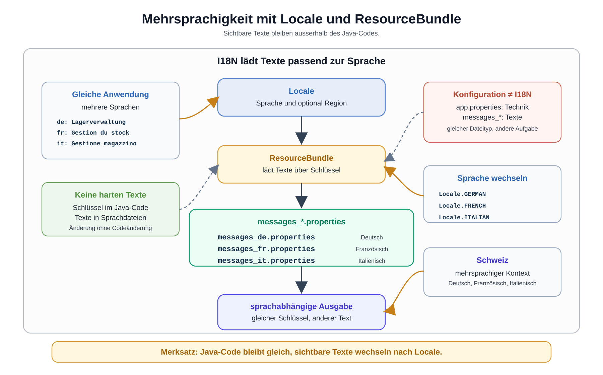

# Arbeitsblatt – Mehrsprachigkeit mit Locale und ResourceBundle

## Lernziele

- erklären, warum sichtbare Texte nicht hartcodiert im Java-Code stehen sollen
- Mehrsprachigkeit als reale Anforderung einer Anwendung einordnen
- `Locale` als Beschreibung von Sprache und Region verstehen
- `ResourceBundle` zum Laden sprachabhängiger Texte verwenden
- `messages_de.properties`, `messages_fr.properties` und `messages_it.properties` aufbauen
- einfache sprachabhängige Konsolenausgaben erzeugen
- technische Konfiguration und I18N sauber unterscheiden
- typische Fehler beim Umgang mit ResourceBundles erkennen

---

## Ausgangslage

Die bekannte Lagerverwaltung ist technisch gewachsen:

```text
Main
-> LagerService
-> ProduktRepository
-> JDBC / H2
-> technisches Logging
-> technische Konfiguration
```

In der letzten Einheit wurden technische Werte aus dem Code ausgelagert:

```properties
db.url=jdbc:h2:./data/lager
produkt.datei=data/produkte.csv
logging.level=INFO
```

Jetzt geht es um eine andere Art von Werten: sichtbare Texte.

```java
System.out.println("Produkt wurde gespeichert.");
System.out.println("Produkt wurde nicht gefunden.");
```

Diese Texte sind nicht technische Konfiguration. Sie sind Texte für Benutzerinnen und Benutzer. Wenn die Anwendung Deutsch, Französisch und Italienisch unterstützen soll, dürfen diese Texte nicht fest im Java-Code stehen.

Kernidee:

```text
Texte gehören nicht fest in den Java-Code,
sondern in sprachabhängige Ressourcen.
```



---

## Was bedeutet I18N?

I18N ist eine Abkürzung für Internationalisierung.

Der Begriff bedeutet:

```text
Eine Anwendung wird so vorbereitet,
dass sie mehrere Sprachen unterstützen kann.
```

I18N heisst nicht, dass Java automatisch perfekt übersetzt. I18N bedeutet hier:

- Texte stehen nicht hartcodiert im Code.
- Texte werden über Schlüssel geladen.
- Pro Sprache gibt es eine passende Datei.
- Der Java-Code bleibt gleich.

---

## Warum Mehrsprachigkeit wichtig ist

In der Schweiz sind mehrsprachige Anwendungen normal. Eine Lagerverwaltung kann zum Beispiel in verschiedenen Filialen oder Teams verwendet werden:

- Deutsch
- Französisch
- Italienisch

Die Fachlogik bleibt gleich:

```text
Ein negativer Preis bleibt ungültig.
Ein Produkt wird weiterhin gespeichert.
Eine Datenbankverbindung bleibt technische Infrastruktur.
```

Nur die sichtbaren Texte ändern sich.

---

## `Locale`

`Locale` beschreibt eine Sprache und optional eine Region.

Beispiele:

```java
import java.util.Locale;

Locale deutsch = Locale.GERMAN;
Locale franzoesisch = Locale.FRENCH;
Locale italienisch = Locale.ITALIAN;
```

Sprache und Region sind nicht ganz dasselbe:

| Beispiel | Bedeutung |
|---|---|
| `de` | Deutsch allgemein |
| `de-CH` | Deutsch für die Schweiz |
| `fr` | Französisch allgemein |
| `fr-CH` | Französisch für die Schweiz |
| `it` | Italienisch allgemein |
| `it-CH` | Italienisch für die Schweiz |

Für diese Einheit reicht der einfache Einstieg mit `de`, `fr` und `it`.

---

## `ResourceBundle`

`ResourceBundle` lädt sprachabhängige Texte aus `.properties`-Dateien.

Beispiel:

```java
import java.util.Locale;
import java.util.ResourceBundle;

Locale locale = Locale.GERMAN;
ResourceBundle texte = ResourceBundle.getBundle("messages", locale);

System.out.println(texte.getString("app.title"));
```

Wenn der Basisname `messages` heisst, sucht Java passende Dateien:

```text
messages_de.properties
messages_fr.properties
messages_it.properties
```

In einem Maven-Projekt liegen diese Dateien normalerweise hier:

```text
src/main/resources/
```

Speichere die Sprachdateien als UTF-8, damit Akzente wie `é` oder `è` korrekt erhalten bleiben.

---

## Aufbau der Sprachdateien

Alle Sprachdateien verwenden dieselben Schlüssel. Nur die Werte sind unterschiedlich.

`src/main/resources/messages_de.properties`:

```properties
app.title=Lagerverwaltung
app.welcome=Willkommen in der Lagerverwaltung.
produkt.gespeichert=Produkt wurde gespeichert.
produkt.nichtGefunden=Produkt wurde nicht gefunden.
fehler.allgemein=Ein Fehler ist aufgetreten.
```

`src/main/resources/messages_fr.properties`:

```properties
app.title=Gestion du stock
app.welcome=Bienvenue dans la gestion du stock.
produkt.gespeichert=Produit enregistré.
produkt.nichtGefunden=Produit introuvable.
fehler.allgemein=Une erreur est survenue.
```

`src/main/resources/messages_it.properties`:

```properties
app.title=Gestione magazzino
app.welcome=Benvenuto nella gestione magazzino.
produkt.gespeichert=Prodotto salvato.
produkt.nichtGefunden=Prodotto non trovato.
fehler.allgemein=Si è verificato un errore.
```

Wichtig:

- Die Schlüssel sind in allen Dateien gleich.
- Die Texte sind pro Sprache unterschiedlich.
- Fachregeln werden nicht in Sprachdateien ausgelagert.

---

## Texte aus dem Code auslagern

Vorher:

```java
System.out.println("Produkt wurde gespeichert.");
```

Nachher:

```java
System.out.println(texte.getString("produkt.gespeichert"));
```

Der Java-Code kennt nur noch den Schlüssel. Der konkrete Text kommt aus der passenden Sprachdatei.

---

## Einfache sprachabhängige Ausgabe

```java
import java.util.Locale;
import java.util.ResourceBundle;

public class Main {

    public static void main(String[] args) {
        Locale locale = Locale.GERMAN;
        ResourceBundle texte = ResourceBundle.getBundle("messages", locale);

        System.out.println(texte.getString("app.title"));
        System.out.println(texte.getString("app.welcome"));
        System.out.println(texte.getString("produkt.gespeichert"));
    }
}
```

Mit `Locale.FRENCH` lädt Java die französischen Texte. Mit `Locale.ITALIAN` lädt Java die italienischen Texte.

---

## Sprache auswählen

Eine einfache Variante ist die Auswahl über ein Programmargument.

```java
private static Locale localeAusArgument(String sprache) {
    if (sprache.equals("fr")) {
        return Locale.FRENCH;
    }
    if (sprache.equals("it")) {
        return Locale.ITALIAN;
    }
    return Locale.GERMAN;
}
```

Für EFZ-Niveau reicht diese einfache Variante. Eine komplexe Sprachverwaltung ist hier kein Ziel.

---

## Konfiguration vs. I18N

Beide Themen können `.properties`-Dateien verwenden. Trotzdem sind sie nicht dasselbe.

| Technische Konfiguration | I18N |
|---|---|
| steuert technische Infrastruktur | liefert sichtbare Texte |
| Beispiel: `db.url` | Beispiel: `app.title` |
| Beispiel: `logging.level` | Beispiel: `produkt.gespeichert` |
| wird für Betrieb und Umgebung verwendet | wird für Sprache und Benutzertext verwendet |
| Datei z. B. `config/app.properties` | Dateien z. B. `messages_de.properties` |

Merke:

```text
.properties ist nur das Dateiformat.
Die Verantwortung der Datei muss klar bleiben.
```

---

## Typische Fehlerbilder

| Fehler | Problem |
|---|---|
| Texte bleiben hartcodiert in `Main` | Sprache kann nicht einfach gewechselt werden |
| falsche `Locale` wird verwendet | falsche Sprachdatei wird geladen |
| Datei heisst `message_de.properties` | `ResourceBundle` findet `messages_de.properties` nicht |
| Schlüssel fehlt in einer Sprache | Fehler tritt erst zur Laufzeit auf |
| technische Werte landen in `messages_de.properties` | Konfiguration und I18N werden vermischt |
| Sprache wird überall mit `if` im Code verzweigt | Code wird schwer wartbar |
| `ResourceBundle` wird in jeder Methode neu geladen | unnötige Wiederholung und unklare Verantwortung |

---

## Reflexion

Beantworte die Fragen kurz:

1. Welche Texte waren in deiner Lagerverwaltung bisher hartcodiert?
2. Welche Vorteile bringt I18N?
3. Warum sind `Locale` und Sprache nicht ganz dasselbe?
4. Welche Probleme entstehen ohne Mehrsprachigkeit?
5. Warum ist I18N besonders in der Schweiz relevant?
6. Warum ist I18N nicht dasselbe wie technische Konfiguration?

---

## Bewusste Nicht-Ziele

In dieser Einheit werden nicht behandelt:

- Spring I18N
- Web-I18N
- Angular-I18N
- ICU
- automatische Übersetzungsdienste
- datenbankbasierte Übersetzungen
- komplexe Formatierungsregeln

Der Fokus bleibt auf einfacher Konsolenausgabe mit `Locale`, `ResourceBundle` und klassischen `.properties`-Dateien.
