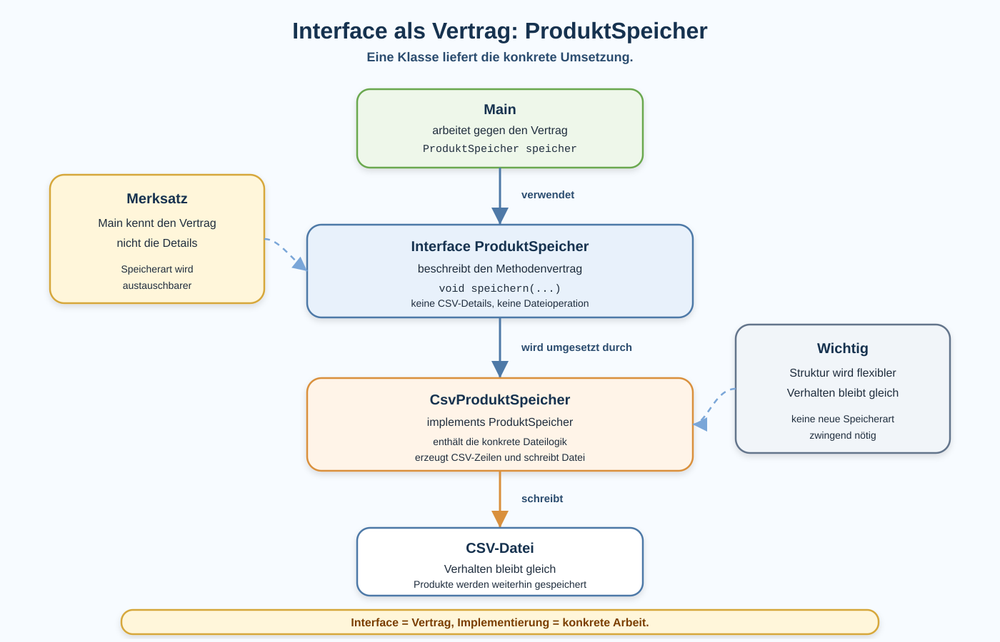

# Arbeitsblatt – Interfaces für austauschbare Services

## Lernziele

- erklären, was ein Interface als Vertrag bedeutet
- ein einfaches Interface mit einer Methode lesen und schreiben
- `implements` als Zusage einer Klasse verstehen
- `CsvProduktSpeicher` als konkrete Implementierung eines Interfaces einordnen
- `Main` so lesen, dass eine Variable vom Interface-Typ verwendet wird
- erklären, warum eine Speicherart dadurch austauschbarer wird
- die Grenze dieser Einheit benennen: kein Spring, keine Dependency Injection, keine abstrakten Klassen

---

## Ausgangslage

Die Produktverwaltung ist inzwischen in mehrere Verantwortlichkeiten aufgeteilt:

| Klasse | Aufgabe |
|---|---|
| `Produkt` | hält Daten |
| `ProduktVerwaltung` | enthält Fachlogik |
| `CsvProduktLeser` | lädt CSV-Daten |
| `CsvProduktSpeicher` | speichert CSV-Daten |
| `Main` | startet und orchestriert den Ablauf |

Bisher kann `Main` direkt mit dem konkreten `CsvProduktSpeicher` arbeiten:

```java
CsvProduktSpeicher speicher = new CsvProduktSpeicher();
speicher.speichern(produkte, "data/produkte.csv");
```

Wenn deine bestehende Klasse die Methode bereits `speichereProdukte(...)` nennt, darfst du diesen Namen beibehalten. Wichtig ist, dass Interface und Klasse dieselbe Methodensignatur verwenden.

Das funktioniert. Aber `Main` ist damit direkt an diese konkrete Speicherklasse gebunden.

Die neue Idee ist:

```text
Main soll wissen, dass Produkte gespeichert werden.
Main muss nicht überall wissen, wie genau gespeichert wird.
```



---

## Was ist ein Interface?

Ein Interface beschreibt einen Vertrag.

Der Vertrag sagt:

```text
Welche Methode muss eine Klasse anbieten?
```

Er sagt nicht:

```text
Wie genau wird diese Methode umgesetzt?
```

Beispiel:

```java
public interface ProduktSpeicher {
    void speichern(ArrayList<Produkt> produkte, String dateipfad);
}
```

Für vollständigen Java-Code brauchst du passende Imports für `ArrayList` und `Produkt`.

Das bedeutet:

- Jede Klasse, die `ProduktSpeicher` sein will, muss `speichern(...)` anbieten.
- Das Interface enthält keine CSV-Logik.
- Das Interface speichert nicht selbst.
- Es beschreibt nur den Methodenvertrag.

---

## Eine Klasse erfüllt den Vertrag

`CsvProduktSpeicher` ist die konkrete Klasse, die Produkte als CSV-Datei schreibt.

Mit `implements` sagt die Klasse:

```text
Ich erfülle den Vertrag von ProduktSpeicher.
```

```java
public class CsvProduktSpeicher implements ProduktSpeicher {
    public void speichern(ArrayList<Produkt> produkte, String dateipfad) {
        // CSV-Zeilen erzeugen
        // Datei schreiben
    }
}
```

Wichtig:

- `ProduktSpeicher` ist der Vertrag.
- `CsvProduktSpeicher` ist die Umsetzung.
- Die Methodensignatur muss passen.

---

## Main arbeitet gegen das Interface

Vorher:

```java
CsvProduktSpeicher speicher = new CsvProduktSpeicher();
speicher.speichern(produkte, "data/produkte.csv");
```

Nachher:

```java
ProduktSpeicher speicher = new CsvProduktSpeicher();
speicher.speichern(produkte, "data/produkte.csv");
```

Die rechte Seite bleibt konkret:

```text
new CsvProduktSpeicher()
```

Die linke Seite verwendet den Vertrag:

```text
ProduktSpeicher speicher
```

Das Verhalten bleibt gleich. Die Produkte werden weiterhin als CSV-Datei gespeichert.

Die Struktur ist aber etwas flexibler:

```text
Main kennt den Vertrag.
CsvProduktSpeicher erledigt die konkrete Arbeit.
```

---

## Warum ist das nützlich?

Stell dir vor, später gibt es eine zweite Speicherart.

Beispiele:

- Produkte nur auf der Konsole ausgeben
- Produkte in eine andere Datei exportieren
- Produkte mit Backup speichern

Dann kann eine weitere Klasse denselben Vertrag erfüllen.

```text
ProduktSpeicher
    ^
    |
CsvProduktSpeicher
```

In dieser Einheit bleibt die echte Umsetzung aber bewusst einfach:

```text
CsvProduktSpeicher schreibt CSV-Dateien.
```

Es geht nicht darum, sofort viele Klassen zu bauen. Es geht darum, das Prinzip eines Vertrags zu verstehen.

---

## Bezug zu Verantwortlichkeiten

Ein Interface ersetzt keine saubere Verantwortung.

Die Aufteilung bleibt:

| Teil | Aufgabe |
|---|---|
| `ProduktSpeicher` | beschreibt, wie Speichern aufgerufen wird |
| `CsvProduktSpeicher` | speichert wirklich als CSV-Datei |
| `ProduktVerwaltung` | enthält Fachlogik |
| `Main` | orchestriert den Ablauf |

Das Interface darf keine Fachlogik enthalten.

Das Interface darf keine Datei selber schreiben.

---

## Typische Fehlerbilder

| Fehlerbild | Warum es problematisch ist |
|---|---|
| Interface enthält CSV-Code | ein Interface soll den Vertrag beschreiben, nicht die Umsetzung |
| Methodensignatur passt nicht | `CsvProduktSpeicher` erfüllt den Vertrag nicht korrekt |
| `implements ProduktSpeicher` fehlt | die Klasse ist keine Implementierung des Interfaces |
| `Main` verwendet überall weiter `CsvProduktSpeicher` | die Austauschbarkeit wird nicht sichtbar |
| Interface und Klasse heissen fast gleich | Vertrag und Umsetzung werden verwechselt |
| zu viele Interfaces auf einmal | die Struktur wird schwerer statt klarer |
| Verhalten ändert sich beim Umbau | Refactoring soll zuerst das gleiche Ergebnis behalten |
| Prüfung nach der Umstellung fehlt | Fehler bleiben unbemerkt |

---

## Nicht Ziel dieser Einheit

Bewusst nicht behandelt werden:

- Spring
- Dependency Injection
- abstrakte Klassen
- komplexe Polymorphie
- mehrere Interfaces auf einmal
- Datenbanken
- ORM
- Repository-Pattern formal
- generische CSV-Frameworks

Diese Einheit führt nur ein erstes Interface ein.

---

## Reflexion

Beantworte kurz:

1. Warum ist ein Interface ein Vertrag?
2. Was bedeutet austauschbar in diesem Beispiel?
3. Was gewinnt man, wenn `Main` gegen ein Interface arbeitet?
4. Warum führen wir zunächst nur ein Interface ein?
5. Welche weiteren Services könnten später austauschbar werden?

---

## Ausblick

Später können ähnliche Ideen bei Services, Schichten und weiteren Implementierungen wieder auftauchen.

Mögliche spätere Schritte:

- ein `ProduktLeser`-Interface
- ein Speicher mit Backup
- ein Export in einem anderen Format
- Tests mit einfacher Ersatzimplementierung
- spätere Service- und Persistenzschichten

Noch bleibt die Einheit bewusst klein:

```text
ein Interface
eine konkrete Implementierung
Main arbeitet mit dem Vertrag
```
