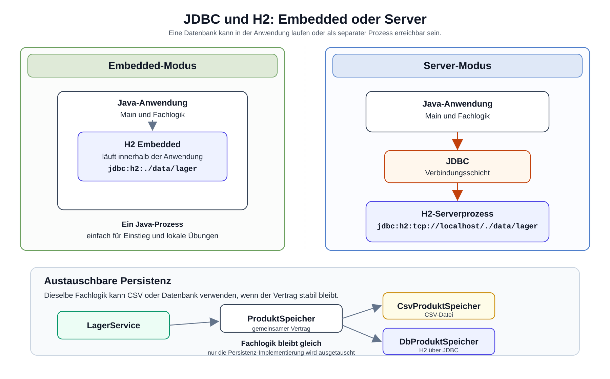

# Arbeitsblatt – JDBC mit eingebetteter H2-Datenbank

## Lernziele

- erklären, warum eine Datenbank eine alternative Persistenz zu CSV ist
- JDBC als Verbindung zwischen Java und relationaler Datenbank einordnen
- H2 als eingebettete Datenbank und im Server-Modus unterscheiden
- eine H2-Dependency in einem Maven-Projekt ergänzen
- mit `Connection`, `PreparedStatement` und `ResultSet` arbeiten
- einfache SQL-Befehle lesen und verwenden
- Fachlogik und konkrete Persistenz weiterhin trennen
- begründen, warum `ProduktSpeicher` durch `DbProduktSpeicher` erweitert werden kann

---

## Ausgangslage

Die bekannte Lagerverwaltung kann Produkte bereits über CSV speichern und laden.

```text
ProduktSpeicher
├── CsvProduktSpeicher
└── DbProduktSpeicher
```

Die Kernidee bleibt:

```text
Persistenz ist austauschbar.
```

`LagerService` entscheidet weiterhin fachlich, zum Beispiel ob ein Verkauf erlaubt ist. `DbProduktSpeicher` kümmert sich um das Speichern und Laden in einer Datenbank. Dadurch muss Fachlogik nicht wissen, ob Daten aus CSV oder aus H2 kommen.



---

## Was ist JDBC?

JDBC bedeutet Java Database Connectivity.

JDBC ist eine Java-Schnittstelle, mit der Java-Code SQL-Befehle an eine relationale Datenbank senden kann.

Wichtige Bausteine:

| Baustein | Aufgabe |
|---|---|
| `Connection` | Verbindung zur Datenbank |
| `PreparedStatement` | vorbereiteter SQL-Befehl mit Platzhaltern |
| `ResultSet` | Ergebnis einer `SELECT`-Abfrage |
| SQL | Sprache für Tabellen, Abfragen und Änderungen |

Ein einfacher Ablauf sieht so aus:

```text
Java-Code
-> JDBC
-> H2-Datenbank
-> Tabelle PRODUKT
```

---

## Embedded-Datenbank und Server-Datenbank

H2 kann auf zwei Arten verwendet werden.

| Betriebsart | Erklärung | Beispiel |
|---|---|---|
| Embedded | H2 läuft direkt im Java-Programm mit | `jdbc:h2:./data/lager` |
| Server-Modus | H2 läuft als separater Prozess | `jdbc:h2:tcp://localhost/./data/lager` |

Für den Einstieg ist Embedded einfacher:

- keine separate Installation
- Datenbank startet mit dem Java-Programm
- gut für kleine Übungen und lokale Tests

Der Server-Modus zeigt später, dass eine Datenbank auch unabhängig vom Java-Programm laufen kann.

---

## Maven-Dependency für H2

Damit Java H2 verwenden kann, braucht das Maven-Projekt eine Dependency.

```xml
<dependency>
    <groupId>com.h2database</groupId>
    <artifactId>h2</artifactId>
    <version>2.2.224</version>
</dependency>
```

Die Dependency gehört in den Abschnitt `<dependencies>` der `pom.xml`.

Wenn du ein neues Maven-Projekt verwendest, soll die `pom.xml` weiterhin Java 21 konfigurieren:

```xml
<properties>
    <maven.compiler.release>21</maven.compiler.release>
    <project.build.sourceEncoding>UTF-8</project.build.sourceEncoding>
</properties>
```

Falls Maven trotzdem mit `Source option 5` oder `Target option 5` fehlschlägt, fehlt im Projekt wahrscheinlich eine aktuelle Compiler-Plugin-Konfiguration aus den Maven-Einheiten.

---

## Tabelle `PRODUKT`

Eine relationale Datenbank speichert Daten in Tabellen. Für die Lagerverwaltung reicht zuerst eine Tabelle.

```sql
CREATE TABLE IF NOT EXISTS PRODUKT (
    ID INT AUTO_INCREMENT PRIMARY KEY,
    NAME VARCHAR(100) NOT NULL,
    PREIS DOUBLE NOT NULL,
    BESTAND INT NOT NULL
);
```

Vergleich mit CSV:

```text
CSV-Zeile:
Maus;24.9;10

Datenbankzeile:
ID | NAME | PREIS | BESTAND
1  | Maus | 24.9  | 10
```

---

## Beispiel: Verbindung herstellen

```java
import java.sql.Connection;
import java.sql.DriverManager;
import java.sql.SQLException;

public class DbDemo {
    private static final String URL = "jdbc:h2:./data/lager";

    public static void main(String[] args) throws SQLException {
        try (Connection connection = DriverManager.getConnection(URL)) {
            System.out.println("Verbindung hergestellt");
        }
    }
}
```

`try (...)` sorgt dafür, dass die Verbindung am Ende automatisch geschlossen wird.

---

## Beispiel: Tabelle erstellen

```java
private static void tabelleErstellen(Connection connection) throws SQLException {
    String sql = """
            CREATE TABLE IF NOT EXISTS PRODUKT (
                ID INT AUTO_INCREMENT PRIMARY KEY,
                NAME VARCHAR(100) NOT NULL,
                PREIS DOUBLE NOT NULL,
                BESTAND INT NOT NULL
            )
            """;

    try (PreparedStatement statement = connection.prepareStatement(sql)) {
        statement.executeUpdate();
    }
}
```

`CREATE TABLE IF NOT EXISTS` ist praktisch für Übungen: Die Tabelle wird nur erstellt, wenn sie noch fehlt.

---

## Beispiel: Produkt einfügen

```java
private static void produktEinfuegen(Connection connection, String name, double preis, int bestand)
        throws SQLException {
    String sql = "INSERT INTO PRODUKT (NAME, PREIS, BESTAND) VALUES (?, ?, ?)";

    try (PreparedStatement statement = connection.prepareStatement(sql)) {
        statement.setString(1, name);
        statement.setDouble(2, preis);
        statement.setInt(3, bestand);
        statement.executeUpdate();
    }
}
```

Die Fragezeichen sind Platzhalter. Die Werte werden danach mit `setString`, `setDouble` und `setInt` eingesetzt.

Das ist sauberer als SQL mit String-Verkettung zusammenzubauen.

Nicht so:

```java
String sql = "INSERT INTO PRODUKT (NAME) VALUES ('" + name + "')";
```

Besser:

```java
String sql = "INSERT INTO PRODUKT (NAME) VALUES (?)";
statement.setString(1, name);
```

---

## Beispiel: Produkte lesen

```java
private static void produkteAusgeben(Connection connection) throws SQLException {
    String sql = "SELECT ID, NAME, PREIS, BESTAND FROM PRODUKT ORDER BY ID";

    try (PreparedStatement statement = connection.prepareStatement(sql);
         ResultSet resultSet = statement.executeQuery()) {

        while (resultSet.next()) {
            int id = resultSet.getInt("ID");
            String name = resultSet.getString("NAME");
            double preis = resultSet.getDouble("PREIS");
            int bestand = resultSet.getInt("BESTAND");

            System.out.println(id + ": " + name + " / " + preis + " / " + bestand);
        }
    }
}
```

Wichtig:

- `executeQuery()` wird für `SELECT` verwendet.
- `resultSet.next()` bewegt den Cursor zur nächsten Zeile.
- Am Anfang steht das `ResultSet` vor der ersten Zeile.
- Ohne `next()` können keine Werte gelesen werden.

---

## Beispiel: Produkt aktualisieren und löschen

```java
private static void bestandAktualisieren(Connection connection, int id, int neuerBestand)
        throws SQLException {
    String sql = "UPDATE PRODUKT SET BESTAND = ? WHERE ID = ?";

    try (PreparedStatement statement = connection.prepareStatement(sql)) {
        statement.setInt(1, neuerBestand);
        statement.setInt(2, id);
        statement.executeUpdate();
    }
}
```

```java
private static void produktLoeschen(Connection connection, int id) throws SQLException {
    String sql = "DELETE FROM PRODUKT WHERE ID = ?";

    try (PreparedStatement statement = connection.prepareStatement(sql)) {
        statement.setInt(1, id);
        statement.executeUpdate();
    }
}
```

`UPDATE` und `DELETE` verändern Daten. Darum muss klar sein, welche Zeile betroffen ist. Dafür wird hier `WHERE ID = ?` verwendet.

---

## CSV und Datenbank vergleichen

| Frage | CSV | Datenbank |
|---|---|---|
| Speicherform | Textdatei | Tabellen |
| Lesen | Zeilen parsen | `SELECT` |
| Schreiben | Datei neu schreiben | `INSERT`, `UPDATE`, `DELETE` |
| Struktur | durch Format vereinbart | durch Tabelle definiert |
| Zugriff | meist ganze Datei | gezielte Abfragen möglich |
| Einstieg | sehr einfach sichtbar | mehr Technik, dafür strukturierter |

CSV bleibt für kleine Datenmengen und einfache Übungen sinnvoll. Eine Datenbank hilft, wenn Daten strukturierter, gezielter oder zuverlässiger verwaltet werden sollen.

---

## Verantwortlichkeiten

| Klasse | Verantwortung |
|---|---|
| `Main` | Ablauf starten und einfache Ausgabe steuern |
| `LagerService` | Fachlogik, zum Beispiel Verkauf und Bestandsprüfung |
| `Produkt` | Produktdaten halten |
| `ProduktSpeicher` | Vertrag für Laden und Speichern |
| `CsvProduktSpeicher` | CSV-Datei lesen und schreiben |
| `DbProduktSpeicher` | SQL und JDBC-Zugriff auf H2 |

Wichtig:

```text
SQL gehört nicht in LagerService.
Fachlogik gehört nicht in DbProduktSpeicher.
```

---

## H2 kurz im Server-Modus

Embedded:

```text
Java-Programm und H2 laufen im gleichen Prozess.
JDBC-URL: jdbc:h2:./data/lager
```

Server-Modus:

```text
H2 läuft als separater Prozess.
Java verbindet sich über TCP.
JDBC-URL: jdbc:h2:tcp://localhost/./data/lager
```

Für den Einstieg reicht Embedded. Der Server-Modus zeigt nur den Unterschied in der Betriebsart.

---

## Typische Fehlerbilder

| Fehler | Wirkung |
|---|---|
| `Connection` wird nicht geschlossen | Ressourcen bleiben länger offen als nötig |
| Werte werden in SQL-Strings verkettet | fehleranfällig und unsauber |
| `ResultSet.next()` wird vergessen | Daten können nicht korrekt gelesen werden |
| `executeQuery()` und `executeUpdate()` werden verwechselt | SQL-Befehl passt nicht zur Methode |
| Embedded- und Server-URL werden verwechselt | Datenbank wird nicht gefunden oder neu angelegt |
| SQL steht in `Main` oder `LagerService` | Verantwortlichkeiten vermischen sich |
| Exceptions werden ignoriert | Fehlerursache bleibt unsichtbar |

---

## Reflexion

- Wann reicht CSV für eine Lagerverwaltung aus?
- Wann hilft eine Datenbank?
- Welche Verantwortung bleibt beim `LagerService`?
- Warum kann `ProduktSpeicher` unterschiedliche Implementierungen haben?
- Was ist der Unterschied zwischen H2 Embedded und H2 Server-Modus?
- Warum ist `PreparedStatement` besser als zusammengesetztes SQL mit Variablen?
