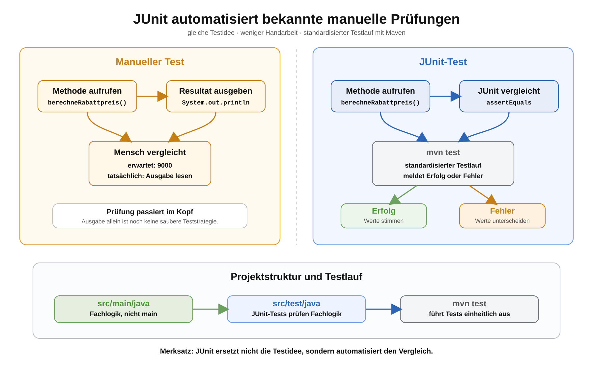

# Arbeitsblatt – Von manuellen Tests zu automatisierten Tests mit JUnit

## Lernziele

- erklären, dass JUnit bekannte manuelle Prüfideen automatisiert
- eine einfache JUnit-Jupiter-Testklasse unter `src/test/java` anlegen
- `@Test` und `assertEquals` für einfache Prüfungen einsetzen
- erwartetes Resultat und tatsächliches Resultat klar unterscheiden
- Fachlogik weiter von `main` trennen
- Edge Cases als eigene Testfälle formulieren
- `mvn test` als standardisierten Testlauf verwenden
- grob erklären, warum eine JUnit-Dependency mit `scope test` nur für Tests gebraucht wird

---

## Ausgangslage

Im letzten Block wurden Prüfungen noch von Hand geschrieben:

```java
int erwartet = 9000;
int tatsaechlich = verwaltung.berechneRabattpreis(10000, 10);

if (erwartet == tatsaechlich) {
    System.out.println("Test erfolgreich");
} else {
    System.out.println("Test fehlgeschlagen");
}
```

Die Idee war bereits richtig:

```text
erwartetes Resultat mit tatsächlichem Resultat vergleichen
```

JUnit macht daraus keine Magie. JUnit automatisiert genau diese Prüfung:

```java
assertEquals(9000, verwaltung.berechneRabattpreis(10000, 10));
```

Hier ist `9000` das erwartete Resultat. Der Methodenaufruf berechnet das tatsächliche Resultat.



---

## Projektstruktur mit Tests

Bisher lag der Produktivcode unter `src/main/java`.

Für Tests kommt ein zweiter Ordner dazu:

```text
produktverwaltung-maven/
  pom.xml
  src/main/java/
    ch/allianz/youngoitv/produktverwaltung/
      Main.java
      model/Produkt.java
      service/ProduktVerwaltung.java
  src/test/java/
    ch/allianz/youngoitv/produktverwaltung/
      service/ProduktVerwaltungTest.java
```

Wichtig:

- `src/main/java` enthält den Code des Programms.
- `src/test/java` enthält Testcode.
- `main` bleibt der Startpunkt des Programms.
- Die Fachlogik bleibt in kleinen Methoden mit Rückgabewerten.

---

## Erste externe Dependency

JUnit ist nicht Teil von Java. Das Projekt braucht deshalb eine externe Bibliothek.

In Maven wird sie in `pom.xml` eingetragen:

```xml
<project xmlns="http://maven.apache.org/POM/4.0.0"
         xmlns:xsi="http://www.w3.org/2001/XMLSchema-instance"
         xsi:schemaLocation="http://maven.apache.org/POM/4.0.0 https://maven.apache.org/xsd/maven-4.0.0.xsd">
    <modelVersion>4.0.0</modelVersion>

    <groupId>ch.allianz.youngoitv</groupId>
    <artifactId>produktverwaltung</artifactId>
    <version>1.0.0</version>

    <properties>
        <maven.compiler.source>17</maven.compiler.source>
        <maven.compiler.target>17</maven.compiler.target>
        <project.build.sourceEncoding>UTF-8</project.build.sourceEncoding>
    </properties>

    <dependencies>
        <dependency>
            <groupId>org.junit.jupiter</groupId>
            <artifactId>junit-jupiter</artifactId>
            <version>6.0.3</version>
            <scope>test</scope>
        </dependency>
    </dependencies>

    <build>
        <plugins>
            <plugin>
                <groupId>org.apache.maven.plugins</groupId>
                <artifactId>maven-surefire-plugin</artifactId>
                <version>3.5.4</version>
            </plugin>
        </plugins>
    </build>
</project>
```

Kurze Einordnung:

- `junit-jupiter` enthält die JUnit-Jupiter-Funktionen für moderne JUnit-Tests.
- `scope test` bedeutet: Die Bibliothek wird für Tests gebraucht, nicht für das normale Programm.
- Maven lädt externe Bibliotheken aus Maven Central herunter, wenn sie lokal noch fehlen.
- Lokal speichert Maven heruntergeladene Bibliotheken im `.m2`-Repository im Benutzerordner. Beim ersten `mvn test` kann das deshalb kurz dauern.
- Die Surefire-Zeilen sorgen dafür, dass Maven JUnit-Tests zuverlässig mit `mvn test` ausführt. Wir vertiefen das Plugin hier nicht.

---

## Erste JUnit-Testklasse

Produktivcode:

```java
package ch.allianz.youngoitv.produktverwaltung.service;

public class ProduktVerwaltung {
    public int berechneRabattpreis(int preisInRappen, int rabattProzent) {
        int rabattBetrag = preisInRappen * rabattProzent / 100;
        return preisInRappen - rabattBetrag;
    }
}
```

Testcode:

```java
package ch.allianz.youngoitv.produktverwaltung.service;

import org.junit.jupiter.api.Test;

import static org.junit.jupiter.api.Assertions.assertEquals;

class ProduktVerwaltungTest {

    @Test
    void berechneRabattpreis_mitZehnProzent_liefertReduziertenPreis() {
        ProduktVerwaltung verwaltung = new ProduktVerwaltung();

        int erwartet = 9000;
        int tatsaechlich = verwaltung.berechneRabattpreis(10000, 10);

        assertEquals(erwartet, tatsaechlich);
    }
}
```

`@Test` markiert eine Methode als Testmethode.

`assertEquals(erwartet, tatsaechlich)` vergleicht:

- erster Wert: erwartetes Resultat
- zweiter Wert: tatsächliches Resultat

Wenn beide Werte gleich sind, ist der Test erfolgreich. Wenn nicht, zeigt JUnit eine Fehlermeldung.

---

## Mehrere kleine Testmethoden

Für jeden wichtigen Fall wird eine eigene kleine Testmethode geschrieben.

```java
@Test
void berechneRabattpreis_ohneRabatt_liefertOriginalpreis() {
    ProduktVerwaltung verwaltung = new ProduktVerwaltung();

    assertEquals(10000, verwaltung.berechneRabattpreis(10000, 0));
}

@Test
void berechneRabattpreis_mitVollemRabatt_liefertNull() {
    ProduktVerwaltung verwaltung = new ProduktVerwaltung();

    assertEquals(0, verwaltung.berechneRabattpreis(10000, 100));
}
```

Sprechende Namen helfen, Fehler schneller zu verstehen.

Ein guter Testname sagt:

```text
Welche Methode wird geprüft?
Welcher Fall wird geprüft?
Welches Resultat wird erwartet?
```

---

## Produktverwaltung testen

Beispiel für Produkt und Gesamtwert:

```java
package ch.allianz.youngoitv.produktverwaltung.model;

public class Produkt {
    private String name;
    private int preisInRappen;
    private int anzahl;

    public Produkt(String name, int preisInRappen, int anzahl) {
        this.name = name;
        this.preisInRappen = preisInRappen;
        this.anzahl = anzahl;
    }

    public String getName() {
        return name;
    }

    public int getPreisInRappen() {
        return preisInRappen;
    }

    public int getAnzahl() {
        return anzahl;
    }
}
```

```java
package ch.allianz.youngoitv.produktverwaltung.service;

import ch.allianz.youngoitv.produktverwaltung.model.Produkt;

public class ProduktVerwaltung {
    public int berechneGesamtwert(Produkt[] produkte) {
        int summe = 0;

        for (Produkt produkt : produkte) {
            summe = summe + produkt.getPreisInRappen() * produkt.getAnzahl();
        }

        return summe;
    }

    public Produkt findeProdukt(Produkt[] produkte, String name) {
        for (Produkt produkt : produkte) {
            if (produkt.getName().equals(name)) {
                return produkt;
            }
        }

        return null;
    }
}
```

JUnit-Test:

```java
package ch.allianz.youngoitv.produktverwaltung.service;

import ch.allianz.youngoitv.produktverwaltung.model.Produkt;
import org.junit.jupiter.api.Test;

import static org.junit.jupiter.api.Assertions.assertEquals;
import static org.junit.jupiter.api.Assertions.assertTrue;

class ProduktVerwaltungTest {

    @Test
    void berechneGesamtwert_mitDreiProdukten_liefertSumme() {
        ProduktVerwaltung verwaltung = new ProduktVerwaltung();
        Produkt[] produkte = {
                new Produkt("Maus", 2500, 3),
                new Produkt("Tastatur", 7000, 2),
                new Produkt("Monitor", 19900, 1)
        };

        assertEquals(41400, verwaltung.berechneGesamtwert(produkte));
    }

    @Test
    void findeProdukt_mitVorhandenemNamen_liefertProdukt() {
        ProduktVerwaltung verwaltung = new ProduktVerwaltung();
        Produkt[] produkte = {
                new Produkt("Maus", 2500, 3),
                new Produkt("Tastatur", 7000, 2)
        };

        Produkt produkt = verwaltung.findeProdukt(produkte, "Tastatur");

        assertTrue(produkt != null);
        assertEquals("Tastatur", produkt.getName());
    }
}
```

`assertTrue` wird hier nur sparsam verwendet: Es prüft, ob überhaupt ein Produkt gefunden wurde.

---

## Edge Cases

Edge Cases sind Randfälle, bei denen Fehler häufig sichtbar werden.

Beispiele:

| Methode | Edge Case | Erwartung |
|---|---|---|
| `berechneRabattpreis` | `0` Prozent Rabatt | Preis bleibt gleich |
| `berechneRabattpreis` | `100` Prozent Rabatt | Resultat ist `0` |
| `berechneGesamtwert` | leeres Produktarray | Gesamtwert ist `0` |
| `findeProdukt` | Name existiert nicht | Rückgabewert ist `null` |

Beispiel:

```java
@Test
void berechneGesamtwert_mitLeeremArray_liefertWertNull() {
    ProduktVerwaltung verwaltung = new ProduktVerwaltung();

    assertEquals(0, verwaltung.berechneGesamtwert(new Produkt[0]));
}
```

---

## Tests ausführen mit Maven

Tests werden im Projektordner gestartet:

```bash
mvn test
```

Maven erledigt dabei grob:

1. Produktivcode kompilieren
2. Testcode kompilieren
3. JUnit-Tests ausführen
4. Ergebnis anzeigen

Nach dem Testlauf liegen technische Berichte unter:

```text
target/surefire-reports/
```

Für diese Einheit reicht: Der Ordner zeigt, welche Tests Maven ausgeführt hat und ob sie erfolgreich waren.

---

## Regressionstest

Ein Regressionstest schützt vor alten Fehlern, die später wieder auftauchen könnten.

Beispiel:

Ein Rabatt von `100` Prozent muss `0` ergeben. Wenn diese Prüfung als JUnit-Test vorhanden ist, fällt ein späterer Fehler bei `mvn test` sofort auf.

```java
@Test
void berechneRabattpreis_mitVollemRabatt_liefertNull() {
    ProduktVerwaltung verwaltung = new ProduktVerwaltung();

    assertEquals(0, verwaltung.berechneRabattpreis(10000, 100));
}
```

---

## Typische Fehler

### Testklasse liegt unter `src/main/java`

Tests gehören unter `src/test/java`. Sonst vermischt sich Testcode mit dem normalen Programm.

### `@Test` fehlt

Ohne `@Test` erkennt JUnit die Methode nicht als Test.

### Erwartet und tatsächlich verwechselt

Ungünstig:

```java
assertEquals(tatsaechlich, erwartet);
```

Besser:

```java
assertEquals(erwartet, tatsaechlich);
```

So bleibt die Fehlermeldung besser lesbar.

### Fachlogik bleibt in `main`

JUnit testet Methoden mit klaren Eingaben und Rückgabewerten. Berechnungen direkt in `main` sind schwer prüfbar.

### Test hängt von `System.out.println` ab

Ein Test soll Rückgabewerte prüfen. Konsolenausgaben sind für Menschen sichtbar, aber keine saubere Testgrundlage.

### Dependency ist falsch eingetragen

Stimmen `groupId`, `artifactId`, `version` oder `scope` nicht, kann Maven JUnit nicht korrekt verwenden.

### Maven wird aus dem falschen Verzeichnis gestartet

`mvn test` muss im Ordner mit der passenden `pom.xml` gestartet werden.

---

## Abgrenzung

In dieser Einheit geht es nur um erste Unit Tests mit JUnit Jupiter.

Noch nicht behandelt werden:

- Mocking
- Parameterized Tests
- Test Doubles
- Testcontainers
- Spring Tests
- Lifecycle-Methoden wie `@BeforeEach`
- komplexe Maven-Plugin-Konfiguration
- Multi-Module
- technische Umsetzung einer CI/CD-Pipeline

---

## Reflexion

Beantworte kurz:

1. Welche manuelle Prüfung wurde durch `assertEquals` ersetzt?
2. Warum ist `src/test/java` ein eigener Ordner?
3. Warum ist eine Methode mit Rückgabewert besser testbar als eine reine Ausgabe?
4. Warum ist `mvn test` hilfreicher als einzelne Tests von Hand zu starten?
