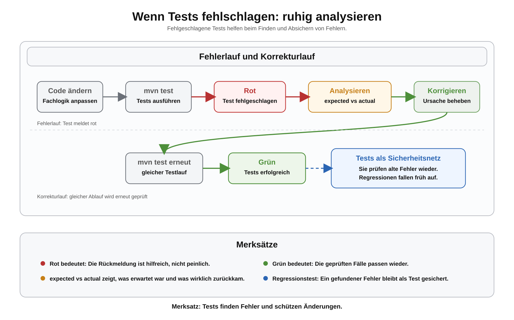

# Arbeitsblatt – Wenn automatisierte Tests fehlschlagen

## Lernziele

- fehlgeschlagene JUnit-Tests als hilfreiche Rückmeldung verstehen
- `expected` und `actual` in Fehlermeldungen unterscheiden
- einfache `assertEquals`-Fehlermeldungen lesen
- einen Stacktrace grob einordnen
- mit `mvn test` einen Fehler reproduzierbar prüfen
- Ursachen zwischen Fachlogikfehler, Testfehler und vergessenem Edge Case unterscheiden
- Regressionstests als Sicherheitsnetz erklären
- verstehen, warum Maven Builds bei fehlerhaften Tests stoppt

---

## Ausgangslage

Im letzten Block wurde aus einer manuellen Prüfung ein JUnit-Test:

```java
@Test
void berechneRabattpreis_mitZehnProzent_liefertReduziertenPreis() {
    ProduktVerwaltung verwaltung = new ProduktVerwaltung();

    int erwartet = 9000;
    int tatsaechlich = verwaltung.berechneRabattpreis(10000, 10);

    assertEquals(erwartet, tatsaechlich);
}
```

Wenn dieser Test fehlschlägt, ist das zuerst einmal hilfreich:

```text
Der Test zeigt, dass Erwartung und Wirklichkeit nicht zusammenpassen.
```

Ein roter Test ist kein Grund zur Panik. Er ist ein Hinweis, wo genauer hingeschaut werden muss.



---

## Fehlgeschlagene Tests sind nützlich

Ein Programm kann starten und trotzdem falsch rechnen. Ein Test macht den Fehler sichtbar.

Beispiel für fehlerhafte Fachlogik:

```java
public int berechneRabattpreis(int preisInRappen, int rabattProzent) {
    return preisInRappen - 500;
}
```

Der Test erwartet bei `10000` Rappen und `10` Prozent Rabatt:

```text
9000
```

Die Methode liefert aber:

```text
9500
```

JUnit meldet dann sinngemäss:

```text
expected: <9000> but was: <9500>
```

Das bedeutet:

- `expected` ist das erwartete Resultat
- `actual` oder `was` ist das tatsächliche Resultat
- die Methode liefert nicht das, was der Test erwartet

---

## `expected` und `actual`

Bei `assertEquals` ist die Reihenfolge wichtig:

```java
assertEquals(erwartet, tatsaechlich);
```

Übersetzt:

```text
Vergleiche: erwartetes Resultat mit tatsächlichem Resultat
```

Wenn ein Test fehlschlägt, zuerst diese Frage stellen:

```text
Ist die Erwartung falsch oder ist die Fachlogik falsch?
```

Beispiel:

```java
assertEquals(9500, verwaltung.berechneRabattpreis(10000, 10));
```

Dieser Test ist fachlich falsch, wenn `10` Prozent Rabatt auf `10000` Rappen erwartet werden. Korrekt ist `9000`.

Nicht jeder rote Test bedeutet automatisch, dass die Fachlogik falsch ist. Manchmal ist der Test falsch formuliert.

---

## Stacktrace grob einordnen

Bei einem fehlgeschlagenen Test zeigt Maven mehrere Zeilen. Nicht alles ist gleich wichtig.

Suche zuerst nach:

- Name der Testklasse
- Name der Testmethode
- Zeile mit `assertEquals`
- erwarteter und tatsächlicher Wert

Vereinfachtes Beispiel:

```text
ProduktVerwaltungTest.berechneRabattpreis_mitZehnProzent_liefertReduziertenPreis
expected: <9000> but was: <9500>
at ProduktVerwaltungTest.java:16
```

Das reicht für den Einstieg:

```text
Welche Prüfung ist fehlgeschlagen?
Welche Werte wurden verglichen?
In welcher Testzeile steht die Prüfung?
```

---

## `mvn test` bei Fehlern

Tests werden weiterhin im Projektordner gestartet:

```bash
mvn test
```

Wenn alle Tests erfolgreich sind, ist der Testlauf grün.

Wenn mindestens ein Test fehlschlägt:

- zeigt Maven den Fehler an
- ist der Testlauf nicht erfolgreich
- endet `mvn test` mit einem Fehlerstatus
- würden spätere Build-Schritte nicht weiterlaufen
- kann später auch ein Build-Server den Fehler erkennen

Das ist gewollt. Fehlerhafte Tests sollen sichtbar sein.

---

## `target/surefire-reports`

Nach `mvn test` legt Maven technische Testberichte ab:

```text
target/surefire-reports/
```

Für diese Einheit reicht:

- Der Ordner zeigt Details zum Testlauf.
- Bei Fehlern können dort zusätzliche Hinweise stehen.
- Wir vertiefen das Format der Dateien nicht.

---

## Fehleranalyse in kleinen Schritten

Wenn ein Test rot ist, gehe ruhig vor:

1. Testmethode lesen
2. `expected` und `actual` vergleichen
3. Eingabewerte prüfen
4. Fachlogik prüfen
5. Test erneut mit `mvn test` ausführen

Beispiel:

```java
public int berechneRabattpreis(int preisInRappen, int rabattProzent) {
    int rabattBetrag = preisInRappen * rabattProzent / 10;
    return preisInRappen - rabattBetrag;
}
```

Problem:

```text
Durch 10 statt durch 100.
```

Korrektur:

```java
public int berechneRabattpreis(int preisInRappen, int rabattProzent) {
    int rabattBetrag = preisInRappen * rabattProzent / 100;
    return preisInRappen - rabattBetrag;
}
```

---

## Edge Cases ergänzen

Ein Fehler kann zeigen, dass ein wichtiger Randfall noch fehlt.

Beispiele:

| Methode | Edge Case | Erwartung |
|---|---|---|
| `berechneRabattpreis` | `0` Prozent Rabatt | Originalpreis |
| `berechneRabattpreis` | `100` Prozent Rabatt | `0` |
| `berechneGesamtwert` | leeres Produktarray | `0` |
| `findeProdukt` | Produkt existiert nicht | `null` |

Ein Test für einen Edge Case:

```java
@Test
void berechneRabattpreis_mitVollemRabatt_liefertNull() {
    ProduktVerwaltung verwaltung = new ProduktVerwaltung();

    assertEquals(0, verwaltung.berechneRabattpreis(10000, 100));
}
```

---

## Regressionstest

Eine Regression ist ein Fehler, der nach einer Änderung wieder auftaucht.

Ein Regressionstest schützt davor:

```text
Ein gefundener Fehler wird als Test festgehalten.
```

Beispiel:

Wenn einmal ein Fehler bei `100` Prozent Rabatt gefunden wurde, bleibt dieser Test im Projekt:

```java
@Test
void berechneRabattpreis_mitVollemRabatt_liefertNull() {
    ProduktVerwaltung verwaltung = new ProduktVerwaltung();

    assertEquals(0, verwaltung.berechneRabattpreis(10000, 100));
}
```

So fällt der gleiche Fehler später bei `mvn test` wieder auf.

---

## Tests als Sicherheitsnetz

Tests sind besonders hilfreich, wenn Code verändert wird.

Beispiel:

- Methode vereinfachen
- Namen verbessern
- Duplikate entfernen
- Berechnung klarer schreiben

Nach der Änderung wird ausgeführt:

```bash
mvn test
```

Wenn die Tests grün bleiben, ist das ein gutes Signal: Das geprüfte Verhalten ist noch gleich.

Das ist eine Vorbereitung auf Refactoring. Refactoring bedeutet: Code verbessern, ohne das Verhalten absichtlich zu ändern.

---

## Typische Fehler

### `expected` und `actual` verwechseln

```java
assertEquals(tatsaechlich, erwartet);
```

Besser:

```java
assertEquals(erwartet, tatsaechlich);
```

### Fehlermeldung ignorieren

Die Fehlermeldung ist der wichtigste Hinweis. Sie zeigt, welcher Test fehlschlägt und welche Werte unterschiedlich sind.

### Fachlogik bleibt in `main`

Tests prüfen Methoden mit Rückgabewerten. Wenn die Berechnung direkt in `main` steckt, ist sie schwer testbar.

### Falsche Erwartung im Test

Nicht jede rote Meldung bedeutet, dass der Produktivcode falsch ist. Manchmal ist der erwartete Wert im Test falsch.

### Edge Case vergessen

Normalfälle reichen nicht. Randfälle wie `0` Prozent Rabatt, `100` Prozent Rabatt oder leere Arrays sind wichtig.

### Maven aus dem falschen Verzeichnis starten

`mvn test` muss im Ordner mit der passenden `pom.xml` gestartet werden.

### Test löschen statt Fehler verstehen

Ein roter Test soll verstanden werden. Löschen ist keine Fehleranalyse.

---

## Abgrenzung

In dieser Einheit geht es um einfache Fehleranalyse mit JUnit und Maven.

Noch nicht behandelt werden:

- formales TDD
- Mocking
- komplexe Assertions
- Coverage
- technische CI/CD-Umsetzung
- tiefer Debugger-Einsatz
- Logging-Frameworks
- Parameterized Tests
- Integrationstests

---

## Reflexion

Beantworte kurz:

1. Warum ist ein fehlgeschlagener Test hilfreich?
2. Wie erkennst du in einer Fehlermeldung erwartetes und tatsächliches Resultat?
3. Warum sind automatisierte Tests bei Refactoring wichtig?
4. Warum stoppen Build-Server bei fehlerhaften Tests?
