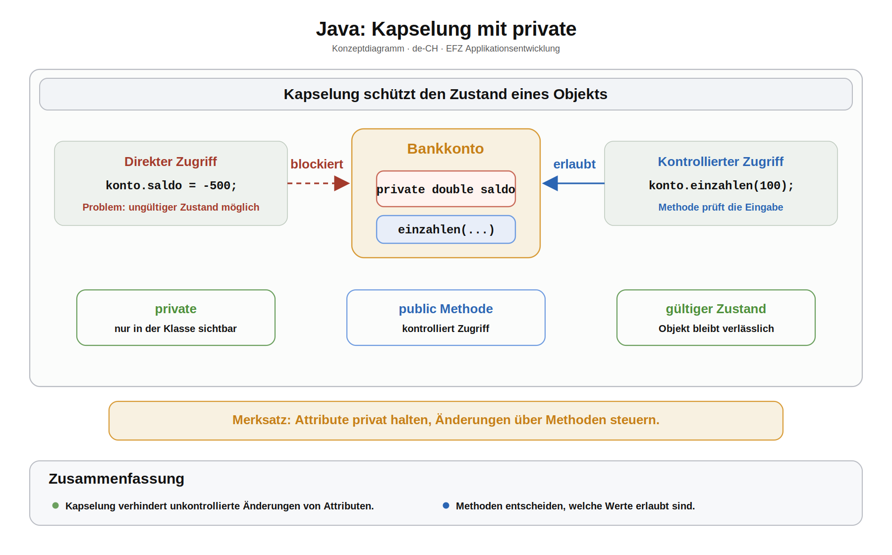
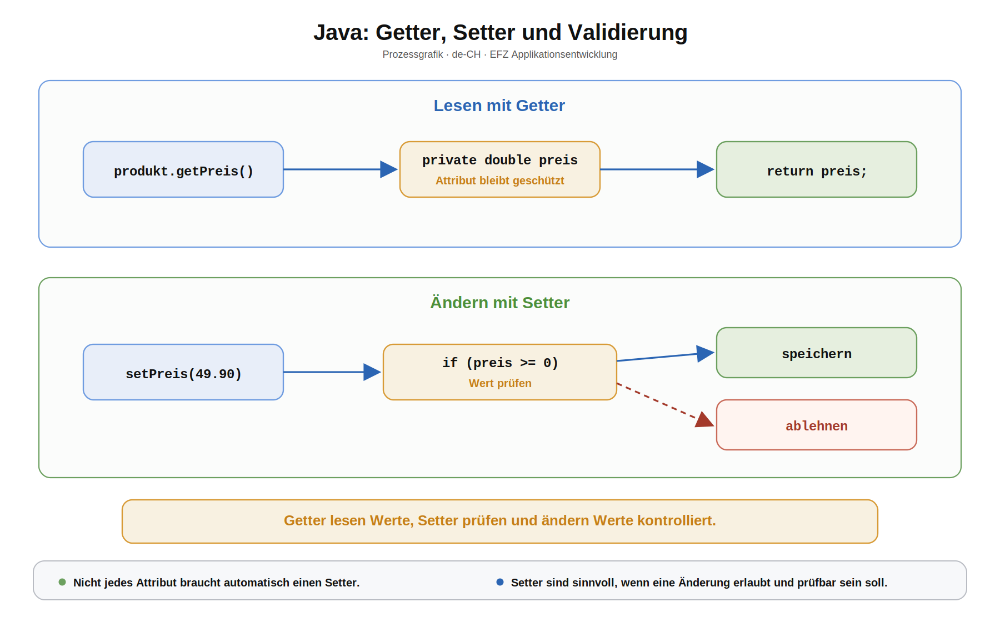

# Arbeitsblatt – Kapselung, Getter und Setter

## Lernziele

- Kapselung als Schutz des Objektzustands erklären
- Attribute mit `private` vor direktem Zugriff schützen
- Getter zum Lesen von Attributen schreiben
- Setter zum kontrollierten Ändern von Attributen schreiben
- einfache Validierung in einem Setter umsetzen

---

## Ausgangslage

Im Einstieg zu Klassen wurden Attribute direkt verwendet.

```java
Produkt p = new Produkt("Maus", 24.50);
p.preis = -10.0;
```

Das Programm erlaubt damit einen ungültigen Zustand: Ein Produkt mit negativem Preis.

---

## Kapselung

Kapselung bedeutet: Ein Objekt schützt seine Daten und entscheidet selbst, wie sie gelesen oder geändert werden dürfen.



Attribute werden dafür meistens `private` gemacht.

```java
class Produkt {
    private String name;
    private double preis;
}
```

Jetzt kann Code ausserhalb der Klasse nicht mehr direkt auf `preis` zugreifen.

---

## Getter

Ein Getter gibt einen Attributwert zurück.

```java
public double getPreis() {
    return preis;
}
```

Aufruf:

```java
double aktuellerPreis = produkt.getPreis();
```

---

## Setter

Ein Setter ändert einen Attributwert kontrolliert.

```java
public void setPreis(double preis) {
    if (preis >= 0) {
        this.preis = preis;
    }
}
```

Der Setter prüft zuerst, ob der neue Wert erlaubt ist.



---

## Konstruktor mit Validierung

Auch der Konstruktor soll keinen ungültigen Startzustand erlauben.

```java
class Produkt {
    private String name;
    private double preis;

    Produkt(String name, double preis) {
        this.name = name;
        setPreis(preis);
    }
}
```

Der Konstruktor verwendet hier den Setter, damit die gleiche Prüfung nur an einer Stelle steht.

---

## Beispiel komplett

```java
class Produkt {
    private String name;
    private double preis;

    Produkt(String name, double preis) {
        this.name = name;
        setPreis(preis);
    }

    public String getName() {
        return name;
    }

    public double getPreis() {
        return preis;
    }

    public void setPreis(double preis) {
        if (preis >= 0) {
            this.preis = preis;
        }
    }

    public void ausgeben() {
        System.out.println(name + ": " + preis);
    }
}
```

---

## Nicht jeder Setter ist sinnvoll

Wenn ein Wert nach dem Erstellen nicht mehr geändert werden soll, kann man den Setter weglassen.

Beispiel:

- `name` soll nach dem Erstellen gleich bleiben.
- `preis` darf später geändert werden.

Dann gibt es `getName()`, aber keinen `setName(...)`.

---

## Typische Stolpersteine

- Attribute bleiben öffentlich, obwohl sie geschützt werden sollten.
- Setter prüfen den Wert nicht und bringen keinen Vorteil.
- Im Setter wird `this.preis = preis;` vergessen.
- Getter verändern versehentlich den Zustand.
- Für jedes Attribut wird automatisch ein Setter erstellt, obwohl nicht jede Änderung erlaubt sein soll.

---

## Reflexion

- Warum ist `private` bei Attributen sinnvoll?
- Was ist der Unterschied zwischen Getter und Setter?
- Welche Werte müssen validiert werden?
- Wann sollte es keinen Setter geben?
