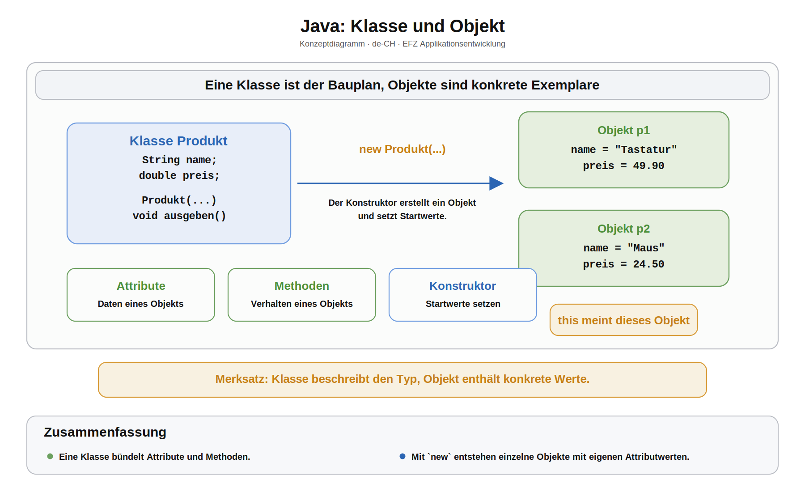
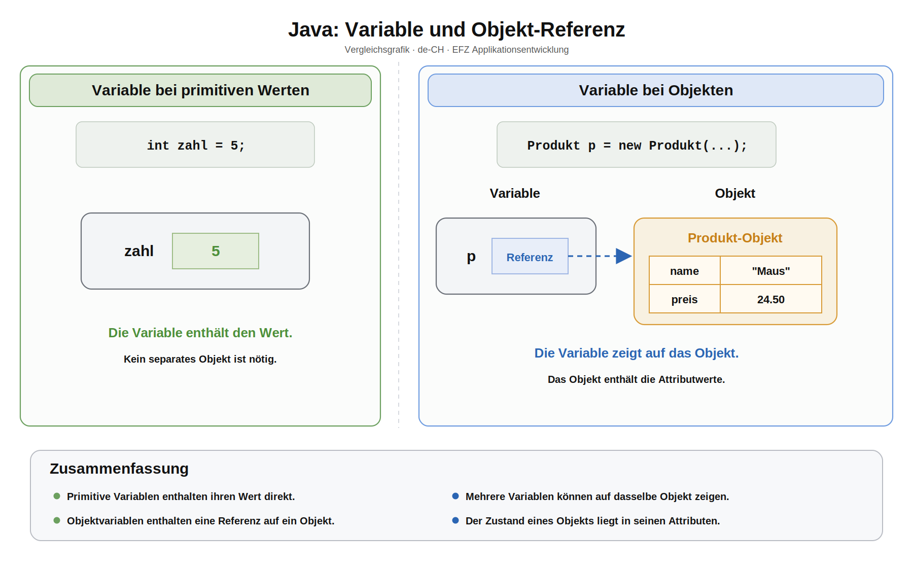

# Arbeitsblatt – Klassen und Objekte

## Lernziele

- Klasse und Objekt unterscheiden
- Attribute, Methoden und Konstruktor lesen und schreiben
- `this` in einem Konstruktor verstehen
- einfache Objekte in `main` erstellen und verwenden
- typische Fehler beim Einstieg in objektorientierte Programmierung erkennen

---

## Konzept

Eine **Klasse** ist ein Bauplan. Ein **Objekt** ist ein konkretes Exemplar dieses Bauplans.



Beispiel:

```java
class Produkt {
    String name;
    double preis;
}
```

`Produkt` ist die Klasse. Ein konkretes Produkt wäre zum Beispiel eine Tastatur mit Preis `49.90`.

---

## Attribute

Attribute speichern Daten eines Objekts.

```java
class Produkt {
    String name;
    double preis;
}
```

Jedes Objekt hat eigene Attributwerte.

```java
Produkt p1 = new Produkt();
p1.name = "Tastatur";
p1.preis = 49.90;

Produkt p2 = new Produkt();
p2.name = "Maus";
p2.preis = 24.50;
```

---

## Objektvariablen und Referenzen

Eine Objektvariable enthält nicht das ganze Objekt direkt. Sie enthält eine Referenz auf das Objekt.



Für den Einstieg reicht diese Formulierung:

- `p1` zeigt auf ein Produkt-Objekt.
- Das Objekt enthält die Werte für `name` und `preis`.
- Über `p1.name` greift man auf das Attribut dieses Objekts zu.

---

## Methoden in Klassen

Methoden beschreiben, was ein Objekt tun kann.

```java
class Produkt {
    String name;
    double preis;

    void ausgeben() {
        System.out.println(name + ": " + preis);
    }
}
```

Aufruf:

```java
Produkt p = new Produkt();
p.name = "Tastatur";
p.preis = 49.90;

p.ausgeben();
```

---

## Konstruktor

Ein Konstruktor wird beim Erstellen eines Objekts ausgeführt. Er setzt sinnvolle Startwerte.

```java
class Produkt {
    String name;
    double preis;

    Produkt(String name, double preis) {
        this.name = name;
        this.preis = preis;
    }
}
```

`this.name` meint das Attribut des aktuellen Objekts. `name` meint den Parameter des Konstruktors.

Verwendung:

```java
Produkt p = new Produkt("Tastatur", 49.90);
```

---

## Beispiel komplett

```java
class Produkt {
    String name;
    double preis;

    Produkt(String name, double preis) {
        this.name = name;
        this.preis = preis;
    }

    void ausgeben() {
        System.out.println(name + ": " + preis);
    }
}

public class Main {
    public static void main(String[] args) {
        Produkt tastatur = new Produkt("Tastatur", 49.90);
        Produkt maus = new Produkt("Maus", 24.50);

        tastatur.ausgeben();
        maus.ausgeben();
    }
}
```

---

## Typische Stolpersteine

- Klasse und Objekt werden verwechselt.
- Ein Objekt wird verwendet, bevor es mit `new` erstellt wurde.
- Im Konstruktor wird `this` vergessen, wenn Parameter gleich heissen wie Attribute.
- Eine Methode gibt direkt aus, obwohl später vielleicht ein Rückgabewert sinnvoller wäre.
- Mehrere Objekte haben gleiche Attribute, aber unterschiedliche Werte.

---

## Reflexion

- Was ist der Unterschied zwischen `Produkt` und `new Produkt(...)`?
- Welche Daten gehören als Attribute in eine Klasse?
- Welche Aufgabe übernimmt der Konstruktor?
- Wann ist `this` nötig?
