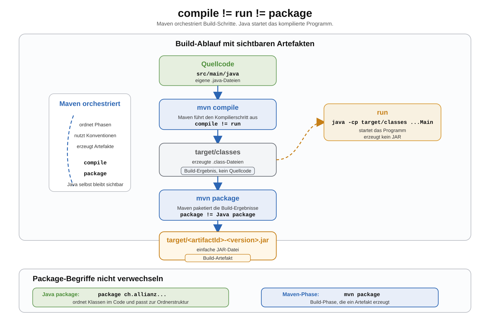

# Arbeitsblatt – Maven-Projekte ausführen und paketieren

## Lernziele

- den Unterschied zwischen `mvn compile`, Programmstart und `mvn package` erklären
- `target/classes` als Ausgabeordner für kompilierte `.class`-Dateien erkennen
- ein Maven-Projekt nach dem Kompilieren mit `java -cp target/classes ...` starten
- erklären, was ein Build-Artefakt ist
- eine einfache JAR-Datei als Build-Artefakt einordnen
- Java-`package` und Maven-Phase `package` unterscheiden
- Maven als Werkzeug verstehen, das bekannte Schritte orchestriert
- reproduzierbare und standardisierte Builds als Grundlage für spätere Build-Server verstehen

---

## Ausgangslage

Wir greifen auf die Produktverwaltung aus dem Package-Block zurück. Im Maven-Einstieg wurde sie in eine Maven-Struktur übertragen.

```text
produktverwaltung-maven/
  pom.xml
  src/
    main/
      java/
        ch/
          allianz/
            youngoitv/
              produktverwaltung/
                Main.java
                model/
                  Produkt.java
                service/
                  ProduktVerwaltung.java
```

Wichtig bleibt:

- `src/main/java` enthält eigenen Quellcode.
- `target` enthält erzeugte Build-Ergebnisse.
- Maven ersetzt Java nicht.
- Maven orchestriert bekannte Schritte in einer festen Reihenfolge.



---

## Compile: Quellcode kompilieren

Mit diesem Befehl kompiliert Maven den Java-Code:

```bash
mvn compile
```

Der Befehl wird im Projektordner ausgeführt, also dort, wo die `pom.xml` liegt.

Maven sucht Quellcode standardmässig hier:

```text
src/main/java
```

Die erzeugten `.class`-Dateien liegen danach hier:

```text
target/classes
```

Beispiel:

```text
target/classes/ch/allianz/youngoitv/produktverwaltung/Main.class
target/classes/ch/allianz/youngoitv/produktverwaltung/model/Produkt.class
target/classes/ch/allianz/youngoitv/produktverwaltung/service/ProduktVerwaltung.class
```

Merksatz:

```text
compile erzeugt .class-Dateien, startet aber kein Programm.
```

---

## Run: Programm starten

Nach `mvn compile` kann das Programm mit `java` gestartet werden.

`run` ist hier kein Maven-Befehl und keine Maven-Phase. Gemeint ist der sichtbare Programmstart mit `java`.

Beispiel:

```bash
java -cp target/classes ch.allianz.youngoitv.produktverwaltung.Main
```

Dabei bedeutet:

- `java` startet ein kompiliertes Java-Programm.
- `-cp target/classes` setzt den Classpath auf die erzeugten Klassen.
- `ch.allianz.youngoitv.produktverwaltung.Main` ist der vollständige Klassenname inklusive Java-`package`.

Maven hat vorher kompiliert. Gestartet wird hier bewusst mit Java, damit der Zusammenhang mit `target/classes` sichtbar bleibt.

Merksatz:

```text
run startet das Programm. Dafür braucht Java die kompilierten Klassen im Classpath.
```

---

## Package: Build-Artefakt erzeugen

Mit diesem Befehl führt Maven die Phase `package` aus und erzeugt ein Build-Artefakt:

```bash
mvn package
```

Maven führt dabei notwendige frühere Schritte mit aus. Wenn noch nicht kompiliert wurde, wird beim Paketieren auch kompiliert.

Danach liegt im Ordner `target` eine JAR-Datei, zum Beispiel:

```text
target/produktverwaltung-1.0.0.jar
```

Eine JAR-Datei ist ein Archiv für kompilierte Klassen und Ressourcen. In diesem Block reicht die einfache Idee:

```text
Eine JAR-Datei bündelt Build-Ergebnisse in einer Datei.
```

Wir bauen hier noch kein speziell startbares JAR mit Manifest. Es geht zuerst darum, das Artefakt zu sehen und einzuordnen.

Merksatz:

```text
package erzeugt ein Build-Artefakt, zum Beispiel eine JAR-Datei.
```

---

## Was ist ein Build-Artefakt?

Ein Build erzeugt Ergebnisse. Nicht alle Ergebnisse haben dieselbe Rolle.

- `target/classes` enthält erzeugte Build-Ergebnisse, zum Beispiel `.class`-Dateien.
- Eine `.jar`-Datei unter `target` ist ein typisches Build-Artefakt, das man weitergeben kann.

Eigener Quellcode ist kein Build-Ergebnis und kein Build-Artefakt.

```text
src/main/java/ch/allianz/.../Main.java        eigener Quellcode
target/classes/ch/allianz/.../Main.class      erzeugtes Build-Ergebnis
target/produktverwaltung-1.0.0.jar            Build-Artefakt
```

Der Ordner `target` darf gelöscht und neu erzeugt werden. Deshalb gehört eigener Quellcode nie dorthin.

---

## Java package und Maven package

Der Begriff `package` kommt an zwei Stellen vor. Er bedeutet dort nicht dasselbe.

| Begriff | Beispiel | Bedeutung |
|---|---|---|
| Java-`package` | `package ch.allianz.youngoitv.produktverwaltung;` | ordnet Java-Klassen im Code |
| Maven-`package` | `mvn package` | Build-Phase, die ein Artefakt erzeugt |

Java-`package`:

```java
package ch.allianz.youngoitv.produktverwaltung.model;
```

Passender Pfad:

```text
src/main/java/ch/allianz/youngoitv/produktverwaltung/model/Produkt.java
```

Maven `package`:

```bash
mvn package
```

Ergebnis:

```text
target/produktverwaltung-1.0.0.jar
```

Merksatz:

```text
Java package strukturiert Code. Maven package erzeugt ein Build-Artefakt.
```

---

## Compile, Run und Package im Vergleich

| Schritt | Befehl | Ergebnis |
|---|---|---|
| Kompilieren | `mvn compile` | `.class`-Dateien in `target/classes` |
| Ausführen | `java -cp target/classes ...Main` | Programm läuft |
| Paketieren | `mvn package` | JAR-Datei in `target` |

Wichtig:

- `compile` ist nicht `run`.
- `run` ist nicht `package`.
- `package` ist nicht Java-`package`.

---

## Maven-Lifecycle ganz grob

Maven arbeitet mit Phasen. Der Maven-Lifecycle enthält weitere Phasen; wir betrachten hier nur `compile` und `package`:

```text
compile  ->  package
```

Wenn du `mvn package` ausführst, arbeitet Maven die nötigen vorherigen Schritte mit ab. Deshalb muss man nicht immer zuerst einzeln `mvn compile` ausführen.

`run` gehört in diesem Block nicht zu den Maven-Phasen. Das Programm wird sichtbar mit `java` gestartet.

Wir behandeln hier bewusst noch nicht:

- externe Dependencies
- Maven Central
- JUnit
- Plugins im Detail
- Fat Jars
- Spring Boot
- `install`
- `deploy`

---

## Reproduzierbare und standardisierte Builds

Ein Build ist standardisiert, wenn alle dieselben Ordner, Befehle und Maven-Phasen verwenden.

Ein Build ist reproduzierbar, wenn derselbe Ablauf mit denselben Projektdateien wiederholt werden kann und nachvollziehbare Ergebnisse erzeugt.

Ein Maven-Projekt hilft dabei, weil vieles standardisiert ist:

- Quellcode liegt unter `src/main/java`.
- Build-Ergebnisse liegen unter `target`.
- Kompilieren läuft mit `mvn compile`.
- Paketieren läuft mit `mvn package`.

Ein typischer sauberer Ablauf ist:

```bash
mvn clean package
```

`clean` entfernt alte Build-Ergebnisse. `package` baut das Projekt neu und erzeugt ein Artefakt.

`clean` ist ein eigener Aufräumschritt vor dem neuen Build. In der Praxis helfen zusätzlich gleiche Java- und Maven-Versionen.

Das ist wichtig für Teams: Alle können denselben Befehl verwenden.

---

## Kleiner Ausblick: Build-Server und CI/CD

Später kann ein Build-Server dieselben Maven-Befehle ausführen wie du lokal.

Beispiele für Build-Server oder CI/CD-Werkzeuge:

- Jenkins
- GitLab CI/CD
- GitHub Actions

Wir merken uns nur: Der Build-Server führt später denselben Build-Befehl aus.

Für diesen Block reicht die Grundidee:

```text
Wenn der Build lokal mit standardisierten Befehlen funktioniert,
kann später auch ein Build-Server denselben Ablauf ausführen.
```

Ein Build-Server könnte zum Beispiel nach jeder Änderung automatisch ausführen:

```bash
mvn clean package
```

Die Details zu Jenkins, Pipeline-Dateien, Tests und Deployment kommen später.

---

## Typische Fehler

### Fehler 1: `mvn compile` startet das Programm nicht

Falsch gedacht:

```text
Nach mvn compile müsste die Produktverwaltung laufen.
```

Richtig:

```text
mvn compile erzeugt .class-Dateien. Gestartet wird danach mit java.
```

### Fehler 2: `package` mit Java-Packages verwechseln

Falsch gedacht:

```text
mvn package ändert meine package-Deklarationen.
```

Richtig:

```text
mvn package erzeugt ein Build-Artefakt. Java-Packages bleiben Code-Struktur.
```

### Fehler 3: `target` mit `src` verwechseln

Falsch:

```text
target/classes/ch/allianz/.../Main.java
```

Richtig:

```text
src/main/java/ch/allianz/.../Main.java
```

`target` enthält erzeugte Dateien. `src/main/java` enthält Quellcode.

### Fehler 4: Aus dem falschen Arbeitsverzeichnis starten

Falsch:

```text
produktverwaltung-maven/src/main/java/ch/allianz/youngoitv/produktverwaltung/
```

Richtig:

```text
produktverwaltung-maven/
```

Dort liegt die `pom.xml`.

### Fehler 5: Maven als Magie verstehen

Falsch gedacht:

```text
Maven macht einfach alles automatisch.
```

Besser:

```text
Maven hält sich an Konventionen und orchestriert bekannte Werkzeuge in einem Build-Ablauf.
```

### Fehler 6: JAR automatisch als startbar annehmen

Falsch gedacht:

```text
Jede JAR-Datei kann ich direkt mit java -jar starten.
```

Richtig:

```text
Eine einfache JAR-Datei ist zuerst ein Build-Artefakt. Ein direkt startbares JAR braucht zusätzliche Informationen.
```

---

## Reflexion

Beantworte kurz:

1. Was ist der Unterschied zwischen `mvn compile` und `mvn package`?
2. Warum startet `mvn compile` das Programm nicht?
3. Warum ist `target/classes` für den Classpath wichtig?
4. Warum ist `package` bei Maven nicht dasselbe wie ein Java-`package`?
5. Warum helfen standardisierte Maven-Befehle später auf einem Build-Server?
