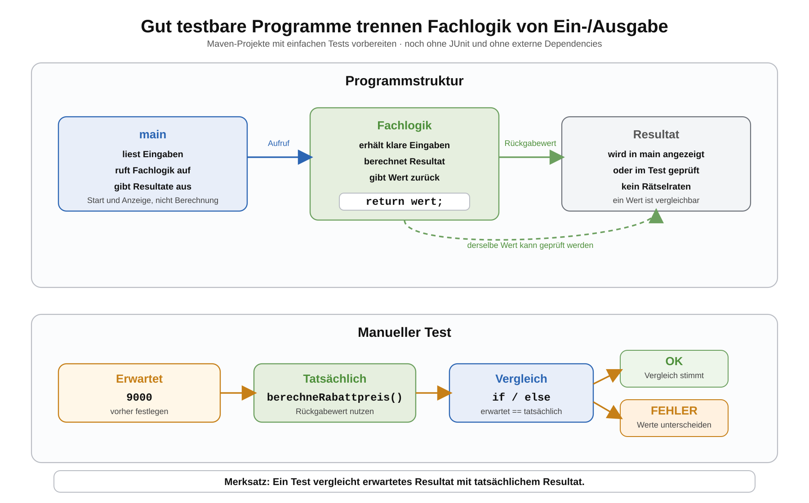

# Arbeitsblatt – Maven-Projekte mit einfachen Tests vorbereiten

## Lernziele

- erklären, warum Programme geprüft werden müssen
- manuelle Testausgaben von systematischem Prüfen unterscheiden
- erwartete und tatsächliche Resultate vergleichen
- kleine Methoden mit klaren Eingaben und Rückgabewerten schreiben
- Fachlogik aus `main` herauslösen
- einfache Edge Cases bewusst prüfen
- einfache Testmethoden mit `if`/`else` und Rückgabewerten formulieren
- erklären, warum diese Struktur später für automatisierte Tests hilfreich ist

---

## Ausgangslage

Wir arbeiten weiter mit der Produktverwaltung aus den Maven-Blöcken.

```text
produktverwaltung-maven/
  pom.xml
  src/main/java/
    ch/allianz/youngoitv/produktverwaltung/
      Main.java
      model/Produkt.java
      service/ProduktVerwaltung.java
```

Bisher standen Build, Start und Paketierung im Vordergrund:

- `mvn compile` kompiliert den Code.
- `java -cp target/classes ...Main` startet das Programm.
- `mvn package` erzeugt ein Build-Artefakt.

In diesem Block geht es nicht um neue Maven-Technik. Es geht darum, den Code so zu schreiben, dass er prüfbar wird.



Wir verwenden bewusst noch nicht:

- JUnit
- externe Dependencies
- Maven Central
- Test-Annotationen
- Assertions-Bibliotheken
- Plugin-Details
- Test-Lifecycle-Details

---

## Warum testen wir Programme?

Ein Programm kann starten und trotzdem falsch rechnen.

Beispiel:

```java
int preis = 10000;
int rabatt = 10;
int neuerPreis = 9500;

System.out.println(neuerPreis);
```

Die Ausgabe `9500` beweist noch nicht, dass die Rabattberechnung korrekt ist. Eine Person muss wissen, dass bei 10 Prozent Rabatt auf 10000 Rappen eigentlich `9000` erwartet wird.

Testen bedeutet:

```text
Eingabe festlegen
erwartetes Resultat festlegen
tatsächliches Resultat berechnen
beide Resultate vergleichen
```

---

## Manuelle Ausgabe ist noch kein Test

Eine reine Ausgabe zeigt nur einen Wert:

```java
System.out.println(verwaltung.berechneRabattpreis(10000, 10));
```

Das ist besser als nichts, aber die Prüfung passiert im Kopf.

Systematischer wird es so:

```java
int erwartet = 9000;
int tatsaechlich = verwaltung.berechneRabattpreis(10000, 10);

if (erwartet == tatsaechlich) {
    System.out.println("OK: Rabattpreis");
} else {
    System.out.println("FEHLER: erwartet " + erwartet + ", erhalten " + tatsaechlich);
}
```

Jetzt steht im Code, welches Resultat erwartet wird. Das Programm vergleicht selbst.

Merksatz:

```text
System.out.println zeigt etwas an. Ein Test vergleicht erwartet mit tatsächlich.
```

---

## `main` ist nicht die Fachlogik

Die `main`-Methode ist der Startpunkt des Programms. Sie soll nicht alle Berechnungen selbst enthalten.

Ungünstig:

```java
public class Main {
    public static void main(String[] args) {
        int preis = 10000;
        int rabatt = 10;
        int rabattBetrag = preis * rabatt / 100;
        int neuerPreis = preis - rabattBetrag;

        System.out.println(neuerPreis);
    }
}
```

Hier ist die Fachlogik direkt in `main`. Das ist schlecht prüfbar.

Besser:

```java
public class ProduktVerwaltung {
    public int berechneRabattpreis(int preisInRappen, int rabattProzent) {
        int rabattBetrag = preisInRappen * rabattProzent / 100;
        return preisInRappen - rabattBetrag;
    }
}
```

`main` ruft die Methode nur auf:

```java
public class Main {
    public static void main(String[] args) {
        ProduktVerwaltung verwaltung = new ProduktVerwaltung();
        int rabattpreis = verwaltung.berechneRabattpreis(10000, 10);
        System.out.println(rabattpreis);
    }
}
```

Die Fachlogik liegt nun in einer Methode mit klaren Eingaben und einem Rückgabewert.

---

## Kleine prüfbare Methoden

Gut prüfbare Methoden haben einen klaren Auftrag.

Beispiele:

```java
public int berechneRabattpreis(int preisInRappen, int rabattProzent)
```

```java
public int berechneGesamtwert(Produkt[] produkte)
```

```java
public Produkt findeProdukt(Produkt[] produkte, String name)
```

Solche Methoden sind gut prüfbar, weil sie:

- Eingaben über Parameter erhalten
- ein Resultat zurückgeben
- nicht direkt von Konsolenausgaben abhängen
- nicht mehrere Aufgaben vermischen

Weniger gut prüfbar:

```java
public void zeigeRabattpreis() {
    int preis = 10000;
    int rabatt = 10;
    System.out.println(preis - preis * rabatt / 100);
}
```

Diese Methode gibt nur aus und liefert kein Resultat zurück.

---

## Beispiel: Produkt und ProduktVerwaltung

Eine kleine Produktklasse kann so aussehen:

```java
package ch.allianz.youngoitv.produktverwaltung.model;

public class Produkt {
    private String name;
    private int preisInRappen;
    private int anzahl;

    public Produkt(String name, int preisInRappen, int anzahl) {
        this.name = name;
        this.preisInRappen = preisInRappen;
        this.anzahl = anzahl;
    }

    public String getName() {
        return name;
    }

    public int getPreisInRappen() {
        return preisInRappen;
    }

    public int getAnzahl() {
        return anzahl;
    }
}
```

Die Fachlogik liegt in `ProduktVerwaltung`:

```java
package ch.allianz.youngoitv.produktverwaltung.service;

import ch.allianz.youngoitv.produktverwaltung.model.Produkt;

public class ProduktVerwaltung {
    public int berechneRabattpreis(int preisInRappen, int rabattProzent) {
        int rabattBetrag = preisInRappen * rabattProzent / 100;
        return preisInRappen - rabattBetrag;
    }

    public int berechneGesamtwert(Produkt[] produkte) {
        int summe = 0;

        for (Produkt produkt : produkte) {
            summe = summe + produkt.getPreisInRappen() * produkt.getAnzahl();
        }

        return summe;
    }

    public Produkt findeProdukt(Produkt[] produkte, String name) {
        for (Produkt produkt : produkte) {
            if (produkt.getName().equals(name)) {
                return produkt;
            }
        }

        return null;
    }
}
```

Diese Methoden kann man einzeln prüfen.

---

## Erwartet und tatsächlich

Für eine Prüfung braucht es immer mindestens diese drei Teile:

| Teil | Bedeutung | Beispiel |
|---|---|---|
| Eingabe | Werte, mit denen die Methode aufgerufen wird | `10000`, `10` |
| Erwartet | korrektes Resultat, bevor der Code ausgeführt wird | `9000` |
| Tatsächlich | Resultat der Methode | Rückgabewert der Methode |

Beispiel als Tabelle:

| Methode | Eingabe | Erwartet |
|---|---|---|
| `berechneRabattpreis` | `10000`, `10` | `9000` |
| `berechneRabattpreis` | `10000`, `0` | `10000` |
| `berechneRabattpreis` | `10000`, `100` | `0` |

---

## Einfache Testmethode mit `if`/`else`

Noch ohne JUnit kann eine einfache Prüfmethode so aussehen:

```java
public static boolean testeRabattberechnung() {
    ProduktVerwaltung verwaltung = new ProduktVerwaltung();

    int erwartet = 9000;
    int tatsaechlich = verwaltung.berechneRabattpreis(10000, 10);

    if (erwartet == tatsaechlich) {
        System.out.println("OK: Rabattberechnung");
        return true;
    } else {
        System.out.println("FEHLER: Rabattberechnung");
        System.out.println("Erwartet: " + erwartet);
        System.out.println("Tatsächlich: " + tatsaechlich);
        return false;
    }
}
```

Die Methode liefert `true` oder `false` zurück. Damit kann `main` später mehrere Prüfungen zusammenfassen.

---

## Mehrere Prüfungen zusammenfassen

```java
public class Main {
    public static void main(String[] args) {
        int fehler = 0;

        if (!testeRabattberechnung()) {
            fehler++;
        }

        if (!testeGesamtwert()) {
            fehler++;
        }

        if (fehler == 0) {
            System.out.println("Alle Prüfungen erfolgreich.");
        } else {
            System.out.println("Anzahl Fehler: " + fehler);
        }
    }
}
```

Das ist noch kein automatisiertes Testframework. Es zeigt aber bereits die zentrale Testidee:

```text
Erwartetes Resultat mit tatsächlichem Resultat vergleichen.
```

---

## Edge Cases bewusst prüfen

Normale Fälle reichen nicht. Fehler entstehen oft an Rändern.

Beispiele für sinnvolle Edge Cases:

| Methode | Edge Case | Erwartung |
|---|---|---|
| `berechneRabattpreis` | `0` Prozent Rabatt | Preis bleibt gleich |
| `berechneRabattpreis` | `100` Prozent Rabatt | Preis wird `0` |
| `berechneGesamtwert` | leeres Produktarray | Gesamtwert ist `0` |
| `findeProdukt` | Produktname nicht vorhanden | Rückgabewert ist `null` |
| `findeProdukt` | erstes Produkt passt | erstes Produkt wird zurückgegeben |

Edge Cases müssen zum aktuellen Code passen. Man soll nicht möglichst viele Spezialfälle sammeln, sondern die wichtigen Ränder bewusst auswählen.

---

## Maven-Bezug

Maven hilft schon jetzt beim standardisierten Build:

```bash
mvn compile
```

Damit wird geprüft, ob der Code kompiliert.

Ein erfolgreicher Build bedeutet aber noch nicht, dass die Fachlogik richtig rechnet.

Später kann Maven auch Tests standardisiert ausführen. Dafür ist wichtig, dass die Fachlogik schon heute gut prüfbar ist:

- kleine Methoden
- klare Eingaben
- klare Rückgabewerte
- wenig Fachlogik in `main`
- erwartete Resultate schriftlich oder im Code festhalten

In diesem Block bauen wir die Denkweise auf. Die spätere Testtechnik automatisiert diese Denkweise nur.

---

## Typische Fehler

| Fehler | Problem | Besser |
|---|---|---|
| Alles steht in `main` | Fachlogik ist schwer einzeln prüfbar | Methoden in `ProduktVerwaltung` schreiben |
| Methode gibt nur aus | Kein Rückgabewert zum Vergleichen | Methode gibt `int`, `boolean` oder Objekt zurück |
| Erwartung fehlt | Ausgabe muss im Kopf geprüft werden | erwartetes Resultat vorher festlegen |
| Nur Normalfälle geprüft | Randfehler bleiben verborgen | Edge Cases ergänzen |
| Zu grosse Methode | Ursache eines Fehlers ist schwer zu finden | kleine Methoden mit einem Auftrag |
| Maven als Testlösung verstanden | Maven prüft nicht automatisch die Fachlogik | Maven kann später Tests ausführen |

---

## Abgrenzung

Wir bereiten Tests nur vor. Wir verwenden noch keine Testbibliothek.

Noch nicht Thema:

- JUnit
- Test-Annotationen
- Assertions-Bibliotheken
- externe Dependencies
- Maven Central
- Plugin-Konfiguration
- Test-Lifecycle im Detail

Wichtig ist zuerst diese Grundlage:

```text
Gut prüfbare Fachlogik ist die Voraussetzung für gute Tests.
```

---

## Reflexion

Beantworte kurz:

1. Warum ist `main` ein schlechter Ort für umfangreiche Fachlogik?
2. Was ist der Unterschied zwischen einer Ausgabe und einer Prüfung?
3. Warum sind Rückgabewerte für Tests hilfreich?
4. Welcher Edge Case ist bei der Produktverwaltung besonders wichtig?
5. Warum hilft diese Struktur später, wenn Tests automatisiert werden?
