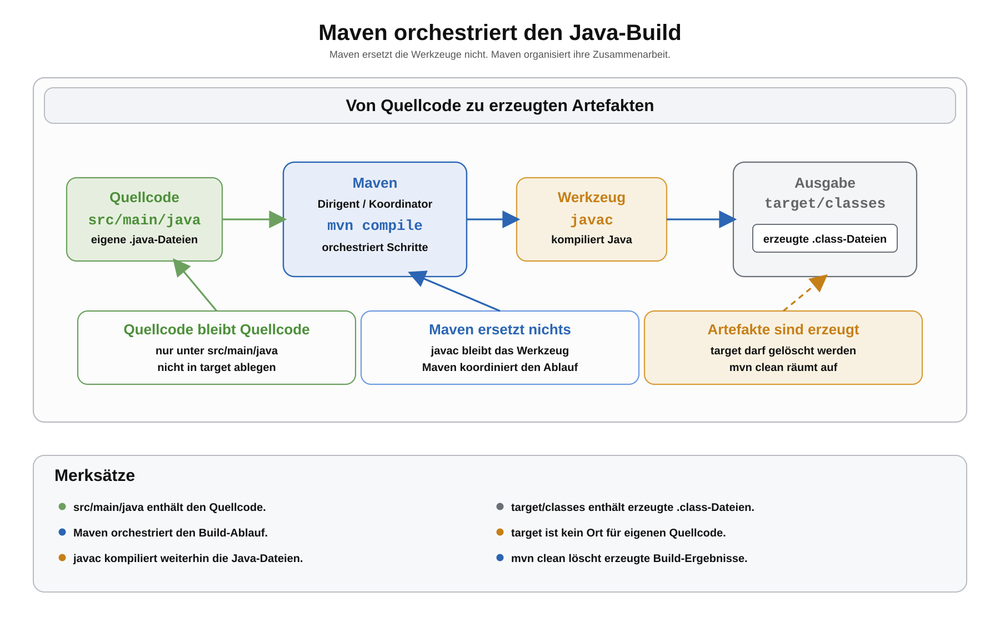

# Arbeitsblatt – Maven Einstieg

## Lernziele

- erklären, wozu Maven in einem Java-Projekt verwendet wird
- beschreiben, dass Maven Java nicht ersetzt
- erklären, wie Maven bekannte Werkzeuge wie `javac` in einer geordneten Reihenfolge aufruft
- den Begriff **orchestrieren** mit einer einfachen Analogie erklären
- `Convention over Configuration` als Grundidee von Maven verstehen
- den manuellen Build mit `src`, `out`, `javac -d out` und `java -cp out` mit Maven vergleichen
- die Maven-Ordner `src/main/java` und `target` korrekt unterscheiden
- typische Fehler bei Maven-Projektstrukturen erkennen

---

## Ausgangslage: Java-Projekt ohne Maven

Im Package-Block wurde eine Produktverwaltung in mehrere Dateien aufgeteilt.

Eine manuelle Struktur sah zum Beispiel so aus:

```text
produktverwaltung-packages/
  src/
    ch/
      allianz/
        youngoitv/
          produktverwaltung/
            Main.java
            model/
              Produkt.java
            service/
              ProduktVerwaltung.java
  out/
```

Kompilieren:

```bash
javac -d out $(find src -name "*.java")
```

Starten:

```bash
java -cp out ch.allianz.youngoitv.produktverwaltung.Main
```

Das ist wichtig, weil sichtbar bleibt:

- `src` enthält den Quellcode.
- `javac` kompiliert `.java`-Dateien.
- `out` enthält erzeugte `.class`-Dateien.
- `java -cp out` startet eine kompilierte Klasse über den Classpath.

Maven baut auf diesem Verständnis auf.

---

## Was ist Maven?

Maven ist ein Build-Tool für Java-Projekte.

Ein Build-Tool hilft dabei, wiederkehrende Projektschritte zuverlässig auszuführen. Dazu gehören zum Beispiel:

- Quellcode an der richtigen Stelle finden
- Code kompilieren
- erzeugte Dateien in einem Ausgabeordner ablegen
- alte Build-Ergebnisse löschen

Maven ersetzt Java nicht.

Maven ersetzt auch nicht das Verständnis von Packages, Classpath oder Kompilieren. Maven automatisiert diese Schritte, damit sie wiederholbar und weniger fehleranfällig werden.

---

## Maven orchestriert den Build

Das Fachwort **orchestrieren** bedeutet: Mehrere Schritte werden koordiniert und in einer passenden Reihenfolge ausgeführt.

Eine einfache Analogie:

Ein Dirigent spielt nicht selbst jedes Instrument. Er sorgt aber dafür, dass die Musikerinnen und Musiker im Orchester zur richtigen Zeit einsetzen.

Ähnlich ist es bei Maven:

- Maven ist nicht `javac`.
- Maven ist nicht `java`.
- Maven ruft Werkzeuge wie `javac` passend auf.
- Maven hält sich an einen festgelegten Ablauf.

Wenn du `mvn compile` ausführst, sucht Maven den Quellcode an der erwarteten Stelle und kompiliert ihn. Intern wird dafür der Java-Compiler verwendet.

Maven ist also keine Magie. Maven führt bekannte Schritte geordnet aus.



---

## Convention over Configuration

Ein zentrales Maven-Prinzip heisst:

```text
Convention over Configuration
```

Auf Deutsch:

```text
Konvention vor Konfiguration
```

Das bedeutet:

Maven erwartet bestimmte Standardordner und Standardnamen. Wenn ein Projekt diese Konventionen einhält, muss man Maven weniger erklären.

Die wichtigste Konvention für diesen Einstieg:

```text
src/main/java
```

Dort erwartet Maven den Java-Quellcode.

Weil Maven diesen Ordner standardmässig kennt, müssen wir ihn nicht extra in der `pom.xml` konfigurieren.

Die Ausgabe landet standardmässig in:

```text
target
```

`target` ist vergleichbar mit `out` aus dem manuellen Build. Beide Ordner enthalten erzeugte Dateien. Der Quellcode gehört nicht dorthin.

---

## Vergleich: manuell und mit Maven

| Thema | Ohne Maven | Mit Maven |
|---|---|---|
| Quellcode | `src` | `src/main/java` |
| Ausgabeordner | `out` | `target` |
| Kompilieren | `javac -d out ...` | `mvn compile` |
| Aufräumen | `out` löschen | `mvn clean` |
| Starten | `java -cp out ...` | später mit Plugin oder JAR |
| Grundidee | du steuerst die Befehle selbst | Maven orchestriert die Schritte |

In diesem Einstieg verwenden wir Maven noch ohne externe Dependencies.

Wir verwenden auch noch kein JUnit, kein Maven Central und keine Multi-Module-Projekte.

---

## Maven-Projektstruktur

Eine Maven-Version der Produktverwaltung sieht so aus:

```text
produktverwaltung-maven/
  pom.xml
  src/
    main/
      java/
        ch/
          allianz/
            youngoitv/
              produktverwaltung/
                Main.java
                model/
                  Produkt.java
                service/
                  ProduktVerwaltung.java
  target/
```

Wichtig:

- `pom.xml` liegt direkt im Projektordner.
- `src/main/java` ist der Quellwurzelordner für Java-Code.
- Die Package-Struktur beginnt unterhalb von `src/main/java`.
- `target` wird von Maven erzeugt.
- Eigene `.java`-Dateien gehören nicht in `target`.

Die Package-Deklarationen bleiben gleich.

Beispiel:

```java
package ch.allianz.youngoitv.produktverwaltung.model;
```

Diese Zeile passt zur Datei:

```text
src/main/java/ch/allianz/youngoitv/produktverwaltung/model/Produkt.java
```

---

## Minimale pom.xml

Die Datei `pom.xml` beschreibt das Maven-Projekt.

Für diesen Einstieg reicht eine kleine Datei:

```xml
<project xmlns="http://maven.apache.org/POM/4.0.0"
         xmlns:xsi="http://www.w3.org/2001/XMLSchema-instance"
         xsi:schemaLocation="http://maven.apache.org/POM/4.0.0 https://maven.apache.org/xsd/maven-4.0.0.xsd">
    <modelVersion>4.0.0</modelVersion>

    <groupId>ch.allianz.youngoitv</groupId>
    <artifactId>produktverwaltung</artifactId>
    <version>1.0.0</version>

    <properties>
        <maven.compiler.source>17</maven.compiler.source>
        <maven.compiler.target>17</maven.compiler.target>
        <project.build.sourceEncoding>UTF-8</project.build.sourceEncoding>
    </properties>
</project>
```

Für den Moment wichtig:

- `groupId` beschreibt meist Organisation oder Domain.
- `artifactId` ist der Projektname.
- `version` ist die Projektversion.
- Die `properties` legen Java-Version und Zeichencodierung fest.

Es gibt hier bewusst keinen `dependencies`-Abschnitt.

---

## Wichtige Maven-Befehle

Ausführen immer im Ordner, in dem `pom.xml` liegt.

Kompilieren:

```bash
mvn compile
```

Maven sucht Java-Dateien unter:

```text
src/main/java
```

Die kompilierten `.class`-Dateien landen standardmässig unter:

```text
target/classes
```

Aufräumen:

```bash
mvn clean
```

Dabei wird standardmässig der Ordner `target` gelöscht.

Danach kann wieder neu kompiliert werden:

```bash
mvn compile
```

---

## Typische Fehler

### Fehler 1: `target` mit `src` verwechseln

Falsch:

```text
target/ch/allianz/youngoitv/produktverwaltung/Main.java
```

Richtig:

```text
src/main/java/ch/allianz/youngoitv/produktverwaltung/Main.java
```

`target` enthält Build-Ergebnisse. `src/main/java` enthält Quellcode.

### Fehler 2: Aus dem falschen Arbeitsverzeichnis starten

Falsch:

```text
produktverwaltung-maven/src/main/java/
```

Dort liegt keine `pom.xml`.

Richtig:

```text
produktverwaltung-maven/
```

Dort liegt die `pom.xml`.

### Fehler 3: Package-Struktur falsch abbilden

Falsch:

```text
src/main/java/produktverwaltung/ch/allianz/youngoitv/Main.java
```

Richtig:

```text
src/main/java/ch/allianz/youngoitv/produktverwaltung/Main.java
```

Die Ordner unter `src/main/java` müssen zur Package-Deklaration passen.

### Fehler 4: Maven als Magie verstehen

Falsch gedacht:

```text
Maven macht einfach alles irgendwie.
```

Besser:

```text
Maven hält sich an Konventionen und führt bekannte Build-Schritte geordnet aus.
```

### Fehler 5: `pom.xml` am falschen Ort ablegen

Falsch:

```text
produktverwaltung-maven/src/main/java/pom.xml
```

Richtig:

```text
produktverwaltung-maven/pom.xml
```

---

## Reflexion

Beantworte kurz:

1. Welche Schritte hast du vorher mit `javac` und `java` selbst gesteuert?
2. Was übernimmt Maven bei `mvn compile`?
3. Warum ist `src/main/java` keine zufällige Ordnerwahl?
4. Warum darf `target` jederzeit gelöscht werden?
5. Warum ist Maven ein Build-Tool und nicht Java selbst?
