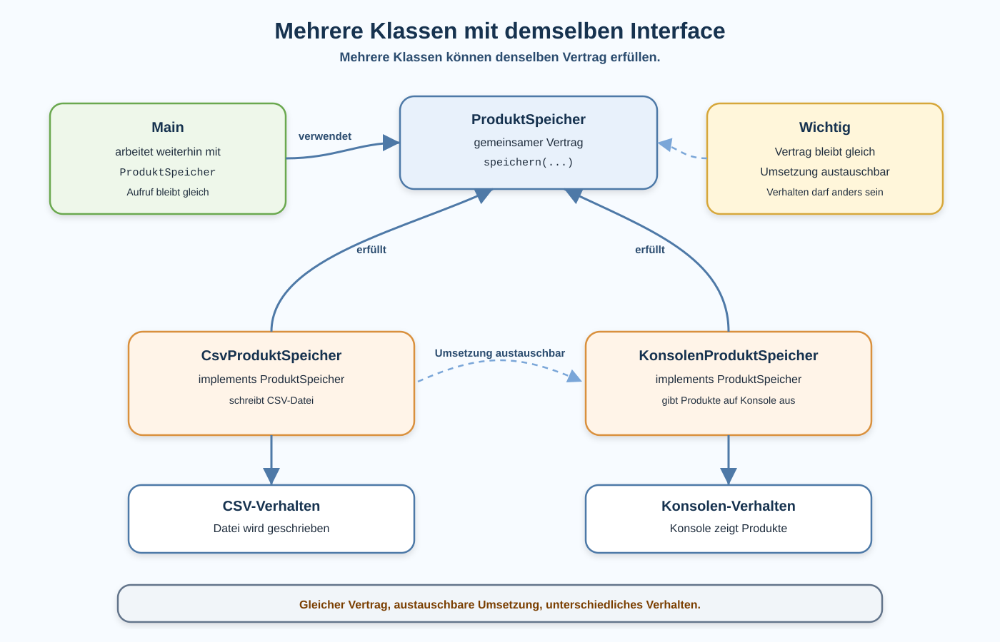

# Arbeitsblatt – Mehrere Klassen mit demselben Interface

## Lernziele

- erklären, dass mehrere Klassen denselben Interface-Vertrag erfüllen können
- `implements` bei einer zweiten konkreten Klasse korrekt einordnen
- `ProduktSpeicher`, `CsvProduktSpeicher` und `KonsolenProduktSpeicher` unterscheiden
- erkennen, dass dieselbe Methodensignatur unterschiedliches Verhalten ermöglichen kann
- `Main` so lesen, dass mit dem Interface-Typ `ProduktSpeicher` gearbeitet wird
- die konkrete Implementierung austauschen, ohne den restlichen Ablauf in `Main` umzubauen
- Vertrag und konkrete Umsetzung klar unterscheiden

---

## Ausgangslage

In der vorherigen Einheit wurde ein erstes Interface eingeführt:

```java
public interface ProduktSpeicher {
    void speichern(ArrayList<Produkt> produkte, String dateipfad);
}
```

Für vollständigen Java-Code brauchst du passende Imports für `ArrayList` und `Produkt`.

`CsvProduktSpeicher` erfüllt diesen Vertrag:

```java
public class CsvProduktSpeicher implements ProduktSpeicher {
    @Override
    public void speichern(ArrayList<Produkt> produkte, String dateipfad) {
        // Produkte als CSV-Datei speichern
    }
}
```

`Main` arbeitet gegen den Interface-Typ:

```java
ProduktSpeicher speicher = new CsvProduktSpeicher();
speicher.speichern(produkte, "data/produkte.csv");
```

Die neue Idee dieser Einheit:

```text
Das Interface bleibt gleich.
Eine zweite Klasse erfüllt denselben Vertrag.
Main ruft weiterhin dieselbe Methode auf.
Nur die konkrete Umsetzung wird gewechselt.
```



---

## Theorie: Ein Vertrag, mehrere Umsetzungen

Ein Interface beschreibt einen Vertrag.

Der Vertrag sagt:

```text
Diese Methode muss vorhanden sein.
```

Der Vertrag sagt nicht:

```text
So genau muss die Methode intern arbeiten.
```

Darum können mehrere Klassen dasselbe Interface implementieren:

```text
ProduktSpeicher
  - CsvProduktSpeicher
  - KonsolenProduktSpeicher
```

Beide Klassen müssen die Methode `speichern(...)` anbieten. Sie dürfen aber unterschiedlich arbeiten.

---

## Beispiel: CsvProduktSpeicher

`CsvProduktSpeicher` schreibt Produkte in eine Datei.

```java
public class CsvProduktSpeicher implements ProduktSpeicher {
    @Override
    public void speichern(ArrayList<Produkt> produkte, String dateipfad) {
        ArrayList<String> zeilen = new ArrayList<>();

        for (Produkt produkt : produkte) {
            zeilen.add(produkt.getName() + ";" + produkt.getPreis());
        }

        // Datei schreiben, zum Beispiel mit Files.write(...)
    }
}
```

Diese Klasse enthält Dateilogik und CSV-Logik.

---

## Beispiel: KonsolenProduktSpeicher

`KonsolenProduktSpeicher` erfüllt denselben Vertrag. Er schreibt aber keine Datei. Er gibt die Produkte auf der Konsole aus.

```java
public class KonsolenProduktSpeicher implements ProduktSpeicher {
    @Override
    public void speichern(ArrayList<Produkt> produkte, String dateipfad) {
        for (Produkt produkt : produkte) {
            System.out.println(produkt.getName() + ": " + produkt.getPreis());
        }
    }
}
```

Die Methodensignatur ist gleich:

```java
void speichern(ArrayList<Produkt> produkte, String dateipfad)
```

Das Verhalten ist anders:

| Klasse | Verhalten |
|---|---|
| `CsvProduktSpeicher` | schreibt eine CSV-Datei |
| `KonsolenProduktSpeicher` | gibt Produkte auf der Konsole aus |

Der Parameter `dateipfad` wird beim Konsolenspeicher nicht wirklich gebraucht. Er bleibt trotzdem in der Methodensignatur, weil der Vertrag gleich bleiben soll.

---

## Main bleibt einfach

`Main` kennt den Vertrag:

```java
ProduktSpeicher speicher = new CsvProduktSpeicher();
speicher.speichern(produkte, "data/produkte.csv");
```

Wenn die konkrete Umsetzung gewechselt wird, ändert sich nur die rechte Seite:

```java
ProduktSpeicher speicher = new KonsolenProduktSpeicher();
speicher.speichern(produkte, "data/produkte.csv");
```

Der Ablauf in `Main` bleibt gleich. Nur die Erzeugung der konkreten Klasse wird gewechselt.

Gleich bleibt:

- Variable vom Typ `ProduktSpeicher`
- Aufruf `speicher.speichern(...)`
- Produktliste
- restlicher Ablauf in `Main`

Geändert wird:

- konkrete Klasse hinter `new`
- sichtbares Verhalten beim Speichern

---

## Vertrag und Umsetzung

| Rolle | Beispiel | Aufgabe |
|---|---|---|
| Vertrag | `ProduktSpeicher` | legt die Methode fest |
| Umsetzung | `CsvProduktSpeicher` | speichert als CSV-Datei |
| Umsetzung | `KonsolenProduktSpeicher` | gibt Produkte auf der Konsole aus |
| Nutzung | `Main` | arbeitet mit dem Vertrag |

Merksatz:

```text
Main muss wissen, dass gespeichert werden kann.
Main muss nicht jede Speicherart im Detail kennen.
```

---

## Warum ist der Konsolenspeicher didaktisch sinnvoll?

`KonsolenProduktSpeicher` ist bewusst einfach.

Er zeigt den Unterschied zwischen Vertrag und Umsetzung, ohne neue Technik einzuführen:

- keine Datenbank
- kein JSON-Parser
- kein Spring
- keine Dependency Injection
- keine Factory
- keine abstrakten Klassen

So bleibt der Fokus auf der eigentlichen Idee:

```text
Gleiches Interface, gleiche Methode, anderes Verhalten.
```

---

## Typische Fehlerbilder

| Fehlerbild | Warum es problematisch ist |
|---|---|
| Das Interface wird verändert statt eine zweite Klasse zu erstellen | der gemeinsame Vertrag geht verloren |
| Die Methodensignatur stimmt nicht überein | die Klasse erfüllt den Vertrag nicht korrekt |
| `implements ProduktSpeicher` fehlt | die Klasse ist keine Implementierung des Interfaces |
| `Main` verwendet wieder überall konkrete Klassen | die Austauschbarkeit wird schlechter sichtbar |
| `KonsolenProduktSpeicher` hat eine andere Methode, zum Beispiel `ausgeben(...)` | der Vertrag wird nicht erfüllt |
| beide Klassen verhalten sich identisch | der Nutzen verschiedener Implementierungen wird nicht sichtbar |
| zu viele neue Implementierungen auf einmal | das eigentliche Lernziel wird überladen |
| Vertrag und konkrete Klasse werden verwechselt | Rollen im Programm bleiben unklar |

---

## Nicht Ziel dieser Einheit

Bewusst nicht behandelt werden:

- Spring
- Dependency Injection
- Factory
- abstrakte Klassen
- Datenbanken
- Repository-Pattern
- komplexe Polymorphie
- Generics-Vertiefung
- komplexe UML

Diese Einheit bleibt bei einer zweiten einfachen Implementierung.

---

## Vorsichtiger Ausblick

Später nennt man diese Idee auch Polymorphie:

```text
Eine Variable hat den Interface-Typ.
Dahinter kann eine von mehreren passenden Klassen stecken.
Der gleiche Methodenaufruf kann je nach konkreter Klasse anders ausgeführt werden.
```

Für Services ist diese Idee ebenfalls wichtig:

```text
Ein Service-Vertrag beschreibt, was gebraucht wird.
Konkrete Service-Klassen entscheiden, wie sie es umsetzen.
```

Noch reicht die einfache Produktverwaltung:

```text
ProduktSpeicher speicher = new KonsolenProduktSpeicher();
```

---

## Reflexion

Beantworte kurz:

1. Was bleibt gleich, wenn von `CsvProduktSpeicher` auf `KonsolenProduktSpeicher` gewechselt wird?
2. Warum hilft das Interface bei diesem Wechsel?
3. Was ist der Unterschied zwischen Vertrag und Umsetzung?
4. Warum ist `KonsolenProduktSpeicher` einfacher als eine Datenbank?
5. Welche weiteren Implementierungen wären später denkbar?
