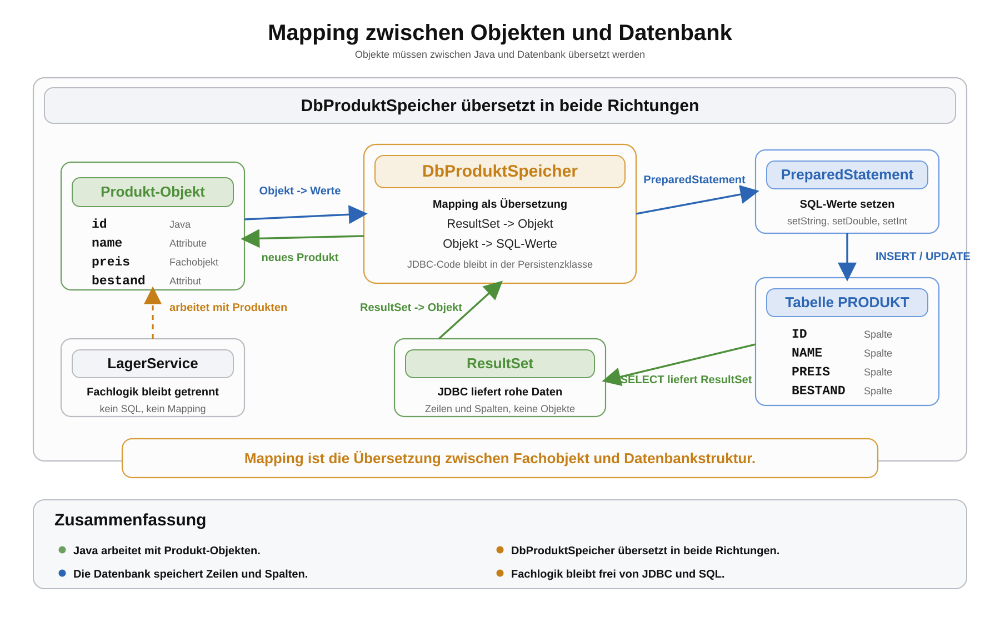

# Arbeitsblatt – Mapping zwischen Objekten und Datenbank

## Lernziele

- erklären, warum Java-Objekte nicht direkt in einer Datenbank existieren
- eine Tabellenzeile der Tabelle `PRODUKT` einem `Produkt`-Objekt zuordnen
- aus einem `ResultSet` ein `Produkt`-Objekt erzeugen
- ein `Produkt`-Objekt in ein `PreparedStatement` übertragen
- Unterschiede zwischen Java-Typen und SQL-Typen erkennen
- Mapping-Code als eigene Verantwortung im `DbProduktSpeicher` einordnen
- begründen, warum `Main` und `LagerService` keinen Mapping-Code enthalten sollen
- typische Fehler beim Lesen und Schreiben von Datenbankwerten erkennen

---

## Ausgangslage

Die bekannte Lagerverwaltung kann Produkte bereits in H2 speichern. Dafür gibt es eine konkrete Persistenzklasse:

```text
DbProduktSpeicher
```

Sie arbeitet mit JDBC und der Tabelle `PRODUKT`.

Wichtig ist nun eine Beobachtung:

```text
Ein Produkt-Objekt existiert im Java-Programm.
Eine Tabellenzeile existiert in der Datenbank.
Beides ist nicht dasselbe.
```

Darum braucht es Mapping. Mapping bedeutet hier: Werte werden zwischen Java-Objekt und Datenbankstruktur übersetzt.



---

## Objekt vs. Tabellenzeile

Ein Java-Objekt kann so aussehen:

```java
Produkt produkt = new Produkt(1, "Maus", 24.90, 10);
```

Die Datenbank speichert aber eine Zeile:

```text
ID | NAME | PREIS | BESTAND
1  | Maus | 24.9  | 10
```

Die Zuordnung ist einfach, aber sie passiert nicht automatisch.

| Java-Objekt | Datenbanktabelle |
|---|---|
| `produkt.getId()` | `ID` |
| `produkt.getName()` | `NAME` |
| `produkt.getPreis()` | `PREIS` |
| `produkt.getBestand()` | `BESTAND` |

Die Kernbotschaft:

```text
Jemand muss zwischen Fachobjekt und Datenbankzeile übersetzen.
```

---

## Mapping als Übersetzung

Beim Speichern geht die Richtung vom Objekt zur Datenbank:

```text
Produkt
-> Werte aus dem Objekt lesen
-> PreparedStatement befüllen
-> INSERT oder UPDATE ausführen
```

Beim Laden geht die Richtung von der Datenbank zum Objekt:

```text
ResultSet
-> Spaltenwerte lesen
-> neues Produkt erzeugen
-> Produkt an die Anwendung zurückgeben
```

JDBC liefert rohe Daten aus Tabellen. Aus diesen Werten muss der Java-Code wieder sinnvolle Objekte bauen.

---

## ResultSet zu Objekt

Ein `SELECT` liefert ein `ResultSet`.

Beispiel:

```java
private Produkt leseProdukt(ResultSet resultSet) throws SQLException {
    int id = resultSet.getInt("ID");
    String name = resultSet.getString("NAME");
    double preis = resultSet.getDouble("PREIS");
    int bestand = resultSet.getInt("BESTAND");

    return new Produkt(id, name, preis, bestand);
}
```

Diese Methode macht genau eine Sache:

```text
Sie übersetzt eine aktuelle ResultSet-Zeile in ein Produkt-Objekt.
```

Wichtig: Vor dem Lesen muss bei einem `ResultSet` bereits `next()` aufgerufen worden sein.

---

## Mehrere Produkte lesen

Wenn mehrere Produkte gelesen werden, wird jede Zeile einzeln übersetzt.

```java
public ArrayList<Produkt> ladeProdukte(String quelle) {
    ArrayList<Produkt> produkte = new ArrayList<>();

    String sql = "SELECT ID, NAME, PREIS, BESTAND FROM PRODUKT ORDER BY ID";

    try (Connection connection = verbindungHerstellen(quelle)) {
        tabelleErstellen(connection);

        try (PreparedStatement statement = connection.prepareStatement(sql);
             ResultSet resultSet = statement.executeQuery()) {

            while (resultSet.next()) {
                Produkt produkt = leseProdukt(resultSet);
                produkte.add(produkt);
            }
        }

        return produkte;
    } catch (SQLException exception) {
        throw new IllegalStateException("Produkte konnten nicht geladen werden.", exception);
    }
}
```

Die Schleife gehört zur Datenbank-Persistenz. Der `LagerService` bekommt danach normale `Produkt`-Objekte.

---

## Objekt zu PreparedStatement

Beim Speichern werden die Objektwerte in SQL-Platzhalter eingesetzt.

```java
private void setzeProduktWerte(PreparedStatement statement, Produkt produkt)
        throws SQLException {
    statement.setString(1, produkt.getName());
    statement.setDouble(2, produkt.getPreis());
    statement.setInt(3, produkt.getBestand());
}
```

Diese Methode passt zum SQL:

```sql
INSERT INTO PRODUKT (NAME, PREIS, BESTAND) VALUES (?, ?, ?)
```

Die Reihenfolge ist entscheidend:

| Platzhalter | Wert |
|---|---|
| `1` | `NAME` |
| `2` | `PREIS` |
| `3` | `BESTAND` |

---

## INSERT-Mapping

Beim Einfügen wird ein neues Produkt gespeichert.

```java
private void produktEinfuegen(Connection connection, Produkt produkt)
        throws SQLException {
    String sql = "INSERT INTO PRODUKT (NAME, PREIS, BESTAND) VALUES (?, ?, ?)";

    try (PreparedStatement statement = connection.prepareStatement(sql)) {
        setzeProduktWerte(statement, produkt);
        statement.executeUpdate();
    }
}
```

Die `ID` wird hier nicht gesetzt, weil die Datenbank sie mit `AUTO_INCREMENT` erzeugt.

---

## UPDATE-Mapping

Beim Aktualisieren wird zusätzlich die `ID` gebraucht, damit die richtige Zeile geändert wird.

```java
private void produktAktualisieren(Connection connection, Produkt produkt)
        throws SQLException {
    String sql = "UPDATE PRODUKT SET NAME = ?, PREIS = ?, BESTAND = ? WHERE ID = ?";

    try (PreparedStatement statement = connection.prepareStatement(sql)) {
        setzeProduktWerte(statement, produkt);
        statement.setInt(4, produkt.getId());
        statement.executeUpdate();
    }
}
```

Auch hier muss die Reihenfolge zur SQL-Anweisung passen.

---

## Java-Typen und SQL-Typen

Java und SQL verwenden ähnliche, aber nicht identische Typen.

| Java | SQL in dieser Einheit | Beispiel |
|---|---|---|
| `int` | `INT` | `ID`, `BESTAND` |
| `String` | `VARCHAR(100)` | `NAME` |
| `double` | `DOUBLE` | `PREIS` |

JDBC übernimmt die technische Umwandlung nicht völlig automatisch. Der Code muss passende Methoden verwenden:

- `getInt(...)` und `setInt(...)`
- `getString(...)` und `setString(...)`
- `getDouble(...)` und `setDouble(...)`

---

## Warum Mapping repetitiv wird

Mapping-Code wiederholt sich:

- Spaltennamen werden mehrfach verwendet.
- Werte werden beim Laden gelesen.
- Werte werden beim Speichern gesetzt.
- Fehler in Reihenfolge oder Namen sind leicht möglich.

Das ist einer der Gründe, warum es später Frameworks wie ORM gibt. In dieser Einheit werden sie bewusst nicht verwendet. Zuerst soll sichtbar werden, welches Problem solche Frameworks später lösen.

Nicht Ziel dieser Einheit:

- ORM
- Hibernate
- JPA
- Reflection
- generische Mapper
- Annotationen
- Spring Data

---

## Wo gehört Mapping-Code hin?

Für diese Lagerverwaltung gilt:

| Klasse | Verantwortung |
|---|---|
| `Produkt` | hält Produktdaten |
| `DbProduktSpeicher` | übersetzt zwischen Produkt und Tabelle `PRODUKT` |
| `LagerService` | enthält Fachlogik |
| `Main` | startet den Ablauf und verbindet Objekte |

Mapping gehört in den `DbProduktSpeicher`, weil er die Datenbankstruktur kennt.

Nicht in `Main`:

```text
Main soll keine ResultSet-Zeilen lesen.
Main soll keine PreparedStatements befüllen.
Main soll keine SQL-Details kennen.
```

Nicht in `LagerService`:

```text
LagerService soll mit Produkten arbeiten, nicht mit Tabellenzeilen.
```

---

## Typische Fehlerbilder

| Fehler | Folge |
|---|---|
| `ResultSet` ohne `next()` lesen | Es gibt keine aktuelle Zeile |
| falscher Spaltenname | `SQLException` oder falsche Daten |
| falscher Datentyp | Werte werden falsch gelesen oder es gibt Fehler |
| Platzhalter falsch befüllen | Daten landen in falschen Spalten |
| Mapping-Code in `Main` | Ablaufsteuerung und Persistenz vermischen sich |
| Fachlogik im Mapping | Speicherklasse entscheidet fachlich statt technisch |
| Objekt unvollständig erzeugen | Später fehlen Werte im Programm |
| Mapping-Code mehrfach kopieren | Änderungen werden fehleranfällig |

---

## Reflexion

Beantworte die Fragen schriftlich:

1. Warum existiert ein `Produkt`-Objekt nicht direkt in der Datenbank?
2. Welche Verantwortung besitzt `DbProduktSpeicher` beim Mapping?
3. Warum wird Mapping-Code schnell repetitiv?
4. Welche Teile des Codes sind beim Mapping besonders fehleranfällig?
5. Warum helfen klare Verantwortlichkeiten bei Datenbankcode?
6. Warum bleibt `LagerService` unverändert, obwohl die Datenbank mit Tabellen arbeitet?
