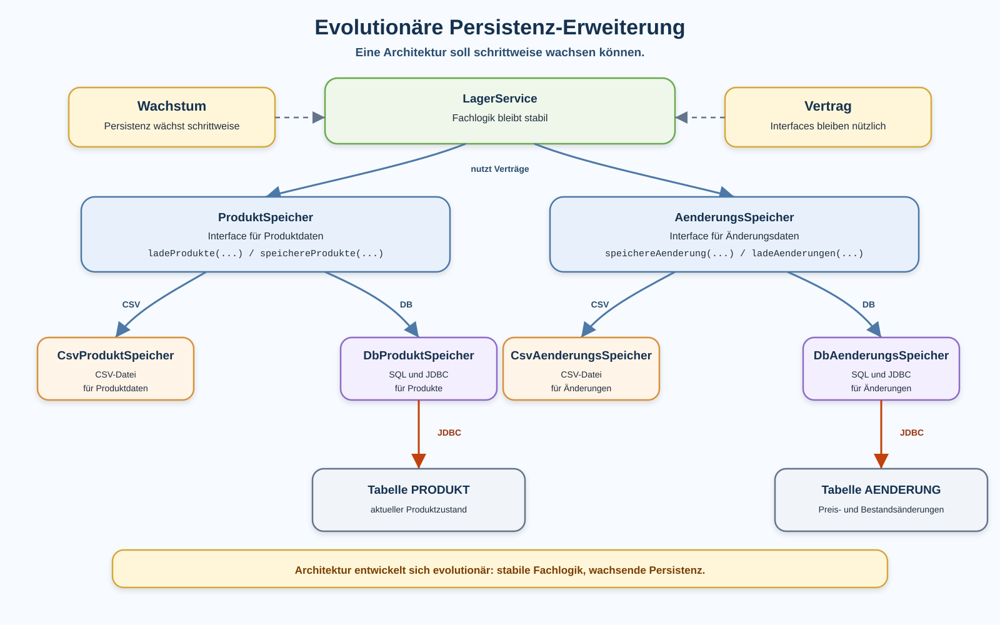

# Arbeitsblatt – Bestehende Persistenz auf Datenbank erweitern

## Lernziele

- erklären, warum Software schrittweise weiterentwickelt wird
- beschreiben, warum eine Architektur Wachstum aushalten soll
- bestehende Services und Fachlogik möglichst stabil halten
- eine weitere Persistenzklasse neben `DbProduktSpeicher` einordnen
- eine zusätzliche H2-Tabelle für Änderungsdaten lesen und erklären
- einfache JDBC-Muster aus `DbProduktSpeicher` wiederverwenden
- `ResultSet`-Daten in ein Objekt abbilden
- typische Fehler bei wachsender Persistenz erkennen

---

## Ausgangslage

Die bekannte Lagerverwaltung besitzt bereits eine erste Datenbank-Persistenz:

```text
ProduktSpeicher
├── CsvProduktSpeicher
└── DbProduktSpeicher
```

Damit können Produkte in CSV oder H2 gespeichert werden. Die Fachlogik liegt weiterhin im `LagerService`.

Jetzt wächst die Anwendung weiter. Neben Produkten sollen auch Änderungen dauerhaft gespeichert werden, zum Beispiel:

```text
Preisänderung: Maus von 24.90 auf 22.90
Bestandsänderung: Tastatur von 5 auf 8
```

Die Kernidee:

```text
Die Architektur soll Wachstum aushalten.
Neue Persistenzbereiche kommen dazu.
Services und Fachlogik bleiben möglichst stabil.
```



---

## Evolutionäre Weiterentwicklung

Evolutionär bedeutet hier: Die Anwendung wird nicht neu geschrieben, sondern Schritt für Schritt erweitert.

| Frage | Gute Weiterentwicklung |
|---|---|
| Muss `LagerService` komplett neu geschrieben werden? | Nein |
| Muss `Main` die SQL-Befehle kennen? | Nein |
| Darf eine neue Speicherklasse entstehen? | Ja |
| Darf eine neue Tabelle entstehen? | Ja |
| Soll die Fachlogik weiterhin getrennt bleiben? | Ja |

Eine gute Struktur erkennt man daran, dass eine neue Anforderung nicht überall Änderungen erzwingt.

---

## Bestehende Struktur erweitern

Bisher:

```text
Produkt
ProduktSpeicher
CsvProduktSpeicher
DbProduktSpeicher
LagerService
Main
```

Neu kommt ein weiterer Persistenzbereich dazu:

```text
AenderungsEintrag
AenderungsSpeicher
CsvAenderungsSpeicher
DbAenderungsSpeicher
```

Mögliche Gesamtstruktur:

```text
ProduktSpeicher
├── CsvProduktSpeicher
└── DbProduktSpeicher

AenderungsSpeicher
├── CsvAenderungsSpeicher
└── DbAenderungsSpeicher
```

`DbProduktSpeicher` kümmert sich um Produkte. `DbAenderungsSpeicher` kümmert sich um Änderungsdaten.

---

## Mehrere Tabellen

Eine Datenbank kann mehrere Tabellen enthalten.

```text
H2-Datenbank
├── PRODUKT
└── AENDERUNG
```

Für den Einstieg reicht eine einfache Tabelle `AENDERUNG`.

```sql
CREATE TABLE IF NOT EXISTS AENDERUNG (
    ID INT AUTO_INCREMENT PRIMARY KEY,
    PRODUKT_NAME VARCHAR(100) NOT NULL,
    ART VARCHAR(30) NOT NULL,
    ALTER_WERT VARCHAR(50) NOT NULL,
    NEUER_WERT VARCHAR(50) NOT NULL,
    ZEITPUNKT VARCHAR(30) NOT NULL
);
```

| Spalte | Bedeutung |
|---|---|
| `ID` | technische Nummer |
| `PRODUKT_NAME` | betroffenes Produkt |
| `ART` | zum Beispiel `PREIS` oder `BESTAND` |
| `ALTER_WERT` | Wert vor der Änderung |
| `NEUER_WERT` | Wert nach der Änderung |
| `ZEITPUNKT` | Zeitpunkt als einfacher Text |

Für diese Lerneinheit bleiben die Werte bewusst als Text gespeichert. So bleibt der Fokus auf Struktur und JDBC.

---

## `AenderungsEintrag`

Ein Änderungsobjekt hält die Daten einer Änderung.

```java
public class AenderungsEintrag {
    private final String produktName;
    private final String art;
    private final String alterWert;
    private final String neuerWert;
    private final String zeitpunkt;

    public AenderungsEintrag(String produktName, String art, String alterWert,
                             String neuerWert, String zeitpunkt) {
        this.produktName = produktName;
        this.art = art;
        this.alterWert = alterWert;
        this.neuerWert = neuerWert;
        this.zeitpunkt = zeitpunkt;
    }

    public String getProduktName() {
        return produktName;
    }

    public String getArt() {
        return art;
    }

    public String getAlterWert() {
        return alterWert;
    }

    public String getNeuerWert() {
        return neuerWert;
    }

    public String getZeitpunkt() {
        return zeitpunkt;
    }
}
```

Wichtig:

- Das Objekt enthält keine SQL-Befehle.
- Das Objekt öffnet keine Datenbankverbindung.
- Das Objekt hält nur Daten.

---

## `AenderungsSpeicher` als Vertrag

Auch Änderungsdaten können über ein Interface beschrieben werden.

```java
import java.util.ArrayList;

public interface AenderungsSpeicher {
    void speichereAenderung(AenderungsEintrag eintrag, String ziel);

    ArrayList<AenderungsEintrag> ladeAenderungen(String quelle);
}
```

CSV und Datenbank können denselben Vertrag erfüllen:

```text
AenderungsSpeicher speicher = new DbAenderungsSpeicher();
```

Die linke Seite ist der Vertrag. Die rechte Seite ist die konkrete Umsetzung.

---

## `DbAenderungsSpeicher`

`DbAenderungsSpeicher` enthält den JDBC-Code für Änderungsdaten.

```java
public class DbAenderungsSpeicher implements AenderungsSpeicher {
    @Override
    public void speichereAenderung(AenderungsEintrag eintrag, String ziel) {
        // INSERT in Tabelle AENDERUNG
    }

    @Override
    public ArrayList<AenderungsEintrag> ladeAenderungen(String quelle) {
        // SELECT aus Tabelle AENDERUNG
        return new ArrayList<>();
    }
}
```

Die Verantwortung ist ähnlich wie bei `DbProduktSpeicher`, aber für einen anderen Datenbereich.

---

## JDBC-Muster wiederverwenden

Viele JDBC-Schritte wiederholen sich:

```text
Verbindung herstellen
Tabelle erstellen
PreparedStatement vorbereiten
Werte setzen
SQL ausführen
ResultSet lesen
Ressourcen schliessen
```

Diese Wiederholung ist am Anfang hilfreich. Lernende erkennen dadurch ein Muster.

Noch nicht Ziel dieser Einheit:

- generische Basisklasse
- `GenericRepository`
- DAO-Framework
- Connection Pooling
- Dependency Injection

Zuerst soll klar sein, wo welcher Code hingehört.

---

## Änderung speichern

Ein einfacher `INSERT`:

```java
String sql = """
        INSERT INTO AENDERUNG
        (PRODUKT_NAME, ART, ALTER_WERT, NEUER_WERT, ZEITPUNKT)
        VALUES (?, ?, ?, ?, ?)
        """;
```

Die Werte werden mit `PreparedStatement` gesetzt:

```java
statement.setString(1, eintrag.getProduktName());
statement.setString(2, eintrag.getArt());
statement.setString(3, eintrag.getAlterWert());
statement.setString(4, eintrag.getNeuerWert());
statement.setString(5, eintrag.getZeitpunkt());
```

So bleibt SQL von konkreten Werten getrennt.

---

## Änderungen lesen

Ein einfacher `SELECT`:

```java
String sql = """
        SELECT PRODUKT_NAME, ART, ALTER_WERT, NEUER_WERT, ZEITPUNKT
        FROM AENDERUNG
        ORDER BY ID
        """;
```

Ein `ResultSet` wird Zeile für Zeile gelesen:

```java
while (resultSet.next()) {
    AenderungsEintrag eintrag = eintragAusResultSet(resultSet);
    eintraege.add(eintrag);
}
```

Die Umwandlung in ein Objekt nennt man Mapping.

---

## Mapping `ResultSet` zu Objekt

Eine kleine Hilfsmethode macht den Code lesbarer:

```java
private AenderungsEintrag eintragAusResultSet(ResultSet resultSet) throws SQLException {
    String produktName = resultSet.getString("PRODUKT_NAME");
    String art = resultSet.getString("ART");
    String alterWert = resultSet.getString("ALTER_WERT");
    String neuerWert = resultSet.getString("NEUER_WERT");
    String zeitpunkt = resultSet.getString("ZEITPUNKT");

    return new AenderungsEintrag(produktName, art, alterWert, neuerWert, zeitpunkt);
}
```

Wichtig: Spaltennamen im SQL und im Mapping müssen zusammenpassen.

---

## Änderungen nach Produkt filtern

Für eine gezielte Suche reicht ein einfaches `WHERE`.

```java
String sql = """
        SELECT PRODUKT_NAME, ART, ALTER_WERT, NEUER_WERT, ZEITPUNKT
        FROM AENDERUNG
        WHERE PRODUKT_NAME = ?
        ORDER BY ID
        """;
```

Auch hier wird der Wert nicht in den SQL-String eingebaut:

```java
statement.setString(1, produktName);
```

---

## CSV vs. Datenbank erneut vergleichen

| Frage | CSV | Datenbank |
|---|---|---|
| Wo liegen Produktdaten? | in einer Datei | in Tabelle `PRODUKT` |
| Wo liegen Änderungsdaten? | weitere Datei | Tabelle `AENDERUNG` |
| Wie wird gefiltert? | Datei lesen und selbst prüfen | `WHERE` |
| Was wächst schneller unübersichtlich? | viele Dateien und Parsing | viele Tabellen und SQL |
| Was bleibt wichtig? | klare Klassen | klare Klassen |

Die Technik ändert sich. Die Verantwortlichkeiten bleiben wichtig.

---

## Stabile Fachlogik trotz neuer Persistenz

`LagerService` soll fachliche Entscheidungen treffen:

```text
Darf verkauft werden?
Darf der Bestand negativ werden?
Wann entsteht eine Änderung?
```

`DbAenderungsSpeicher` soll speichern und laden:

```text
INSERT
SELECT
Mapping
Connection schliessen
```

Merksatz:

```text
Services entscheiden fachlich.
Speicherklassen speichern technisch.
Main steuert den Ablauf.
```

---

## Typische Fehlerbilder

| Fehlerbild | Warum es problematisch ist |
|---|---|
| JDBC-Code steht in `Main` | `Main` kennt zu viele technische Details |
| SQL und Fachlogik werden vermischt | Fachregeln sind schwer testbar |
| Mapping-Code wird mehrfach kopiert | Änderungen müssen an vielen Stellen gemacht werden |
| Tabellenstruktur und Objektstruktur werden verwechselt | Datenbank und Java-Klassen haben unterschiedliche Aufgaben |
| `Connection` wird nicht geschlossen | Ressourcen bleiben offen |
| Services werden mit SQL aufgebläht | Fachlogik und Persistenz sind nicht mehr getrennt |
| Speicherklassen entscheiden fachlich | technische Klassen bekommen falsche Verantwortung |
| unnötige neue Abstraktionen entstehen | die Struktur wird für EFZ-Niveau zu schwer |

---

## Reflexion

Beantworte kurz:

1. Welche Teile der Anwendung blieben stabil?
2. Welche Klassen mussten erweitert oder ergänzt werden?
3. Warum helfen Interfaces weiterhin?
4. Welche Struktur wurde durch die zweite Tabelle schwieriger?
5. Welche Wiederholungen im JDBC-Code fallen auf?
6. Wann könnte weiteres Refactoring sinnvoll werden?

---

## Ausblick

Wenn mehrere Datenbank-Speicherklassen entstehen, fallen Wiederholungen auf. Später kann man überlegen, welche Hilfsmethoden oder kleinen gemeinsamen Bausteine sinnvoll wären.

Für diese Einheit bleibt der Fokus aber klar:

```text
Bestehende Architektur beobachten.
Persistenz schrittweise erweitern.
Fachlogik und Persistenz getrennt halten.
Keine grosse Framework-Architektur einführen.
```
