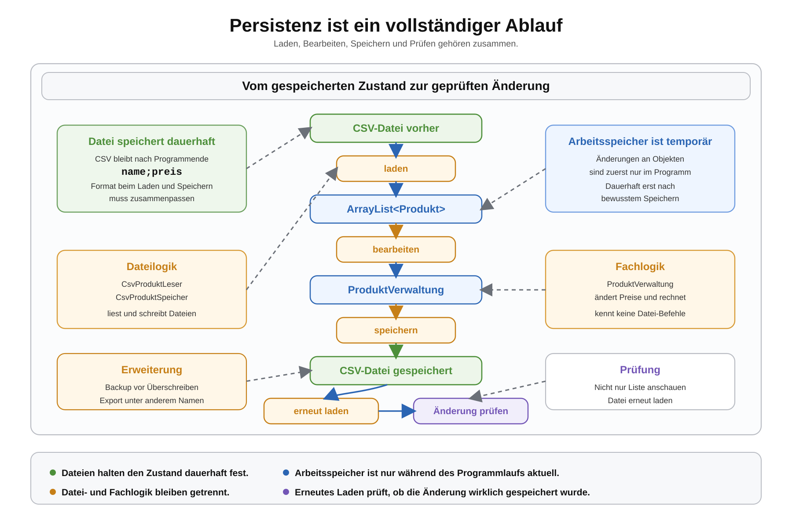

# Arbeitsblatt – Persistenzablauf vertiefen

## Lernziele

- Persistenz als vollständigen Ablauf erklären
- zwischen Daten im Arbeitsspeicher und Daten in einer Datei unterscheiden
- erklären, warum Änderungen bewusst gespeichert werden müssen
- geladene Produkte in einer `ArrayList<Produkt>` bearbeiten
- eine geänderte Produktliste speichern und erneut laden
- prüfen, ob Änderungen nach dem erneuten Laden erhalten geblieben sind
- Speicher- und Ladeformat bewusst vergleichen
- einfache Fehlerfälle beim Persistenzablauf erkennen
- Datei- und Fachlogik weiterhin getrennt halten

---

## Ausgangslage

In den letzten Einheiten wurden Produktdaten aus CSV-Dateien geladen und wieder als CSV-Dateien gespeichert.

Jetzt wird daraus ein vollständiger Ablauf:

```text
produkte.csv
-> laden
-> ArrayList<Produkt>
-> bearbeiten
-> speichern
-> erneut laden
-> prüfen
```



Die Kernidee ist: Persistenz ist nicht nur ein einzelner Datei-Befehl. Persistenz ist ein kontrollierter Ablauf, bei dem der Zustand einer Anwendung aus einer Datei geladen, im Arbeitsspeicher verändert und wieder dauerhaft gespeichert wird.

---

## Arbeitsspeicher und Datei

Eine `ArrayList<Produkt>` liegt im Arbeitsspeicher. Sie existiert während das Programm läuft.

Eine CSV-Datei liegt dauerhaft im Projektordner, zum Beispiel unter:

```text
data/produkte.csv
```

Wenn ein Produkt in der `ArrayList` verändert wird, ändert sich die Datei nicht automatisch.

Beispiel:

```java
produkt.setPreis(34.90);
```

Diese Änderung betrifft zuerst nur das Objekt im Arbeitsspeicher. Erst wenn die Liste gespeichert wird, landet die Änderung in der CSV-Datei.

---

## Zustand einer Anwendung

Der Zustand einer Anwendung beschreibt die aktuellen Daten, mit denen das Programm arbeitet.

In der Produktverwaltung gehören zum Zustand zum Beispiel:

- welche Produkte geladen sind
- welche Preise die Produkte haben
- ob ein neues Produkt hinzugefügt wurde
- ob eine Preisänderung durchgeführt wurde

Dieser Zustand kann im Arbeitsspeicher liegen oder in einer Datei gespeichert sein.

Wichtig:

```text
Arbeitsspeicher: aktueller Zustand während des Programmlaufs
CSV-Datei: gespeicherter Zustand für später
```

---

## Vollständiger Persistenzablauf

Ein vollständiger Ablauf kann so aussehen:

```text
1. Produkte aus data/produkte.csv laden
2. Gesamtwert vor der Änderung berechnen
3. Neues Produkt hinzufügen
4. Preis eines bestehenden Produkts ändern
5. Geänderte Produktliste speichern
6. Datei erneut laden
7. Anzahl, Preise und Gesamtwert prüfen
```

Dadurch wird sichtbar, ob die Änderung nur im Arbeitsspeicher passiert ist oder wirklich dauerhaft gespeichert wurde.

---

## Bekannte Klassen

Die bekannte Produktverwaltung kann weiterverwendet werden.

| Klasse | Aufgabe |
|---|---|
| `Produkt` | speichert Name und Preis |
| `ProduktVerwaltung` | sucht, ergänzt, ändert und berechnet Produkte |
| `CsvProduktLeser` | liest CSV-Zeilen und erzeugt Produkte |
| `CsvProduktSpeicher` | wandelt Produkte in CSV-Zeilen um und schreibt die Datei |
| `Main` | startet den Ablauf und zeigt Resultate an |

`ProduktVerwaltung` soll nicht wissen, wie eine Datei gelesen oder geschrieben wird.

`CsvProduktLeser` und `CsvProduktSpeicher` sollen keinen Gesamtwert berechnen. Das bleibt Fachlogik.

---

## Beispiel: Produkt bearbeiten

Eine einfache Methode in der Produktverwaltung kann den Preis eines Produkts ändern.

```java
public boolean aenderePreis(String name, double neuerPreis) {
    for (Produkt produkt : produkte) {
        if (produkt.getName().equals(name)) {
            produkt.setPreis(neuerPreis);
            return true;
        }
    }

    return false;
}
```

Die Methode gibt `true` zurück, wenn ein Produkt gefunden wurde. Wenn kein Produkt mit diesem Namen existiert, gibt sie `false` zurück.

Das ist besser als eine stille Änderung ohne Rückmeldung.

---

## Speicher- und Ladeformat

Laden und Speichern müssen dasselbe Format verwenden.

Für diese Einheit verwenden wir:

```text
name;preis
Tastatur;79.90
Monitor;249.00
Maus;39.50
```

Die erste Zeile ist eine Kopfzeile. Sie beschreibt die Spalten und wird nicht als Produkt geladen.

Wichtig:

- Trennzeichen bleibt `;`
- Reihenfolge bleibt `name` vor `preis`
- der Preis bleibt mit `Double.parseDouble(...)` lesbar
- Kopfzeile wird beim Laden übersprungen

Wenn der Speicher `name;preis` schreibt, muss der Leser genau damit umgehen können.

---

## Änderungen prüfen

Nach dem Speichern wird die Datei erneut geladen.

Nicht ausreichend:

```text
Produkt in der bestehenden ArrayList prüfen
```

Besser:

```text
Datei speichern
-> Datei erneut laden
-> neu geladene Liste prüfen
```

So wird kontrolliert, ob die Datei wirklich den neuen Zustand enthält.

Beispielausgabe:

```text
Anzahl vorher: 3
Gesamtwert vorher: 368.4
Preis geändert: Maus
Produkt hinzugefügt: Webcam
Anzahl nachher: 4
Gesamtwert nachher: 453.7
```

---

## Fehlerfälle

Bei einem Persistenzablauf können mehrere einfache Fehler auftreten.

| Fehlerfall | Sinnvolle Behandlung |
|---|---|
| Produkt wird geändert, aber nicht gespeichert | nach dem Speichern erneut laden und prüfen |
| Produktname wird nicht gefunden | `false` zurückgeben und Meldung ausgeben |
| CSV-Zeile ist fehlerhaft | Zeile überspringen und mitzählen |
| leere Produktliste wird gespeichert | Datei darf leer oder nur mit Kopfzeile sein |
| Zielordner fehlt | einfache Fehlermeldung ausgeben |
| Format passt nicht | Kopfzeile, Trennzeichen und Spalten vergleichen |

Für diese Einheit reichen einfache Meldungen. Komplexe Exception-Strukturen werden noch nicht benötigt.

---

## Backup und Export

Wenn eine Datei gespeichert wird, kann eine bestehende Datei überschrieben werden.

Vor dem Überschreiben kann eine Backup-Datei erzeugt werden:

```text
data/produkte.csv
data/produkte-backup.csv
```

Die Backup-Datei enthält den alten Stand. Die Hauptdatei enthält nach dem Speichern den neuen Stand.

Eine Exportdatei ist etwas anderes. Sie speichert denselben oder einen ausgewählten Zustand unter einem anderen Namen:

```text
data/produkte-export.csv
```

So kann eine Liste exportiert werden, ohne die Hauptdatei zu verändern.

---

## Typische Fehler

- Änderung wird nicht gespeichert
- Speicher- und Ladeformat passen nicht zusammen
- alles landet wieder in `main`
- Datei wird unbewusst überschrieben
- Preis bleibt `String` statt `double`
- Änderungen passieren an der falschen Liste
- leere oder fehlerhafte Zeilen werden ignoriert, ohne gezählt zu werden
- Zielordner existiert nicht
- Datei- und Fachlogik werden vermischt

---

## Reflexion

Beantworte kurz:

1. Warum reicht Laden alleine nicht für Persistenz?
2. Warum müssen Änderungen bewusst gespeichert werden?
3. Warum ist ein Backup vor dem Überschreiben sinnvoll?
4. Warum sollten Datei- und Fachlogik getrennt bleiben?
5. Was bedeutet Zustand einer Anwendung?

---

## Ausblick

Diese Einheit bereitet spätere Architektur- und Schichten-Themen vor.

Im Moment reicht diese einfache Trennung:

```text
Main
-> ProduktVerwaltung
-> CsvProduktLeser / CsvProduktSpeicher
-> CSV-Datei
```

Später kann daraus eine klarere Architektur mit Schichten entstehen. Dann werden Begriffe wie Service, Persistenzschicht oder Repository-Idee eingeordnet. Datenbanken, ORM, Spring und komplexe Frameworks werden hier bewusst noch nicht behandelt.
