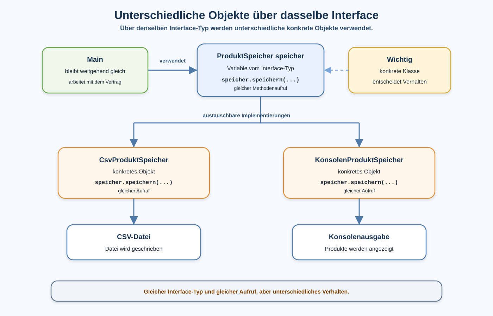

# Arbeitsblatt – Unterschiedliche Objekte über dasselbe Interface verwenden

## Lernziele

- erklären, dass eine Variable vom Interface-Typ unterschiedliche konkrete Objekte enthalten kann
- `ProduktSpeicher` als Typ für `CsvProduktSpeicher` und `KonsolenProduktSpeicher` verwenden
- erkennen, dass der Methodenaufruf gleich bleibt
- beobachten, dass die konkrete Klasse das Verhalten bestimmt
- Vertrag, Variable, konkretes Objekt und Verhalten unterscheiden
- einfache Polymorphie praktisch beschreiben, ohne komplexe Theorie zu verwenden

---

## Ausgangslage

Die Produktverwaltung kennt bereits ein Interface:

```java
public interface ProduktSpeicher {
    void speichern(ArrayList<Produkt> produkte, String dateipfad);
}
```

Für vollständigen Java-Code brauchst du passende Imports für `ArrayList` und `Produkt`.

Zwei Klassen erfüllen diesen Vertrag:

```java
public class CsvProduktSpeicher implements ProduktSpeicher {
    @Override
    public void speichern(ArrayList<Produkt> produkte, String dateipfad) {
        // Produkte als CSV-Datei speichern
    }
}
```

```java
public class KonsolenProduktSpeicher implements ProduktSpeicher {
    @Override
    public void speichern(ArrayList<Produkt> produkte, String dateipfad) {
        // Produkte auf der Konsole ausgeben
    }
}
```

Die neue Idee dieser Einheit:

```text
Eine Variable hat den Interface-Typ.
In dieser Variable kann ein unterschiedliches konkretes Objekt stecken.
Der Methodenaufruf bleibt gleich.
Die konkrete Klasse entscheidet, welcher Code ausgeführt wird.
```



---

## Theorie: Interface-Typ und konkretes Objekt

Eine Variable kann den Typ des Interfaces haben:

```java
ProduktSpeicher speicher;
```

Diese Variable sagt:

```text
Hier darf jedes Objekt stehen, das ProduktSpeicher implementiert.
```

Darum sind beide Zuweisungen erlaubt:

```java
speicher = new CsvProduktSpeicher();
```

```java
speicher = new KonsolenProduktSpeicher();
```

Wichtig ist:

| Teil | Beispiel | Bedeutung |
|---|---|---|
| Interface-Typ | `ProduktSpeicher` | welche Methoden über die Variable bekannt sind |
| konkretes Objekt | `new CsvProduktSpeicher()` | welche Klasse wirklich verwendet wird |
| Methodenaufruf | `speicher.speichern(...)` | bleibt gleich |
| Verhalten | CSV-Datei oder Konsole | kommt von der konkreten Klasse |

---

## Beispiel: Gleiche Variable, anderes Objekt

In `Main` kann zuerst der CSV-Speicher verwendet werden:

```java
ProduktSpeicher speicher = new CsvProduktSpeicher();
speicher.speichern(produkte, "data/produkte.csv");
```

Später kann dieselbe Variable ein anderes passendes Objekt enthalten:

```java
speicher = new KonsolenProduktSpeicher();
speicher.speichern(produkte, "data/produkte.csv");
```

Der Aufruf bleibt gleich:

```java
speicher.speichern(produkte, "data/produkte.csv");
```

Das Verhalten ist unterschiedlich:

| Konkretes Objekt | Gleicher Aufruf | Wirkung |
|---|---|---|
| `new CsvProduktSpeicher()` | `speicher.speichern(...)` | schreibt eine CSV-Datei |
| `new KonsolenProduktSpeicher()` | `speicher.speichern(...)` | gibt Produkte auf der Konsole aus |

---

## Verhalten beobachten

Der folgende Code ist bewusst klein gehalten:

```java
ArrayList<Produkt> produkte = new ArrayList<>();
produkte.add(new Produkt("Maus", 34.90));
produkte.add(new Produkt("Tastatur", 79.90));

ProduktSpeicher speicher = new CsvProduktSpeicher();
speicher.speichern(produkte, "data/produkte.csv");

speicher = new KonsolenProduktSpeicher();
speicher.speichern(produkte, "data/produkte.csv");
```

Was passiert?

1. Beim ersten Aufruf steckt ein `CsvProduktSpeicher` in der Variable.
2. Beim zweiten Aufruf steckt ein `KonsolenProduktSpeicher` in der gleichen Variable.
3. Der Methodenaufruf sieht gleich aus.
4. Java führt den Code der konkreten Klasse aus, die gerade im Objekt steckt.

Dieses Beispiel dient zum Beobachten. Es zeigt bewusst beide Varianten nacheinander, damit der Unterschied sichtbar wird.

Das nennt man später Polymorphie.

Für diese Einheit reicht der Merksatz:

```text
Gleicher Interface-Typ, gleicher Aufruf, konkretes Objekt entscheidet das Verhalten.
```

Wir beobachten zuerst das Verhalten. Den Fachbegriff Polymorphie merken wir uns danach.

---

## Main bleibt übersichtlich

`Main` muss nicht die interne Speicherlogik kennen.

`Main` muss nur wissen:

```text
Ich habe einen ProduktSpeicher.
Ich kann speichern(...) aufrufen.
```

Nicht in `Main` gehören:

- CSV-Zeilen zusammensetzen
- Datei schreiben
- Konsolenausgabe im Detail aufbauen
- Fallunterscheidungen für jede Speicherart

So bleibt `Main` einfach:

```java
ProduktSpeicher speicher = new CsvProduktSpeicher();
speicher.speichern(produkte, "data/produkte.csv");
```

Oder:

```java
ProduktSpeicher speicher = new KonsolenProduktSpeicher();
speicher.speichern(produkte, "data/produkte.csv");
```

Nur die konkrete Klasse rechts von `new` wird gewechselt.

---

## Vertrag und Verhalten trennen

Das Interface legt den Vertrag fest:

```java
void speichern(ArrayList<Produkt> produkte, String dateipfad);
```

Die konkrete Klasse legt das Verhalten fest:

```text
CsvProduktSpeicher schreibt eine Datei.
KonsolenProduktSpeicher schreibt auf die Konsole.
```

Darum bedeutet gleicher Methodenname nicht automatisch gleiches Verhalten.

Gleich bleibt:

- Methodenname
- Parameter
- Rückgabetyp
- Interface-Typ in `Main`

Unterschiedlich ist:

- konkrete Klasse
- ausgeführter Code
- sichtbare Auswirkung

---

## Typische Fehlerbilder

| Fehlerbild | Warum es problematisch ist |
|---|---|
| `ProduktSpeicher` wird direkt mit `new ProduktSpeicher()` erzeugt | ein Interface kann nicht direkt instanziiert werden |
| Variable wird als `CsvProduktSpeicher` deklariert | dann passt ein `KonsolenProduktSpeicher` nicht in dieselbe Variable |
| Interface und konkrete Klasse werden verwechselt | Vertrag und Umsetzung bleiben unklar |
| `Main` enthält `if`-Abfragen für jede Speicherart | die einfache Austauschbarkeit wird verdeckt |
| beide Implementierungen werden mit gleichem Verhalten erwartet | die konkrete Klasse bestimmt die Wirkung |
| die Methodensignatur wird geändert | der gemeinsame Vertrag wird verletzt |
| zu viele neue Implementierungen werden gleichzeitig eingeführt | der Fokus auf Polymorphie geht verloren |

---

## Nicht Ziel dieser Einheit

Bewusst nicht behandelt werden:

- abstrakte Klassen
- `instanceof`
- Downcasting
- komplexe Vererbung
- Spring
- Dependency Injection
- Factory
- Datenbank
- formale UML
- Generics-Vertiefung

Diese Einheit bleibt bei praktischer Beobachtung.

---

## Reflexion

Beantworte am Ende schriftlich:

1. Was bleibt gleich, wenn die konkrete Klasse gewechselt wird?
2. Was verändert sich sichtbar?
3. Warum hilft das Interface bei austauschbaren Implementierungen?
4. Warum sprechen wir hier von unterschiedlichem Verhalten?
5. Welche weitere Implementierung wäre später denkbar?

---

## Vorsichtiger Ausblick

Der Fachbegriff für diese Idee ist Polymorphie.

Kurz und praktisch:

```text
Eine Variable hat einen gemeinsamen Typ.
Zur Laufzeit kann darin ein konkretes Objekt stecken.
Der gleiche Aufruf kann je nach Objekt unterschiedlich ausgeführt werden.
```

Später wird diese Idee bei Services, Tests und Erweiterungen wichtig. In dieser Einheit bleibt der Fokus bei `ProduktSpeicher`, `CsvProduktSpeicher`, `KonsolenProduktSpeicher` und `Main`.
