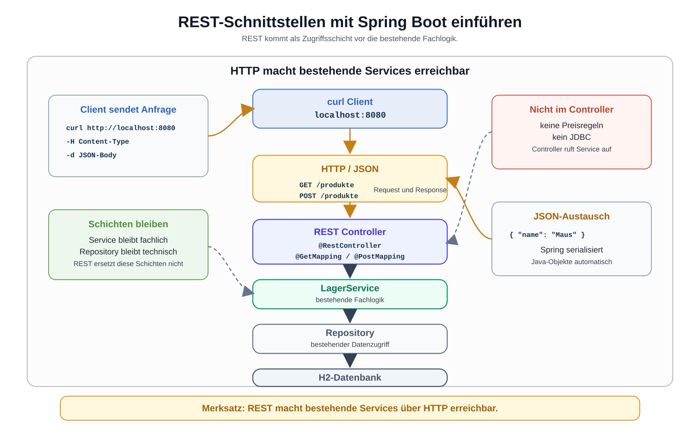

# Arbeitsblatt – REST-Schnittstellen mit Spring Boot einführen

## Lernziele

- REST als zusätzliche Zugriffsschicht über der bestehenden Lagerverwaltung erklären
- Client und Server in einer einfachen Spring-Boot-Anwendung unterscheiden
- HTTP Request und HTTP Response an einem konkreten Beispiel beschreiben
- URL, Endpoint, HTTP-Methode und JSON auseinanderhalten
- einen `@RestController` als Einstiegspunkt für HTTP-Anfragen einordnen
- `@GetMapping` und `@PostMapping` für einfache Endpunkte lesen
- verstehen, dass Spring Boot Java-Objekte automatisch als JSON ausgeben kann
- bestehende Service-Klassen aus einem REST Controller weiterverwenden
- einfache REST-Aufrufe mit `curl` gegen `localhost:8080` ausführen
- typische Fehler beim ersten REST-Einstieg erkennen

---

## Ausgangslage

Die bekannte Lagerverwaltung hat inzwischen eine klare Architektur:

```text
Main
-> LagerService
-> ProduktRepository
-> JDBC / H2
```

Der `LagerService` enthält die Fachlogik. Das Repository kümmert sich um den Datenzugriff. JDBC und H2 sind technische Infrastruktur.

Jetzt kommt eine neue Zugriffsschicht dazu:

```text
curl Client
-> HTTP / JSON
-> REST Controller
-> LagerService
-> ProduktRepository
-> JDBC / H2
```

Wichtig:

```text
Die bestehende Architektur bleibt erhalten.
REST kommt nur als neue Zugriffsschicht vorne dazu.
```



---

## Client und Server

Ein Client sendet eine Anfrage. Ein Server verarbeitet die Anfrage und sendet eine Antwort zurück.

In dieser Einheit ist die Spring-Boot-Anwendung der Server:

```text
Server: Spring Boot auf localhost:8080
```

`curl` ist ein einfacher Client:

```text
Client: curl im Terminal
```

Beispiel:

```bash
curl http://localhost:8080/produkte
```

Der Client fragt Daten an. Der Server ruft intern den passenden Controller auf. Der Controller verwendet den bestehenden Service.

---

## HTTP Request und HTTP Response

Eine HTTP-Anfrage heisst Request. Eine HTTP-Antwort heisst Response.

Beispiel für einen Request:

```text
GET /produkte
Host: localhost:8080
```

Beispiel für eine Response:

```json
[
  {
    "id": 1,
    "name": "Tastatur",
    "preis": 49.9
  }
]
```

Für den Einstieg reicht:

| Begriff | Bedeutung |
|---|---|
| Request | Anfrage vom Client an den Server |
| Response | Antwort vom Server an den Client |
| `GET` | Daten lesen |
| `POST` | Daten senden oder neu anlegen |
| URL | Adresse, die aufgerufen wird |
| Body | Inhalt einer Anfrage oder Antwort |

---

## URL und Endpoint

Eine URL ist eine vollständige Adresse:

```text
http://localhost:8080/produkte
```

Ein Endpoint ist der fachlich interessante Teil der REST-Schnittstelle:

```text
/produkte
```

In dieser Einheit verwenden wir einfache Endpoints:

| HTTP-Methode | Endpoint | Bedeutung |
|---|---|---|
| `GET` | `/produkte` | alle Produkte lesen |
| `GET` | `/produkte/1` | ein Produkt über die ID lesen |
| `POST` | `/produkte` | ein neues Produkt senden |

---

## JSON

JSON ist ein Textformat für Daten. REST-Schnittstellen verwenden JSON häufig, damit Clients und Server Daten austauschen können.

Ein Produkt als JSON:

```json
{
  "id": 1,
  "name": "Tastatur",
  "preis": 49.9
}
```

Eine Liste von Produkten als JSON:

```json
[
  {
    "id": 1,
    "name": "Tastatur",
    "preis": 49.9
  },
  {
    "id": 2,
    "name": "Maus",
    "preis": 24.9
  }
]
```

Merke:

```text
JSON ist nicht Java-Code.
JSON ist nicht SQL.
JSON ist das Austauschformat zwischen Client und Server.
```

---

## REST-Grundidee

REST beschreibt eine einfache Art, fachliche Dinge über HTTP erreichbar zu machen.

Für die Lagerverwaltung bedeutet das:

```text
Produkte sind über /produkte erreichbar.
```

Die HTTP-Methode zeigt, was passieren soll:

```text
GET /produkte    -> Produkte lesen
POST /produkte   -> Produkt senden
```

REST ersetzt den `LagerService` nicht. REST macht den bestehenden Service über HTTP erreichbar.

---

## `@RestController`

Ein REST Controller ist eine Klasse, die HTTP-Anfragen entgegennimmt.

Beispiel:

```java
package ch.allianz.youngoitv.lager.api;

import ch.allianz.youngoitv.lager.LagerService;
import ch.allianz.youngoitv.lager.model.Produkt;
import java.util.List;
import org.springframework.web.bind.annotation.GetMapping;
import org.springframework.web.bind.annotation.PostMapping;
import org.springframework.web.bind.annotation.RequestBody;
import org.springframework.web.bind.annotation.RequestMapping;
import org.springframework.web.bind.annotation.RestController;

@RestController
@RequestMapping("/produkte")
public class ProduktController {

    private final LagerService lagerService;

    public ProduktController(LagerService lagerService) {
        this.lagerService = lagerService;
    }

    @GetMapping
    public List<Produkt> alleProdukte() {
        return lagerService.alleProdukte();
    }

    @PostMapping
    public Produkt produktErstellen(@RequestBody Produkt produkt) {
        return lagerService.produktErstellen(produkt);
    }
}
```

Wichtig:

- Der Controller enthält keine Preisregeln.
- Der Controller spricht nicht direkt mit JDBC.
- Der Controller ruft den bestehenden Service auf.
- Spring Boot wandelt Rückgabewerte automatisch in JSON um.

Damit Spring Boot den `LagerService` in den Controller einsetzen kann, muss der Service für Spring bekannt sein. Für diesen Einstieg reicht eine einfache Annotation:

```java
import org.springframework.stereotype.Service;

@Service
public class LagerService {
    // bestehende Fachlogik
}
```

Das ändert die fachliche Aufgabe des Service nicht. Der Service bleibt die Schicht für Fachlogik.

---

## `@GetMapping`

`@GetMapping` verbindet eine Java-Methode mit einer HTTP-GET-Anfrage.

```java
@GetMapping
public List<Produkt> alleProdukte() {
    return lagerService.alleProdukte();
}
```

Wenn der Controller auf `/produkte` liegt, passt diese Methode zu:

```text
GET /produkte
```

Mit `curl`:

```bash
curl http://localhost:8080/produkte
```

---

## `@PostMapping`

`@PostMapping` verbindet eine Java-Methode mit einer HTTP-POST-Anfrage.

```java
@PostMapping
public Produkt produktErstellen(@RequestBody Produkt produkt) {
    return lagerService.produktErstellen(produkt);
}
```

`@RequestBody` bedeutet:

```text
Spring liest JSON aus dem Request Body
und erzeugt daraus ein Java-Objekt.
```

Mit `curl`:

```bash
curl -X POST http://localhost:8080/produkte \
  -H "Content-Type: application/json" \
  -d '{"name":"Maus","preis":24.9}'
```

---

## Automatische JSON-Ausgabe

Wenn eine Controller-Methode ein Java-Objekt zurückgibt, erzeugt Spring Boot daraus automatisch JSON.

Java-Rückgabe:

```java
return lagerService.alleProdukte();
```

HTTP-Antwort:

```json
[
  {
    "id": 1,
    "name": "Tastatur",
    "preis": 49.9
  }
]
```

Du schreibst für diesen Einstieg keinen eigenen JSON-Parser und keinen eigenen JSON-Generator.

---

## `curl` verwenden

`curl` ist ein kleines Werkzeug für HTTP-Anfragen im Terminal.

GET:

```bash
curl http://localhost:8080/produkte
```

POST mit JSON:

```bash
curl -X POST http://localhost:8080/produkte \
  -H "Content-Type: application/json" \
  -d '{"name":"Tastatur","preis":49.9}'
```

Statuscode anzeigen:

```bash
curl -i http://localhost:8080/produkte
```

Der Header `Content-Type: application/json` sagt dem Server:

```text
Der Request Body enthält JSON.
```

---

## Typische Fehler

| Fehler | Problem |
|---|---|
| Fachlogik im Controller | Regeln werden aus dem Service herausgerissen |
| Repository direkt im Controller | Schichten werden übersprungen |
| falsche URL | der Endpoint wird nicht gefunden |
| fehlender `Content-Type` | Spring erkennt den JSON-Body nicht zuverlässig |
| ungültiges JSON | der Request kann nicht gelesen werden |
| zu grosser Controller | Controller übernimmt zu viele Verantwortungen |
| Spring Boot und Fachlogik vermischt | Infrastruktur und Fachregeln werden unklar |
| `curl` falsch geschrieben | Anfrage erreicht den erwarteten Endpoint nicht |

---

## Nicht-Ziele dieser Einheit

Bewusst noch nicht behandelt werden:

- Security
- Login, Rollen oder Tokens
- JPA oder Hibernate
- Spring Data
- DTOs
- Validation
- Swagger oder OpenAPI
- Lombok
- komplexe Fehlerbehandlung
- globale Exception Handler
- REST-Tests
- Frontend-Anbindung

Diese Themen werden später sinnvoll, wenn die Grundidee der REST-Zugriffsschicht sitzt.

---

## Reflexion

Beantworte kurz:

1. Welche Schicht ist neu dazugekommen?
2. Warum bleibt der `LagerService` trotz REST wichtig?
3. Warum soll der Controller nicht direkt mit dem Repository sprechen?
4. Welche Rolle spielt JSON?
5. Warum ist `curl` zum Lernen hilfreich?
