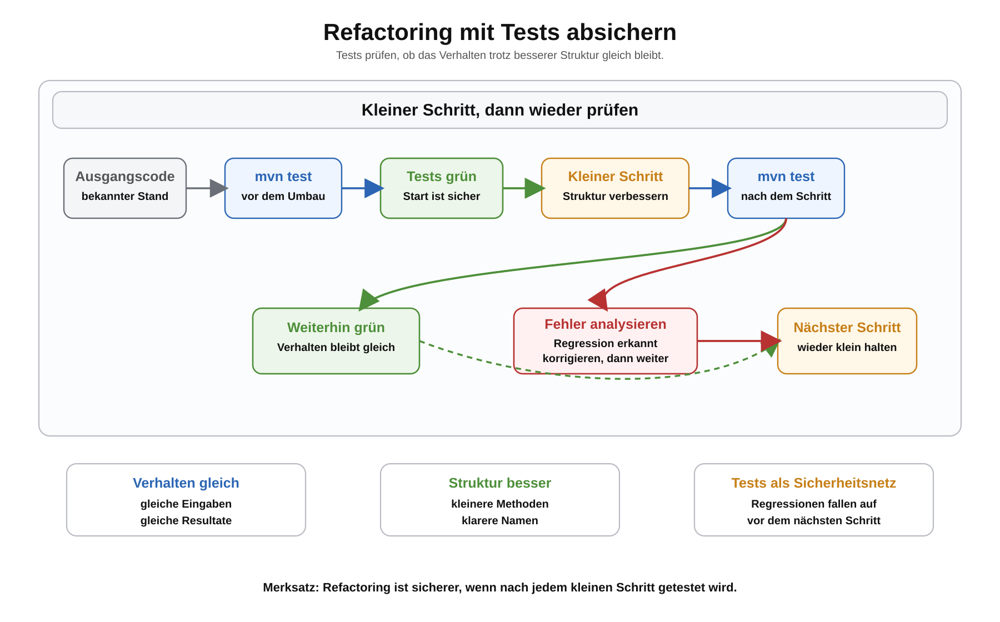

# Arbeitsblatt – Refactoring mit Tests absichern

## Lernziele

- Refactoring als Verbesserung der Code-Struktur erklären
- Verhalten und Struktur unterscheiden
- Tests vor und nach einer Änderung mit `mvn test` ausführen
- automatisierte Tests als Sicherheitsnetz nutzen
- kleine Refactoring-Schritte planen
- `main` von Fachlogik entlasten
- lange Methoden in kleinere Methoden aufteilen
- sprechende Methodennamen wählen
- einfache Duplikate erkennen und reduzieren
- Regressionen nach Änderungen vermeiden

---

## Ausgangslage

In den letzten Einheiten wurden JUnit-Tests eingeführt.

Ein Test prüft zum Beispiel:

```java
@Test
void berechneRabattpreis_mitZehnProzent_liefertReduziertenPreis() {
    ProduktVerwaltung verwaltung = new ProduktVerwaltung();

    assertEquals(9000, verwaltung.berechneRabattpreis(10000, 10));
}
```

Dieser Test beschreibt ein erwartetes Verhalten:

```text
10000 Rappen mit 10 Prozent Rabatt ergeben 9000 Rappen.
```

Beim Refactoring soll dieses Verhalten gleich bleiben. Nur die Struktur des Codes wird verbessert.

---

## Was bedeutet Refactoring?

Refactoring bedeutet:

```text
Code verbessern, ohne das gewünschte Verhalten absichtlich zu ändern.
```

Beispiele:

- eine lange Methode aufteilen
- doppelte Berechnungen entfernen
- schlechte Methodennamen verbessern
- Fachlogik aus `main` herausnehmen
- kleine Methoden mit klaren Rückgabewerten schreiben

Refactoring ist keine neue Funktion. Ein Refactoring soll den Code verständlicher und wartbarer machen.

---

## Verhalten und Struktur

Beim Refactoring ist der Unterschied wichtig:

| Begriff | Bedeutung | Beispiel |
|---|---|---|
| Verhalten | Was das Programm liefert | Rabattpreis ist `9000` |
| Struktur | Wie der Code aufgebaut ist | Berechnung liegt in einer Methode |

Wenn sich die Struktur verbessert und die Tests weiterhin grün sind, ist das ein gutes Zeichen.



---

## Tests als Sicherheitsnetz

Vor dem Refactoring:

```bash
mvn test
```

Wenn die Tests grün sind, ist der aktuelle Stand abgesichert.

Danach wird nur ein kleiner Schritt geändert. Anschliessend wird wieder geprüft:

```bash
mvn test
```

So entsteht ein ruhiger Ablauf:

```text
Tests grün
kleine Änderung
mvn test
Tests grün oder Fehler analysieren
```

Tests beweisen nicht, dass der Code perfekt ist. Sie helfen aber, bekannte Erwartungen erneut zu prüfen.

---

## Beispiel: `main` entlasten

Ungünstig:

```java
public class Main {
    public static void main(String[] args) {
        int preisInRappen = 10000;
        int rabattProzent = 10;

        int rabattBetrag = preisInRappen * rabattProzent / 100;
        int rabattpreis = preisInRappen - rabattBetrag;

        System.out.println(rabattpreis);
    }
}
```

Problem:

- Die Berechnung steckt in `main`.
- Der Rückgabewert kann schlecht getestet werden.
- `System.out.println` ist keine saubere Teststrategie.

Besser:

```java
public class ProduktVerwaltung {
    public int berechneRabattpreis(int preisInRappen, int rabattProzent) {
        int rabattBetrag = preisInRappen * rabattProzent / 100;
        return preisInRappen - rabattBetrag;
    }
}
```

`main` ruft nur noch die Fachlogik auf:

```java
public class Main {
    public static void main(String[] args) {
        ProduktVerwaltung verwaltung = new ProduktVerwaltung();
        int rabattpreis = verwaltung.berechneRabattpreis(10000, 10);

        System.out.println(rabattpreis);
    }
}
```

Der Test prüft die Methode mit Rückgabewert:

```java
assertEquals(9000, verwaltung.berechneRabattpreis(10000, 10));
```

---

## Lange Methode aufteilen

Eine Methode kann korrekt sein und trotzdem schwer lesbar.

Vorher:

```java
public int berechneGesamtwertMitRabatt(Produkt[] produkte, int rabattProzent) {
    int summe = 0;

    for (Produkt produkt : produkte) {
        int preis = produkt.getPreisInRappen();
        int rabattBetrag = preis * rabattProzent / 100;
        int rabattpreis = preis - rabattBetrag;
        summe = summe + rabattpreis * produkt.getAnzahl();
    }

    return summe;
}
```

Nachher:

```java
public int berechneGesamtwertMitRabatt(Produkt[] produkte, int rabattProzent) {
    int summe = 0;

    for (Produkt produkt : produkte) {
        int rabattpreis = berechneRabattpreis(produkt.getPreisInRappen(), rabattProzent);
        summe = summe + rabattpreis * produkt.getAnzahl();
    }

    return summe;
}

public int berechneRabattpreis(int preisInRappen, int rabattProzent) {
    int rabattBetrag = preisInRappen * rabattProzent / 100;
    return preisInRappen - rabattBetrag;
}
```

Das Verhalten bleibt gleich. Die Berechnung ist aber klarer getrennt.

---

## Sprechende Methodennamen

Schlechter Name:

```java
public int rechne(int preis, int rabatt) {
    return preis - preis * rabatt / 100;
}
```

Besser:

```java
public int berechneRabattpreis(int preisInRappen, int rabattProzent) {
    return preisInRappen - preisInRappen * rabattProzent / 100;
}
```

Ein guter Name zeigt:

- was berechnet wird
- welche Bedeutung die Werte haben
- warum die Methode existiert

---

## Duplikate reduzieren

Wenn dieselbe Rabattberechnung an mehreren Stellen steht, ist das riskant.

Ungünstig:

```java
int rabattpreis1 = preis1 - preis1 * rabattProzent / 100;
int rabattpreis2 = preis2 - preis2 * rabattProzent / 100;
```

Besser:

```java
int rabattpreis1 = berechneRabattpreis(preis1, rabattProzent);
int rabattpreis2 = berechneRabattpreis(preis2, rabattProzent);
```

Vorteil:

```text
Wenn die Berechnung korrigiert wird, muss sie nur an einer Stelle geändert werden.
```

---

## Red und Green als einfache Idee

Für diese Einheit reicht eine einfache Bedeutung:

| Zustand | Bedeutung |
|---|---|
| Grün | Tests sind erfolgreich |
| Rot | Mindestens ein Test schlägt fehl |

Refactoring startet mit grünem Teststand.

Wenn ein Test nach dem Refactoring rot ist:

1. Fehlermeldung lesen
2. `expected` und `actual` prüfen
3. letzte Änderung ansehen
4. Verhalten wieder herstellen
5. `mvn test` erneut ausführen

---

## Build-Server als kurzer Ausblick

In einem Team können Build-Server dieselben Tests später automatisch ausführen.

Für diese Einheit reicht:

```text
Wenn `mvn test` lokal rot ist, wäre der automatische Testlauf später ebenfalls rot.
```

Die technische CI/CD-Umsetzung wird hier nicht behandelt.

---

## Typische Fehler

### Verhalten wird versehentlich geändert

Ein Refactoring soll nicht nebenbei die Rabattregel ändern.

### Zu viele Änderungen auf einmal

Wenn danach ein Test rot ist, ist die Ursache schwer zu finden.

### Tests erst nach dem Umbau ausführen

Vorher ist nicht klar, ob der Ausgangszustand überhaupt grün war.

### Testfehler ignorieren

Ein roter Test ist ein Hinweis. Er soll gelesen und verstanden werden.

### Nur Ausgabe ändern

Eine schönere Konsolenausgabe ist noch keine bessere Fachlogik.

### `main` bleibt überladen

Wenn `main` weiterhin rechnet, bleibt der Code schwer testbar.

### Tests prüfen Ausgaben statt Rückgabewerte

Tests sollen klare Rückgabewerte prüfen, nicht `System.out.println`.

### Neue Methoden sind zu allgemein

`rechne()` ist unklar. `berechneRabattpreis()` ist besser.

---

## Abgrenzung

In dieser Einheit geht es um kleine, sichere Verbesserungen.

Nicht behandelt werden:

- formales TDD
- Mocking
- Test Doubles
- komplexe Patterns
- Clean Architecture
- komplexe IDE-Refactorings
- Coverage
- technische CI/CD-Umsetzung
- Spring
- Datenbanken

---

## Reflexion

Beantworte kurz:

1. Woran erkennst du, dass ein Refactoring erfolgreich war?
2. Warum sind kleine Schritte sicherer als grosse Umbauten?
3. Warum helfen automatisierte Tests bei späteren Änderungen?
4. Warum wird Refactoring in Teams besonders wichtig?

---

## Ausblick

Diese Einheit bereitet spätere Architektur- und Schichtenthemen vor.

Wenn Fachlogik nicht in `main` steckt, kann sie später besser in Services organisiert werden. Kleine Methoden mit klaren Namen helfen, Verantwortlichkeiten zu trennen. Später kann daraus eine sauberere Struktur mit Service-Schicht und Repository-Idee entstehen.
