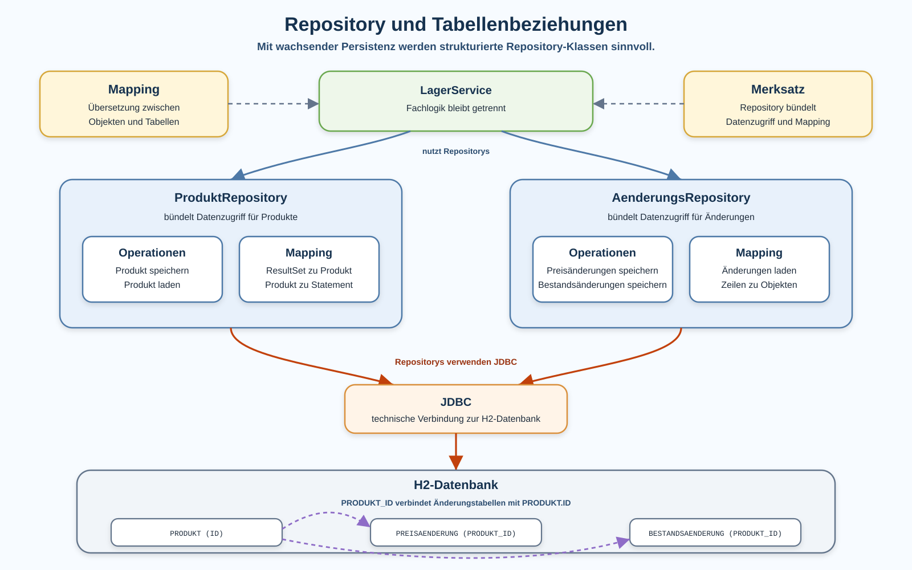
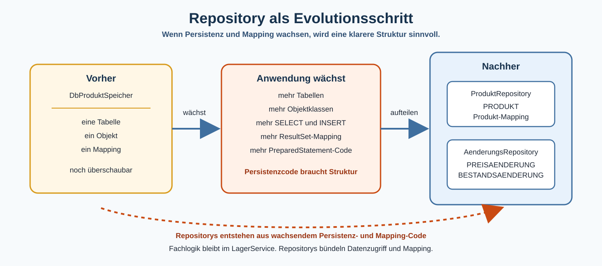

# Arbeitsblatt – Mehrere Tabellen, Beziehungen und Repository

## Lernziele

- erklären, warum fachlich zusammengehörige Daten in mehreren Tabellen liegen können
- einfache Beziehungen zwischen `PRODUKT`, `PREISAENDERUNG` und `BESTANDSAENDERUNG` lesen
- `PRODUKT_ID` als Fremdschlüssel zu `PRODUKT.ID` einordnen
- beschreiben, wie Daten aus mehreren Tabellen wieder zu passenden Java-Objekten werden
- Mapping-Code für `Produkt`, `PreisAenderung` und `BestandsAenderung` unterscheiden
- JDBC-Zugriff mit `ResultSet` und `PreparedStatement` strukturiert in Repository-Klassen bündeln
- erklären, warum `LagerService` weiterhin Fachlogik enthält und keinen SQL-Code
- den Begriff Repository vorsichtig als Klasse für strukturierten Datenzugriff verwenden
- typische Fehler bei Tabellenbeziehungen, Mapping und Verantwortlichkeiten erkennen

---

## Ausgangslage

Die bekannte Lagerverwaltung speichert Produkte bereits mit JDBC und H2. In der letzten Einheit wurde sichtbar:

```text
Produkt-Objekt
<-> Mapping-Code
<-> Tabelle PRODUKT
```

Die Anwendung wächst nun weiter. Zu einem Produkt sollen Preisänderungen und Bestandsänderungen gespeichert werden.

Fachlich gehören diese Daten zusammen:

```text
Produkt
-> mehrere Preisänderungen
-> mehrere Bestandsänderungen
```

In der Datenbank liegen diese Daten aber nicht zwingend in einer einzigen Tabelle. Für diese Einheit verwenden wir drei Tabellen:

```text
PRODUKT
PREISAENDERUNG
BESTANDSAENDERUNG
```

SQL-Grundlagen werden hier nicht erneut ausführlich erklärt. Der Fokus liegt auf Struktur, Mapping und Verantwortlichkeiten.



---

## Mehrere Tabellen

Eine Tabelle `PRODUKT` enthält die aktuellen Produktdaten:

```sql
CREATE TABLE IF NOT EXISTS PRODUKT (
    ID INT AUTO_INCREMENT PRIMARY KEY,
    NAME VARCHAR(100) NOT NULL,
    PREIS DOUBLE NOT NULL,
    BESTAND INT NOT NULL
);
```

Preisänderungen werden separat gespeichert:

```sql
CREATE TABLE IF NOT EXISTS PREISAENDERUNG (
    ID INT AUTO_INCREMENT PRIMARY KEY,
    PRODUKT_ID INT NOT NULL,
    ALTER_PREIS DOUBLE NOT NULL,
    NEUER_PREIS DOUBLE NOT NULL,
    GRUND VARCHAR(200),
    ZEITPUNKT VARCHAR(30) NOT NULL,
    FOREIGN KEY (PRODUKT_ID) REFERENCES PRODUKT(ID)
);
```

Bestandsänderungen werden ebenfalls separat gespeichert:

```sql
CREATE TABLE IF NOT EXISTS BESTANDSAENDERUNG (
    ID INT AUTO_INCREMENT PRIMARY KEY,
    PRODUKT_ID INT NOT NULL,
    ALTER_BESTAND INT NOT NULL,
    NEUER_BESTAND INT NOT NULL,
    GRUND VARCHAR(200),
    ZEITPUNKT VARCHAR(30) NOT NULL,
    FOREIGN KEY (PRODUKT_ID) REFERENCES PRODUKT(ID)
);
```

Die Änderungstabellen enthalten nicht nochmals den Produktnamen, den aktuellen Preis oder den aktuellen Bestand. Sie verweisen mit `PRODUKT_ID` auf das passende Produkt.

---

## Einfache Beziehungen

Die Beziehung kann man so lesen:

```text
Ein Produkt kann mehrere Preisänderungen haben.
Eine Preisänderung gehört zu genau einem Produkt.

Ein Produkt kann mehrere Bestandsänderungen haben.
Eine Bestandsänderung gehört zu genau einem Produkt.
```

In der Datenbank wird diese Verbindung über `PRODUKT_ID` hergestellt.

| Tabelle | Spalte | Bedeutung |
|---|---|---|
| `PRODUKT` | `ID` | eindeutige Produkt-ID |
| `PREISAENDERUNG` | `PRODUKT_ID` | gehört zu diesem Produkt |
| `BESTANDSAENDERUNG` | `PRODUKT_ID` | gehört zu diesem Produkt |

Ein Fremdschlüssel ist hier einfach gesagt eine Spalte, die auf eine Zeile in einer anderen Tabelle zeigt.

```text
PREISAENDERUNG.PRODUKT_ID -> PRODUKT.ID
BESTANDSAENDERUNG.PRODUKT_ID -> PRODUKT.ID
```

Die Datenbank kann dadurch verhindern, dass eine Änderung zu einem Produkt gespeichert wird, das gar nicht existiert.

---

## Produkt und Änderungen als Objekte

Im Java-Code können eigene Klassen verwendet werden:

```java
public class PreisAenderung {
    private int id;
    private int produktId;
    private double alterPreis;
    private double neuerPreis;
    private String grund;
    private String zeitpunkt;
}
```

```java
public class BestandsAenderung {
    private int id;
    private int produktId;
    private int alterBestand;
    private int neuerBestand;
    private String grund;
    private String zeitpunkt;
}
```

Die Klassen zeigen denselben fachlichen Zusammenhang wie die Tabellen:

```text
PreisAenderung.produktId
BestandsAenderung.produktId
```

Beide Werte sagen: Diese Änderung gehört zu einem bestimmten Produkt.

---

## Mapping über mehrere Tabellen

JDBC liefert weiterhin rohe Tabellenwerte. Bei mehreren Tabellen gibt es einfach mehr Mapping-Code:

```text
ResultSet aus PRODUKT
-> Produkt

ResultSet aus PREISAENDERUNG
-> PreisAenderung

ResultSet aus BESTANDSAENDERUNG
-> BestandsAenderung
```

Beispiel für eine Preisänderung:

```java
private PreisAenderung lesePreisAenderung(ResultSet resultSet) throws SQLException {
    int id = resultSet.getInt("ID");
    int produktId = resultSet.getInt("PRODUKT_ID");
    double alterPreis = resultSet.getDouble("ALTER_PREIS");
    double neuerPreis = resultSet.getDouble("NEUER_PREIS");
    String grund = resultSet.getString("GRUND");
    String zeitpunkt = resultSet.getString("ZEITPUNKT");

    return new PreisAenderung(id, produktId, alterPreis, neuerPreis, grund, zeitpunkt);
}
```

Die Methode macht keine Fachentscheidung. Sie übersetzt nur eine aktuelle `ResultSet`-Zeile in ein Objekt.

---

## Änderungen zu einem Produkt laden

Wenn alle Preisänderungen zu einem Produkt geladen werden, wird die `PRODUKT_ID` verwendet:

```java
public ArrayList<PreisAenderung> ladePreisAenderungen(int produktId) {
    ArrayList<PreisAenderung> aenderungen = new ArrayList<>();
    String sql = """
            SELECT ID, PRODUKT_ID, ALTER_PREIS, NEUER_PREIS, GRUND, ZEITPUNKT
            FROM PREISAENDERUNG
            WHERE PRODUKT_ID = ?
            ORDER BY ZEITPUNKT
            """;

    try (Connection connection = verbindungHerstellen();
         PreparedStatement statement = connection.prepareStatement(sql)) {

        statement.setInt(1, produktId);

        try (ResultSet resultSet = statement.executeQuery()) {
            while (resultSet.next()) {
                aenderungen.add(lesePreisAenderung(resultSet));
            }
        }

        return aenderungen;
    } catch (SQLException exception) {
        throw new IllegalStateException("Preisänderungen konnten nicht geladen werden.", exception);
    }
}
```

Damit `ORDER BY ZEITPUNKT` bei Textwerten zuverlässig sortiert, sollen die Zeitpunkte im ISO-Format gespeichert werden, zum Beispiel `2026-05-18T09:00`.

Wichtig bleibt:

- `PreparedStatement` setzt die `PRODUKT_ID`.
- `ResultSet` wird mit `while (resultSet.next())` gelesen.
- Pro Zeile entsteht ein Objekt.
- SQL und Mapping bleiben ausserhalb von `Main` und `LagerService`.

---

## Repository als strukturierter Datenzugriff

Bisher konnte eine Klasse wie `DbProduktSpeicher` noch überschaubar bleiben. Mit mehreren Tabellen wächst der Persistenzcode:

- Tabellen erstellen
- Produkte speichern und laden
- Preisänderungen speichern und laden
- Bestandsänderungen speichern und laden
- `ResultSet` zu verschiedenen Objekten mappen
- Objektwerte in verschiedene `PreparedStatement` einsetzen

Darum wird eine neue Strukturidee nützlich:

```text
Repository
```

In dieser Einheit bedeutet Repository einfach:

```text
Eine Repository-Klasse bündelt Datenzugriff und Mapping für einen fachlichen Bereich.
```



Beispiel:

```text
ProduktRepository
-> kennt Tabelle PRODUKT
-> lädt und speichert Produkte
-> mappt ResultSet zu Produkt

AenderungsRepository
-> kennt PREISAENDERUNG und BESTANDSAENDERUNG
-> speichert Preis- und Bestandsänderungen
-> lädt Änderungen zu einem Produkt
-> mappt ResultSet zu PreisAenderung oder BestandsAenderung
```

Das ist kein ORM und kein Framework. Es ist eine normale Java-Struktur, damit der Datenzugriff nicht überall im Programm verteilt wird.

---

## Fachlogik und Datenzugriff trennen

Der `LagerService` bleibt für fachliche Abläufe zuständig:

- Preis ändern
- Bestand erhöhen oder reduzieren
- Regeln prüfen
- passende Methoden aufrufen

Die Repository-Klassen bleiben für Persistenz zuständig:

- SQL-Anweisungen
- JDBC-Verbindungen
- `PreparedStatement`
- `ResultSet`
- Mapping zwischen Tabellen und Objekten

`Main` bleibt Ablaufsteuerung:

- Objekte erstellen
- Service aufrufen
- einfache Ausgabe steuern

Eine saubere Trennung sieht so aus:

```text
Main
-> LagerService
-> ProduktRepository
-> AenderungsRepository
-> H2-Datenbank
```

Die Kernbotschaft:

```text
Fachlogik entscheidet, was fachlich passieren soll.
Repositories wissen, wie Daten gespeichert und geladen werden.
```

---

## Typische Fehlerbilder

### JDBC-Code in `Main`

`Main` sollte keine Tabellen erstellen, keine SQL-Anweisungen enthalten und kein `ResultSet` lesen. Sonst wird die Ablaufsteuerung schwer verständlich.

### Mapping in Service-Klassen

Der `LagerService` soll nicht wissen, aus welcher Spalte ein Preis gelesen wird. Sonst vermischen sich Fachlogik und Datenbankstruktur.

### SQL und Fachlogik vermischen

Eine SQL-Anweisung sollte nicht entscheiden, ob eine Preisänderung fachlich erlaubt ist. Solche Regeln gehören in den Service oder in passende Fachmethoden.

### Doppelte Mapping-Logik

Wenn `ResultSet`-Spalten mehrfach an verschiedenen Stellen gelesen werden, entstehen leicht Fehler. Kleine private Mapping-Methoden helfen.

### Repository übernimmt Fachlogik

Ein Repository soll Daten speichern und laden. Es soll nicht entscheiden, ob ein Rabatt sinnvoll ist oder ob eine Bestandsänderung fachlich erlaubt ist.

### Unklare Verantwortlichkeiten

Wenn `Main`, Service und Repository alle ein bisschen SQL, Mapping und Fachlogik enthalten, wird die Anwendung schwer wartbar.

### `ResultSet` falsch lesen

Vor dem Lesen muss `resultSet.next()` aufgerufen werden. Bei mehreren Zeilen braucht es eine Schleife.

### Beziehungen falsch modellieren

Eine Änderung ohne `PRODUKT_ID` kann nicht sicher einem Produkt zugeordnet werden. Eine falsche `PRODUKT_ID` verbindet die Änderung mit dem falschen Produkt.

---

## Bewusste Nicht-Ziele

In dieser Einheit werden bewusst nicht behandelt:

- ORM
- Hibernate
- JPA
- Spring Data
- Generic Repository
- automatische Query-Generierung
- Dependency Injection
- komplexe SQL-Joins
- vertiefte Normalformen
- komplexe Transaktionen

Diese Themen lösen später ähnliche Probleme. Hier soll zuerst sichtbar werden, welches Problem durch wachsenden Persistenz- und Mapping-Code entsteht.

---

## Reflexion

Beantworte zum Abschluss kurz:

1. Welche Daten gehören in der Lagerverwaltung fachlich zusammen?
2. Warum helfen Repository-Klassen, wenn mehrere Tabellen dazukommen?
3. Welche Verantwortung besitzt ein Repository in dieser Einheit?
4. Warum wächst Mapping-Code mit der Anwendung?
5. Welche Teile der Anwendung blieben trotz neuer Tabellen stabil?
6. Welche Wiederholungen fallen im JDBC- und Mapping-Code auf?
