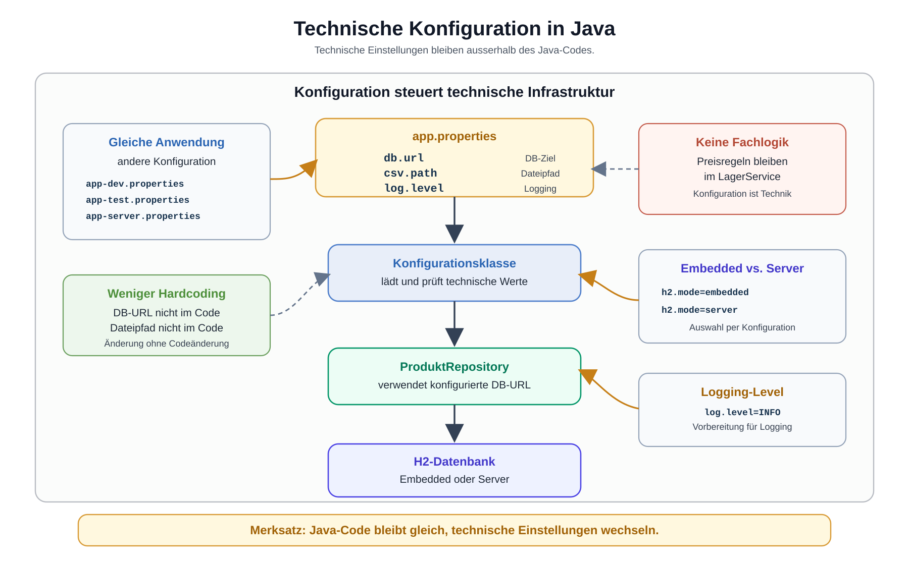

# Arbeitsblatt – Technische Konfiguration in Java

## Lernziele

- erklären, warum technische Einstellungen nicht hartcodiert in Java-Klassen stehen sollen
- Fachlogik von technischer Konfiguration unterscheiden
- `.properties`-Dateien als einfache technische Konfigurationsdateien lesen
- `java.util.Properties` zum Laden von Konfigurationswerten verwenden
- DB-URL, Dateipfade und vorbereitete Logging-Einstellungen aus Konfiguration lesen
- H2 Embedded und H2 Server anhand der Konfiguration unterscheiden
- Konfiguration zentral bündeln, ohne Frameworks einzuführen
- typische Fehler beim Umgang mit technischer Konfiguration erkennen

---

## Ausgangslage

Die bekannte Lagerverwaltung ist technisch gewachsen:

```text
Main
-> LagerService
-> ProduktRepository
-> AenderungsRepository
-> JDBC / H2
-> technisches Logging
```

Bisher stehen technische Werte oft direkt im Code:

```java
String dbUrl = "jdbc:h2:./data/lager";
String produktDatei = "data/produkte.csv";
```

Das funktioniert am Anfang. Sobald dieselbe Anwendung aber mit einer Testdatenbank, einer anderen Datei oder einem anderen H2-Modus laufen soll, wird Hardcoding störend. Für solche Werte ist technische Konfiguration da.

Kernidee:

```text
Technische Infrastruktur soll konfigurierbar sein,
ohne den Java-Code zu ändern.
```



Hinweis zur Grafik: Die Grafik verwendet kurze Beispielnamen wie `csv.path` und `log.level`. Im Code dieser Einheit verwenden wir konsequent `produkt.datei` und `logging.level`.

---

## Was ist technische Konfiguration?

Technische Konfiguration beschreibt Einstellungen, die steuern, wie die Anwendung technisch arbeitet.

Beispiele:

- Datenbank-URL
- Datenbank-Benutzername
- Pfad zu einer CSV- oder Exportdatei
- vorbereiteter Logging-Level
- technischer Modus wie `embedded` oder `server`

Diese Werte sind wichtig, aber sie sind keine Fachregeln der Lagerverwaltung.

---

## Fachlogik vs. technische Konfiguration

Fachlogik beantwortet fachliche Fragen:

```text
Darf ein Preis negativ sein?
Wann wird eine Bestandsänderung gespeichert?
Wie wird der Gesamtwert eines Lagers berechnet?
```

Technische Konfiguration beantwortet technische Fragen:

```text
Welche H2-Datenbank wird verwendet?
Wo liegt die Produktdatei?
Welcher Logging-Level ist vorbereitet?
Läuft H2 eingebettet oder als Server?
```

| Fachlogik | Technische Konfiguration |
|---|---|
| gehört in Services oder Fachklassen | gehört in eine Konfigurationsdatei oder Konfigurationsklasse |
| beschreibt Regeln der Anwendung | beschreibt technische Umgebung |
| wird mit Tests fachlich geprüft | wird beim Start geladen und geprüft |
| ändert sich wegen Anforderungen | ändert sich wegen Umgebung oder Betrieb |

Merke:

```text
Konfiguration ist keine Fachlogik.
```

---

## Aufbau einer `.properties`-Datei

Eine `.properties`-Datei enthält einfache Schlüssel-Wert-Paare.

Beispiel `config/app.properties`:

```properties
db.url=jdbc:h2:./data/lager
db.user=sa
db.password=
produkt.datei=data/produkte.csv
logging.level=INFO
h2.mode=embedded
```

Links steht der Schlüssel, rechts steht der Wert:

```text
db.url -> jdbc:h2:./data/lager
produkt.datei -> data/produkte.csv
```

Die Datei ist bewusst einfach. In dieser Einheit verwenden wir keine YAML-Dateien, keine Spring-Konfiguration und kein Konfigurationsframework.

---

## `java.util.Properties`

Java bringt mit `java.util.Properties` bereits eine einfache Klasse für `.properties`-Dateien mit.

```java
import java.io.IOException;
import java.io.InputStream;
import java.nio.file.Files;
import java.nio.file.Path;
import java.util.Properties;

public class KonfigurationLaden {

    public static Properties ladeProperties(String pfad) {
        Properties properties = new Properties();

        try (InputStream input = Files.newInputStream(Path.of(pfad))) {
            properties.load(input);
            return properties;
        } catch (IOException exception) {
            throw new IllegalStateException("Konfiguration konnte nicht geladen werden: " + pfad, exception);
        }
    }
}
```

Wichtig:

- Die Datei wird mit `try-with-resources` wieder geschlossen.
- Fehler werden nicht still verschluckt.
- `Properties` lädt nur Werte. Die Fachlogik gehört weiterhin nicht in diese Klasse.

---

## Konfigurationswerte lesen

Ein Wert wird mit `getProperty(...)` gelesen:

```java
Properties properties = KonfigurationLaden.ladeProperties("config/app.properties");

String dbUrl = properties.getProperty("db.url");
String produktDatei = properties.getProperty("produkt.datei");
String loggingLevel = properties.getProperty("logging.level");

System.out.println("DB-URL: " + dbUrl);
System.out.println("Produktdatei: " + produktDatei);
System.out.println("Logging-Level: " + loggingLevel);
```

Mit Standardwert:

```java
String h2Mode = properties.getProperty("h2.mode", "embedded");
```

Ein Standardwert ist hilfreich, wenn ein Wert fehlen darf. Pflichtwerte wie `db.url` sollten aber bewusst geprüft werden.

---

## DB-URL konfigurieren

Vorher:

```java
public class ProduktRepository {

    private final String dbUrl = "jdbc:h2:./data/lager";
}
```

Besser:

```java
public class ProduktRepository {

    private final String dbUrl;

    public ProduktRepository(String dbUrl) {
        this.dbUrl = dbUrl;
    }
}
```

Dann kann `Main` die Konfiguration laden und den Wert weitergeben:

```java
Properties properties = KonfigurationLaden.ladeProperties("config/app.properties");
String dbUrl = properties.getProperty("db.url");

ProduktRepository produktRepository = new ProduktRepository(dbUrl);
```

Das Repository kennt die DB-URL noch, aber sie ist nicht mehr hartcodiert.

Für den Basisschritt reicht `db.url`. In der Vertiefung können zusätzlich `db.user` und `db.password` aus der Konfiguration gelesen und an die JDBC-Infrastruktur übergeben werden.

---

## Dateipfade konfigurieren

Dateipfade sind ebenfalls technische Konfiguration.

```properties
produkt.datei=data/produkte.csv
export.datei=data/export.csv
```

Im Java-Code:

```java
String produktDatei = properties.getProperty("produkt.datei");
```

So kann dieselbe Anwendung mit einer anderen Datei arbeiten, ohne dass der Java-Code geändert werden muss.

---

## Logging-Level vorbereiten

In der vorherigen Einheit wurde technisches Logging eingeführt. In dieser Einheit wird der Logging-Level nur vorbereitet:

```properties
logging.level=INFO
```

Ein einfacher Startpunkt:

```java
String loggingLevel = properties.getProperty("logging.level", "INFO");
System.out.println("Konfigurierter Logging-Level: " + loggingLevel);
```

Solche Ausgaben dienen hier nur zur Kontrolle beim Lernen. Sensible Werte wie Passwörter werden nicht ausgegeben.

Die tiefe Logback-Konfiguration ist hier kein Ziel. Die Lernidee ist nur: Auch technische Logging-Einstellungen können konfigurierbar werden.

---

## H2 Embedded vs. Server per Konfiguration

H2 kann eingebettet oder als Server verwendet werden. Für diese Einheit reicht der Vergleich über die URL.

Embedded:

```properties
db.url=jdbc:h2:./data/lager
h2.mode=embedded
```

Server:

```properties
db.url=jdbc:h2:tcp://localhost/./data/lager
h2.mode=server
```

Der Java-Code soll nicht überall wissen müssen, welcher Modus verwendet wird. Er bekommt eine konfigurierte DB-URL.

---

## Zentrale Konfiguration

Wenn überall direkt mit `properties.getProperty("db.url")` gearbeitet wird, verteilen sich die Schlüssel im Projekt. Eine kleine Konfigurationsklasse bündelt den Zugriff.

```java
import java.util.Properties;

public class AppConfig {

    private final Properties properties;

    public AppConfig(Properties properties) {
        this.properties = properties;
    }

    public String dbUrl() {
        return pflichtwert("db.url");
    }

    public String dbUser() {
        return properties.getProperty("db.user", "sa");
    }

    public String dbPassword() {
        return properties.getProperty("db.password", "");
    }

    public String produktDatei() {
        return pflichtwert("produkt.datei");
    }

    public String loggingLevel() {
        return properties.getProperty("logging.level", "INFO");
    }

    public String h2Mode() {
        return properties.getProperty("h2.mode", "embedded");
    }

    private String pflichtwert(String key) {
        String value = properties.getProperty(key);
        if (value == null || value.isBlank()) {
            throw new IllegalStateException("Pflichtwert fehlt: " + key);
        }
        return value;
    }
}
```

Damit wird `Main` übersichtlicher:

```java
Properties properties = KonfigurationLaden.ladeProperties("config/app.properties");
AppConfig config = new AppConfig(properties);

ProduktRepository produktRepository = new ProduktRepository(config.dbUrl());
```

---

## Typische Fehlerbilder

| Fehler | Problem |
|---|---|
| DB-URL bleibt im Repository hartcodiert | Änderung verlangt Codeänderung |
| Properties-Datei wird nicht geschlossen | Ressourcen werden unsauber verwendet |
| fehlende Werte werden nicht geprüft | Fehler erscheinen später unklar |
| Konfiguration wird in Fachobjekte gemischt | Fachmodell kennt technische Umgebung |
| Passwort oder sensible Daten werden geloggt | technische Logs können vertrauliche Daten zeigen |
| Konfiguration wird in jeder Methode neu geladen | unnötige Wiederholung und unklare Verantwortung |
| technische Konfiguration wird mit I18N verwechselt | Mehrsprachigkeit ist ein eigenes späteres Thema |

---

## Reflexion

Beantworte die Fragen kurz:

1. Welche Werte waren in deiner Lagerverwaltung bisher hartcodiert?
2. Welche Vorteile bringt technische Konfiguration?
3. Welche Konfiguration gehört nicht in Fachlogik?
4. Welche Probleme entstehen, wenn technische Einstellungen im Code verteilt sind?
5. Warum hilft eine zentrale Klasse wie `AppConfig`?

---

## Bewusste Nicht-Ziele

In dieser Einheit werden nicht behandelt:

- Spring Configuration
- Dependency Injection
- YAML
- Docker-Konfiguration
- Kubernetes ConfigMaps
- vertiefte Environment Variables
- I18N und `ResourceBundle`

`.properties` wird hier für technische Konfiguration verwendet. Mehrsprachigkeit folgt später separat.
