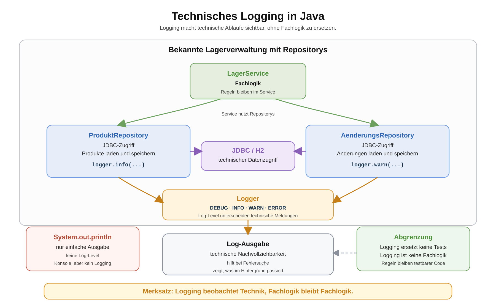

# Arbeitsblatt – Technisches Logging in Java einführen

## Lernziele

- erklären, warum technische Beobachtbarkeit bei wachsender Persistenzkomplexität wichtig wird
- `System.out.println` von dauerhaftem technischem Logging unterscheiden
- SLF4J als Logging-Schnittstelle und Logback als konkrete Umsetzung einordnen
- einen `Logger` in einer Java-Klasse korrekt anlegen
- die Log-Level `DEBUG`, `INFO`, `WARN` und `ERROR` sinnvoll unterscheiden
- Repository-Klassen gezielt mit technischen Logs ergänzen
- JDBC-Schritte und Fehlerfälle nachvollziehbar loggen
- erklären, warum Logging keine Fachlogik ist und Tests nicht ersetzt
- typische Fehler beim Logging erkennen

---

## Ausgangslage

Die bekannte Lagerverwaltung ist inzwischen technisch gewachsen:

```text
Main
-> LagerService
-> ProduktRepository
-> AenderungsRepository
-> JDBC / H2
-> Tabellen PRODUKT, PREISAENDERUNG, BESTANDSAENDERUNG
```

Fachlich bleibt die Anwendung überschaubar: Produkte werden verwaltet, Preise und Bestände ändern sich. Technisch passiert aber deutlich mehr als am Anfang.

Technische Schritte sind zum Beispiel:

- Datenbankverbindungen öffnen
- SQL-Anweisungen vorbereiten
- Werte in `PreparedStatement` einsetzen
- `ResultSet`-Zeilen zu Java-Objekten mappen
- Fehler beim Verbindungsaufbau oder bei SQL nachvollziehen

Genau hier wird Logging sinnvoll. Logging macht technische Abläufe sichtbar, ohne sie zur Fachlogik zu machen.

Kernidee:

```text
Logging beantwortet: Was passiert technisch gerade?
```



---

## Warum Logging?

Bei einfachen Programmen reicht manchmal eine direkte Ausgabe:

```java
System.out.println("Produkt gespeichert");
```

In einer Anwendung mit Repositorys, JDBC und mehreren Tabellen ist das zu ungenau. Wenn ein Fehler passiert, muss man genauer wissen:

- Welche Repository-Methode war aktiv?
- Wurde eine Datenbankverbindung geöffnet?
- Welche technische Aktion ist fehlgeschlagen?
- War die Situation nur ungewöhnlich oder wirklich ein Fehler?

Logging hilft bei der Fehlersuche und Nachvollziehbarkeit. Es soll aber sparsam eingesetzt werden. Zu viele Logs machen ein Programm nicht klarer, sondern schwerer lesbar.

---

## `System.out.println` vs. Logger

`System.out.println` schreibt direkt auf die Konsole. Das ist für erste Beispiele einfach, aber für dauerhafte technische Beobachtbarkeit ungeeignet.

| `System.out.println` | Logger |
|---|---|
| einfache direkte Ausgabe | gezielte technische Meldung |
| keine Log-Level | unterscheidet `DEBUG`, `INFO`, `WARN`, `ERROR` |
| schwer zentral steuerbar | kann später konfiguriert werden |
| vermischt sich leicht mit Benutzer-Ausgabe | trennt technische Beobachtung von Fachausgabe |
| wird oft ad hoc eingefügt | ist bewusst platzierter technischer Code |

Beispiel für Benutzer-Ausgabe:

```java
System.out.println("Produkt wurde gespeichert.");
```

Beispiel für technisches Logging:

```java
logger.info("ProduktRepository speichert ein Produkt.");
```

Die erste Ausgabe kann Teil einer einfachen Konsolenanwendung sein. Die zweite Ausgabe beschreibt einen technischen Ablauf im Code.

---

## SLF4J und Logback

Für diese Einheit verwenden wir:

- SLF4J als Logging-Schnittstelle
- `logback-classic` als konkrete Umsetzung

SLF4J ist die API, gegen die unser Code programmiert. Logback sorgt dafür, dass die Logmeldungen tatsächlich ausgegeben werden.

Darum stehen zwei Dependencies im Projekt: `slf4j-api` ist die Schnittstelle im Code, `logback-classic` ist die einfache konkrete Ausgabe-Umsetzung.

In `pom.xml` werden die Dependencies ergänzt:

```xml
<dependency>
    <groupId>org.slf4j</groupId>
    <artifactId>slf4j-api</artifactId>
    <version>2.0.13</version>
</dependency>
<dependency>
    <groupId>ch.qos.logback</groupId>
    <artifactId>logback-classic</artifactId>
    <version>1.5.6</version>
</dependency>
```

Danach prüfst du das Projekt mit Maven:

```bash
mvn package
```

In dieser Einheit wird Logback nicht vertieft konfiguriert. Es geht zuerst darum, Logger sinnvoll im Java-Code zu verwenden.

---

## Logger in einer Klasse anlegen

Ein Logger wird normalerweise einmal pro Klasse angelegt:

```java
import org.slf4j.Logger;
import org.slf4j.LoggerFactory;

public class ProduktRepository {

    private static final Logger logger =
            LoggerFactory.getLogger(ProduktRepository.class);

    // Methoden der Repository-Klasse
}
```

Wichtig:

- `private`, weil der Logger nur in dieser Klasse verwendet wird
- `static final`, weil es pro Klasse einen festen Logger gibt
- `ProduktRepository.class`, damit im Log erkennbar ist, aus welcher Klasse die Meldung kommt

Typischer Fehler:

```java
Logger logger = LoggerFactory.getLogger(LagerService.class);
```

Wenn dieser Code in `ProduktRepository` steht, ist die Klasse im Logger falsch. Die Logausgabe führt dann in die Irre.

---

## Log-Level

Log-Level helfen, Meldungen nach Bedeutung zu unterscheiden.

| Level | Bedeutung | Beispiel |
|---|---|---|
| `DEBUG` | detaillierter technischer Schritt | SQL-Abfrage wird vorbereitet |
| `INFO` | normaler wichtiger Ablauf | Produkte werden geladen |
| `WARN` | ungewöhnliche, aber behandelbare Situation | Erwartete Änderungen zu Produkt-ID fehlen |
| `ERROR` | Aktion ist fehlgeschlagen | Produkte konnten nicht geladen werden |

Beispiele:

```java
logger.debug("Bereite SELECT auf Tabelle PRODUKT vor.");
logger.info("Lade Produkte aus der Datenbank.");
logger.warn("Erwartete Preisänderungen für Produkt-ID {} fehlen.", produktId);
logger.error("Produkte konnten nicht geladen werden.", exception);
```

Merke:

```text
INFO ist für normale wichtige Abläufe.
DEBUG ist für Details, die man bei der Fehlersuche einschalten möchte.
WARN ist ungewöhnlich, aber nicht zwingend ein Programmabbruch.
ERROR ist ein fehlgeschlagener technischer Ablauf.
```

---

## Logging in Repository-Klassen

Repositorys sind gute Orte für technisches Logging, weil dort Datenzugriff und Mapping stattfinden.

Beispiel:

```java
public ArrayList<Produkt> ladeProdukte() {
    logger.info("Lade Produkte aus der Datenbank.");

    ArrayList<Produkt> produkte = new ArrayList<>();
    String sql = "SELECT ID, NAME, PREIS, BESTAND FROM PRODUKT";

    logger.debug("Bereite SQL-Abfrage für Produkte vor.");

    try (Connection connection = verbindungHerstellen();
         PreparedStatement statement = connection.prepareStatement(sql);
         ResultSet resultSet = statement.executeQuery()) {

        while (resultSet.next()) {
            produkte.add(leseProdukt(resultSet));
        }

        logger.info("{} Produkte geladen.", produkte.size());
        return produkte;
    } catch (SQLException exception) {
        logger.error("Produkte konnten nicht geladen werden.", exception);
        throw new IllegalStateException("Produkte konnten nicht geladen werden.", exception);
    }
}
```

Das Logging beschreibt technische Schritte. Es entscheidet nicht, ob ein Produkt gültig ist oder ob ein Preis erlaubt ist. Solche Regeln bleiben Fachlogik und gehören in den Service.

---

## Logging bei JDBC-Verbindungen

Eine Verbindung kann ebenfalls technisch geloggt werden:

```java
private Connection verbindungHerstellen() throws SQLException {
    logger.debug("Öffne Datenbankverbindung zu {}.", url);
    return DriverManager.getConnection(url, benutzer, passwort);
}
```

Wichtig: Passwörter werden nicht geloggt.

Nicht so:

```java
logger.debug("Verbindung mit Benutzer {} und Passwort {}.", benutzer, passwort);
```

Sensible Daten gehören nicht in Logs.

---

## Logging bei Exceptions

Eine Exception soll mit Kontext geloggt werden:

```java
catch (SQLException exception) {
    logger.error("Preisänderung konnte nicht gespeichert werden.", exception);
    throw new IllegalStateException("Preisänderung konnte nicht gespeichert werden.", exception);
}
```

Der Text sagt, welche Aktion fehlgeschlagen ist. Die Exception liefert die technische Ursache und den Stacktrace.

Nicht hilfreich:

```java
catch (SQLException exception) {
    logger.error("Fehler");
}
```

Auch nicht hilfreich:

```java
catch (SQLException exception) {
    // nichts tun
}
```

Fehler zu verschlucken macht die Fehlersuche schwer und kann Folgefehler auslösen.

---

## Was sollte nicht geloggt werden?

Nicht alles, was technisch möglich ist, sollte im Log stehen.

Nicht loggen:

- Passwörter
- Tokens
- unnötige Personendaten
- komplette sensible Datensätze
- jede einzelne Getter- oder Setter-Verwendung
- jede Schleifeniteration ohne konkreten Nutzen
- Fachentscheidungen als Ersatz für echten Code

Schlechtes Beispiel:

```java
logger.info("Preis ist zu tief, darum wird nicht gespeichert.");
return;
```

Besser:

```java
if (neuerPreis < 0) {
    throw new IllegalArgumentException("Preis darf nicht negativ sein.");
}
```

Falls nötig, kann zusätzlich sparsam geloggt werden. Die Fachregel selbst bleibt aber Code, nicht Logtext.

---

## Typische Fehlerbilder

- alles weiterhin mit `System.out.println` ausgeben
- zu viele `INFO`-Logs schreiben
- `DEBUG` und `INFO` nicht unterscheiden
- Fehler verschlucken
- Exceptions ohne Kontext loggen
- sensible Daten loggen
- Logging für Fachentscheidungen verwenden
- Logger in jeder Methode neu erzeugen
- Logger mit der falschen Klasse initialisieren
- denselben Fehler mehrfach auf mehreren Ebenen loggen
- Logging als Ersatz für Tests verstehen

---

## Reflexion

Beantworte zum Schluss kurz:

1. Wann hilft Logging bei der Fehlersuche?
2. Welche Logs in deinem Code waren wirklich hilfreich?
3. Welche Logs waren überflüssig?
4. Warum ersetzt Logging keine Tests?
5. Warum gehört Logging nicht in die Fachlogik?
