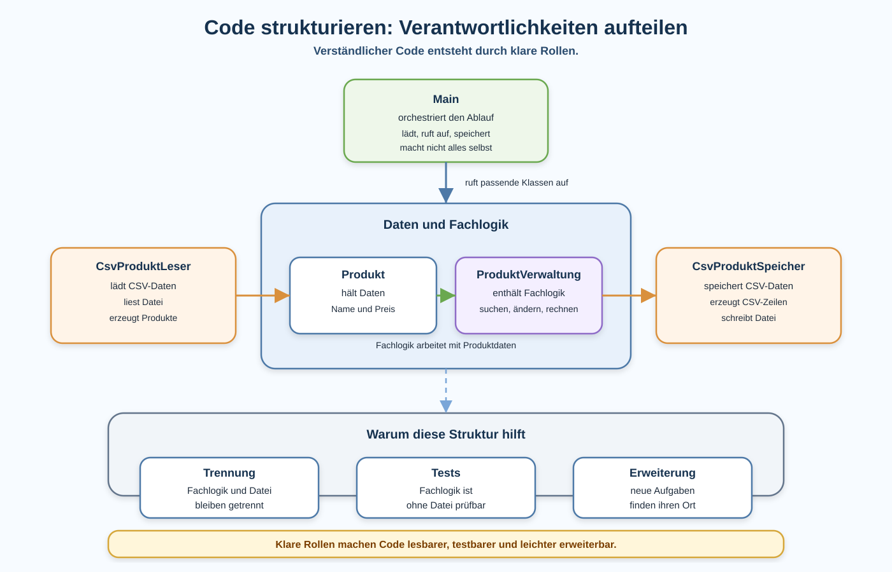

# Arbeitsblatt – Code strukturieren und Verantwortlichkeiten aufteilen

## Lernziele

- erklären, was eine Verantwortung in einer Klasse bedeutet
- erkennen, wenn `Main` zu viel macht
- Fachlogik, Dateilogik und Ablaufsteuerung unterscheiden
- bekannte Klassen der Produktverwaltung passend einordnen
- Methoden aus `Main` in passende Klassen verschieben
- erklären, warum kleinere Klassen leichter testbar und wartbar sind
- einfache Struktur als Vorbereitung für spätere Schichten verstehen

---

## Ausgangslage

In den letzten Einheiten wurde die Produktverwaltung erweitert:

```text
CSV-Datei
-> laden
-> ArrayList<Produkt>
-> bearbeiten
-> speichern
-> erneut laden
-> prüfen
```

Dabei wurden bereits mehrere Klassen verwendet:

- `Produkt`
- `ProduktVerwaltung`
- `CsvProduktLeser`
- `CsvProduktSpeicher`
- `Main`

Jetzt geht es darum, diese Klassen bewusst zu nutzen.

Die Kernidee ist:

```text
Eine Klasse soll nicht alles machen.
```



---

## Was ist eine Verantwortung?

Eine Verantwortung ist die Hauptaufgabe einer Klasse oder Methode.

Beispiele:

| Klasse | Verantwortung |
|---|---|
| `Produkt` | hält Daten wie Name und Preis |
| `ProduktVerwaltung` | sucht Produkte, ändert Preise, berechnet Werte |
| `CsvProduktLeser` | liest CSV-Dateien und erzeugt Produkte |
| `CsvProduktSpeicher` | schreibt Produkte als CSV-Datei |
| `Main` | startet das Programm und ruft die passenden Klassen auf |

Eine Klasse darf mehrere Methoden haben. Diese Methoden sollten aber zur gleichen Hauptaufgabe passen.

---

## Warum zu viel Code in Main problematisch ist

`Main` ist der Startpunkt eines Programms. Dort darf sichtbar sein, was grob passiert.

Problematisch wird es, wenn `Main` auch die ganze Detailarbeit macht:

```java
public static void main(String[] args) {
    // Datei lesen
    // CSV-Zeilen zerlegen
    // Produkte erzeugen
    // Produkte suchen
    // Preise ändern
    // Gesamtwert berechnen
    // CSV-Zeilen erzeugen
    // Datei speichern
}
```

Dann ist schwer zu erkennen:

- welche Aufgabe wohin gehört
- welche Teile fachlich zusammengehören
- welche Teile getestet werden können
- was bei einer Erweiterung geändert werden muss

Besser ist:

```java
public static void main(String[] args) {
    CsvProduktLeser leser = new CsvProduktLeser();
    ProduktVerwaltung verwaltung = new ProduktVerwaltung(leser.ladeProdukte("data/produkte.csv"));

    verwaltung.aenderePreis("Maus", 34.90);

    CsvProduktSpeicher speicher = new CsvProduktSpeicher();
    speicher.speichereProdukte(verwaltung.getProdukte(), "data/produkte.csv");
}
```

`Main` zeigt den Ablauf. Die Details liegen in den passenden Klassen.

---

## Fachlogik, Dateilogik und Ablaufsteuerung

### Fachlogik

Fachlogik beschreibt Regeln der Produktverwaltung.

Beispiele:

- Produkt suchen
- Produkt hinzufügen
- Preis ändern
- Gesamtwert berechnen
- Anzahl Produkte zählen

Diese Aufgaben gehören in `ProduktVerwaltung`.

### Dateilogik

Dateilogik beschreibt den Umgang mit Dateien.

Beispiele:

- Datei lesen
- CSV-Zeilen mit `split(";")` zerlegen
- Preis mit `Double.parseDouble(...)` umwandeln
- CSV-Zeilen erzeugen
- Datei mit `Files.write(...)` speichern

Diese Aufgaben gehören in `CsvProduktLeser` und `CsvProduktSpeicher`.

### Ablaufsteuerung

Ablaufsteuerung beschreibt die Reihenfolge der Schritte.

Beispiel:

```text
laden -> bearbeiten -> speichern -> erneut laden -> prüfen
```

Diese Aufgabe darf in `Main` sichtbar bleiben.

---

## Main als Orchestrator

Ein Orchestrator führt Schritte in einer sinnvollen Reihenfolge aus.

Für `Main` bedeutet das:

- Objekte erstellen
- Methoden aufrufen
- Resultate kurz ausgeben
- keine Detailarbeit selbst erledigen

`Main` soll also eher so lesen:

```text
Lade Produkte.
Ändere Produktdaten.
Speichere Produkte.
Prüfe das Ergebnis.
```

Nicht so:

```text
Zerlege jede CSV-Zeile.
Parse jeden Preis.
Suche jedes Produkt direkt in Main.
Berechne dort jede Summe.
Schreibe jede CSV-Zeile direkt in Main.
```

---

## Beispiel: Methode aus Main verschieben

Wenn in `Main` eine Schleife steht, die ein Produkt sucht, ist das ein Hinweis auf Fachlogik.

Vorher:

```java
for (Produkt produkt : produkte) {
    if (produkt.getName().equals("Maus")) {
        produkt.setPreis(34.90);
    }
}
```

Besser in `ProduktVerwaltung`:

```java
public boolean aenderePreis(String name, double neuerPreis) {
    if (neuerPreis < 0) {
        return false;
    }

    for (Produkt produkt : produkte) {
        if (produkt.getName().equals(name)) {
            produkt.setPreis(neuerPreis);
            return true;
        }
    }

    return false;
}
```

Dann kann `Main` kurz bleiben:

```java
boolean geaendert = verwaltung.aenderePreis("Maus", 34.90);
```

---

## Warum kleine Klassen besser testbar sind

Eine `ProduktVerwaltung` kann ohne echte Datei getestet werden.

Beispiel:

```java
ArrayList<Produkt> produkte = new ArrayList<>();
produkte.add(new Produkt("Maus", 39.50));

ProduktVerwaltung verwaltung = new ProduktVerwaltung(produkte);
boolean geaendert = verwaltung.aenderePreis("Maus", 34.90);
```

Dafür braucht es keine CSV-Datei. Der Test kann direkt prüfen, ob die Fachlogik stimmt.

Wenn Datei- und Fachlogik vermischt sind, braucht jeder Test plötzlich eine Datei. Das macht Tests langsamer und fehleranfälliger.

---

## Typische Fehlerbilder

| Fehlerbild | Warum es problematisch ist |
|---|---|
| alles bleibt in `Main` | Code wird unübersichtlich und schlecht testbar |
| Dateilogik und Fachlogik werden vermischt | Änderungen an Dateien beeinflussen Fachregeln |
| Klassen werden nur umbenannt | die Verantwortung wurde nicht wirklich verschoben |
| Methodennamen bleiben unklar | der Code erklärt sich nicht selbst |
| Tests werden nach dem Refactoring nicht ausgeführt | Fehler bleiben unbemerkt |
| neue Klassen haben keine klare Verantwortung | Struktur wird künstlich statt hilfreich |
| zu viele kleine Klassen ohne Nutzen | der Code wird schwerer statt einfacher |

---

## Einfache Entscheidungsfragen

Wenn du nicht sicher bist, wohin Code gehört, frage:

1. Geht es um Produktregeln oder Berechnungen?
   - Dann eher `ProduktVerwaltung`.
2. Geht es um Dateien, CSV-Zeilen oder Pfade?
   - Dann eher `CsvProduktLeser` oder `CsvProduktSpeicher`.
3. Geht es nur um die Reihenfolge der Schritte?
   - Dann darf es in `Main` bleiben.
4. Würde ich diese Logik ohne Datei testen wollen?
   - Dann gehört sie wahrscheinlich nicht in eine CSV-Klasse.

---

## Nicht Ziel dieser Einheit

Bewusst nicht behandelt werden:

- Datenbanken
- ORM
- Spring
- Clean Architecture
- formales Repository-Pattern
- REST-APIs
- komplexe Frameworks
- generische CSV-Frameworks

Es geht um einfache, saubere Struktur im bekannten Produktverwaltungsprojekt.

---

## Reflexion

Beantworte kurz:

1. Woran erkennst du, dass eine Klasse zu viel macht?
2. Warum ist `Main` als Orchestrator sinnvoll?
3. Warum wird Code durch getrennte Verantwortlichkeiten besser testbar?
4. Welche Struktur hilft später bei REST oder Spring?

---

## Ausblick

Später werden ähnliche Ideen mit Begriffen wie Schichten, Services, Persistenzschicht und REST verbunden.

Diese Einheit bereitet das vor:

- `ProduktVerwaltung` ist eine Vorstufe zu einer Service-Klasse.
- `CsvProduktLeser` und `CsvProduktSpeicher` zeigen eine einfache Persistenz-Verantwortung.
- `Main` zeigt nur den Ablauf und bleibt dadurch austauschbarer.

Noch geht es nicht um Enterprise-Architektur. Es geht darum, Code so aufzuteilen, dass Menschen ihn verstehen, testen und erweitern können.
