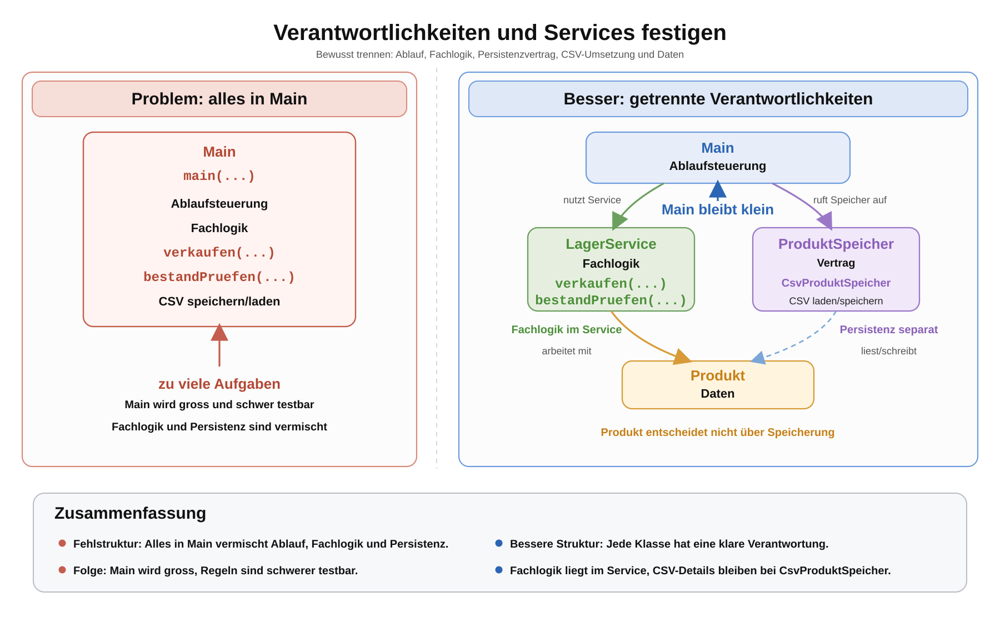

# Arbeitsblatt – Verantwortlichkeiten und Services festigen

## Lernziele

- Verantwortlichkeiten von `Main`, `Produkt`, `LagerService`, `ProduktSpeicher` und `CsvProduktSpeicher` unterscheiden
- Fachlogik, Persistenzlogik und Ablaufsteuerung in bestehendem Code erkennen
- begründen, warum Fachlogik bewusst platziert werden soll
- problematische Strukturen in einer kleinen Lagerverwaltung diagnostizieren
- kleine Refactoring-Schritte planen, ohne neue Technologie einzuführen
- Service-Methoden mit Tests absichern
- erklären, wann eine kleine Struktur hilft und wann sie zu kompliziert wird

---

## Ausgangslage

Du kennst die Lagerverwaltung bereits aus mehreren Einheiten:

- Produkte werden als Objekte modelliert.
- Produktdaten können aus CSV-Dateien geladen und wieder gespeichert werden.
- `ProduktSpeicher` beschreibt einen Vertrag für Speichern und Laden.
- `CsvProduktSpeicher` ist eine konkrete Umsetzung für CSV-Dateien.
- `LagerService` bündelt fachliche Regeln.
- `Main` startet den Ablauf.

In dieser Einheit kommt keine neue grosse Technologie dazu. Es geht darum, vorhandene Strukturideen sicherer zu verwenden.

Die Leitfrage ist:

```text
Welche Klasse trägt welche Verantwortung, und warum?
```

---

## Bekannte Klassen

| Klasse | Hauptverantwortung |
|---|---|
| `Produkt` | Daten eines Produkts halten, zum Beispiel Name, Preis und Bestand |
| `LagerService` | fachliche Regeln rund um Lagerbestand und Verkauf bündeln |
| `ProduktSpeicher` | Vertrag für Persistenz beschreiben |
| `CsvProduktSpeicher` | Produkte als CSV laden und speichern |
| `Main` | Ablauf steuern und Klassen zusammen verwenden |



Merksatz:

```text
Main steuert den Ablauf.
LagerService entscheidet fachlich.
ProduktSpeicher beschreibt den Speichervertrag.
CsvProduktSpeicher kümmert sich um CSV.
Produkt hält Daten.
```

---

## Theorieblock 1 – Fachlogik bewusst erkennen

Fachlogik beschreibt Regeln der Lagerverwaltung.

Beispiele:

- Darf ein Produkt verkauft werden?
- Wie verändert sich der Bestand nach einem Verkauf?
- Darf eine negative Menge verwendet werden?
- Wann ist ein Lagerbestand zu tief?
- Wie wird der Gesamtwert eines Lagers berechnet?

Diese Regeln gehören nicht zufällig irgendwohin. Sie sollen an einem Ort liegen, an dem sie gut lesbar und testbar sind.

In dieser Lagerverwaltung ist das der `LagerService`.

```java
public class LagerService {
    public boolean verkaufen(Produkt produkt, int menge) {
        if (menge <= 0) {
            return false;
        }

        if (produkt.getBestand() < menge) {
            return false;
        }

        produkt.setBestand(produkt.getBestand() - menge);
        return true;
    }
}
```

Der Service entscheidet fachlich. Er schreibt keine CSV-Datei und zeigt keine langen Menüs an.

---

## Theorieblock 2 – Persistenz ist eine andere Verantwortung

Persistenz bedeutet: Daten werden dauerhaft gespeichert oder wieder geladen.

Bei CSV gehören diese Aufgaben zur Speicherklasse:

- Datei lesen
- CSV-Zeile zerlegen
- Text in Zahlen umwandeln
- Produktobjekte aus Zeilen erzeugen
- Produktobjekte als CSV-Zeilen schreiben
- Datei speichern

Diese Aufgaben gehören zu `CsvProduktSpeicher`, nicht zu `LagerService`.

```java
public interface ProduktSpeicher {
    ArrayList<Produkt> ladeProdukte(String pfad);

    void speichereProdukte(ArrayList<Produkt> produkte, String pfad);
}
```

`ProduktSpeicher` sagt nur, welche Methoden vorhanden sein müssen. `CsvProduktSpeicher` entscheidet, wie CSV konkret gelesen und geschrieben wird.

---

## Theorieblock 3 – Main entlasten

`Main` darf den Ablauf zeigen:

```text
Produkte laden.
Service erstellen.
Fachliche Änderung ausführen.
Resultat anzeigen.
Produkte speichern.
```

Problematisch wird `Main`, wenn dort alles passiert:

```java
public class Main {
    public static void main(String[] args) {
        Produkt produkt = new Produkt("Maus", 24.90, 10);
        int menge = 3;

        if (menge > 0 && produkt.getBestand() >= menge) {
            produkt.setBestand(produkt.getBestand() - menge);
        }

        if (produkt.getBestand() < 5) {
            System.out.println("Warnung: tiefer Bestand");
        }

        // CSV-Zeilen erzeugen
        // Datei schreiben
    }
}
```

Hier sind Ablaufsteuerung, Fachlogik, Ausgabe und Persistenz vermischt.

Besser:

```java
public class Main {
    public static void main(String[] args) {
        ProduktSpeicher speicher = new CsvProduktSpeicher();
        ArrayList<Produkt> produkte = speicher.ladeProdukte("data/produkte.csv");

        LagerService lagerService = new LagerService();
        Produkt produkt = produkte.get(0);

        boolean verkauft = lagerService.verkaufen(produkt, 3);

        if (verkauft) {
            System.out.println("Verkauf erfolgreich");
        }

        speicher.speichereProdukte(produkte, "data/produkte.csv");
    }
}
```

`Main` bleibt nicht leer. Sie zeigt aber vor allem den Ablauf.

---

## Theorieblock 4 – Gute Service-Methoden

Eine passende Service-Methode beschreibt eine fachliche Handlung oder Regel.

Geeignet:

```java
verkaufen(produkt, menge)
bestandErhoehen(produkt, menge)
warnungPruefen(produkt, grenze)
berechneLagerwert(produkte)
```

Weniger geeignet:

```java
csvDateiSchreiben(...)
dateipfadEinlesen(...)
druckeMenue(...)
zeigeAlleProdukteAufKonsole(...)
```

Diese Methoden können im Programm vorkommen. Sie gehören aber nicht automatisch in den `LagerService`.

---

## Diagnose – Wo liegt das Problem?

Beispiel einer schlechten Struktur:

```java
public class CsvProduktSpeicher {
    public boolean verkaufenUndSpeichern(Produkt produkt, int menge, String pfad) {
        if (menge <= 0) {
            return false;
        }

        if (produkt.getBestand() < menge) {
            return false;
        }

        produkt.setBestand(produkt.getBestand() - menge);

        // Produkt als CSV schreiben
        return true;
    }
}
```

Diese Methode hat mehrere Verantwortungen:

| Codeanteil | Verantwortung |
|---|---|
| Menge prüfen | Fachlogik |
| Bestand prüfen | Fachlogik |
| Bestand ändern | Fachlogik |
| CSV schreiben | Persistenz |

Problem:

```text
Eine Speicherklasse entscheidet plötzlich über fachliche Verkaufsregeln.
```

Wenn sich später die Verkaufsregel ändert, muss eine CSV-Klasse angepasst werden. Das ist ein Hinweis auf eine falsch platzierte Verantwortung.

---

## Refactoring – Kleine Schritte

Refactoring bedeutet hier:

```text
Struktur verbessern, ohne das gewünschte Verhalten absichtlich zu ändern.
```

Ein guter Ablauf:

1. Ausgangsverhalten prüfen.
2. Eine kleine Logikstelle markieren.
3. Passende Klasse wählen.
4. Methode verschieben oder neu benennen.
5. `Main` vereinfachen.
6. Verhalten erneut prüfen.

Beispiel:

Vorher in `Main`:

```java
if (menge > 0 && produkt.getBestand() >= menge) {
    produkt.setBestand(produkt.getBestand() - menge);
}
```

Nachher im `LagerService`:

```java
public boolean verkaufen(Produkt produkt, int menge) {
    if (menge <= 0 || produkt.getBestand() < menge) {
        return false;
    }

    produkt.setBestand(produkt.getBestand() - menge);
    return true;
}
```

Nachher in `Main`:

```java
boolean verkauft = lagerService.verkaufen(produkt, menge);
```

---

## Tests als Diagnose

Service-Methoden sollen gut testbar sein.

Beispieltests:

```java
@Test
void verkaufen_mitGenugBestand_reduziertBestand() {
    Produkt produkt = new Produkt("Maus", 24.90, 10);
    LagerService service = new LagerService();

    boolean verkauft = service.verkaufen(produkt, 3);

    assertTrue(verkauft);
    assertEquals(7, produkt.getBestand());
}
```

```java
@Test
void verkaufen_mitZuHoherMenge_veraendertBestandNicht() {
    Produkt produkt = new Produkt("Maus", 24.90, 2);
    LagerService service = new LagerService();

    boolean verkauft = service.verkaufen(produkt, 3);

    assertFalse(verkauft);
    assertEquals(2, produkt.getBestand());
}
```

Diese Tests brauchen keine echte CSV-Datei. Das ist ein Zeichen, dass Fachlogik und Persistenz getrennt sind.

---

## Typische Fehlstrukturen

| Fehlstruktur | Problem |
|---|---|
| alles in `Main` | schwer lesbar, schwer testbar, schwer erweiterbar |
| Persistenz im `LagerService` | Fachlogik und Dateioperationen werden vermischt |
| Fachlogik in `Produkt` | Datenobjekt wird zu einer ganzen Verwaltung |
| doppelte Prüfungen | Regeln können auseinanderlaufen |
| unnötige Vererbung | Struktur wird komplizierter, ohne ein echtes Wiederverwendungsproblem zu lösen |
| zu grosse Service-Klasse | Service wird selbst unübersichtlich |
| Speicherklasse enthält Fachregeln | CSV-Klasse entscheidet über Lagerregeln |

---

## Reflexion

Beantworte am Ende schriftlich:

1. Welche Verantwortung war schwierig zuzuordnen?
2. Warum hilft der `LagerService`?
3. Welche Klasse wurde oder wäre schnell zu gross?
4. Welche Stelle war vor dem Refactoring schwer testbar?
5. Wie würde sich die Struktur bei einer Erweiterung verhalten?
6. Wann wären zusätzliche Services hilfreich?
7. Wann wären zusätzliche Services eher ein Problem?

---

## Nicht Ziel dieser Einheit

Bewusst nicht behandelt werden:

- grosse Frameworks
- Datenbanken
- Web-APIs
- grosse Architekturtheorie

Der Fokus bleibt auf kleinen Java-Strukturen, klaren Verantwortlichkeiten und begründbaren Entscheidungen.
