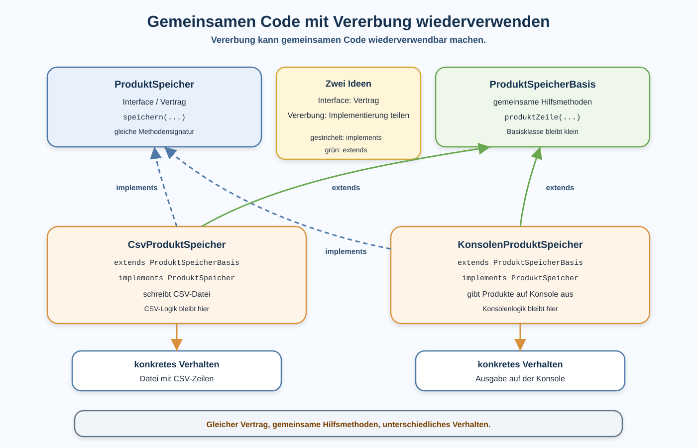

# Arbeitsblatt – Gemeinsamen Code mit Vererbung wiederverwenden

## Lernziele

- Vererbung aus einem konkreten Code-Duplikat heraus motivieren
- `extends` als Java-Schlüsselwort für Vererbung verwenden
- eine kleine Basisklasse `ProduktSpeicherBasis` erstellen
- gemeinsame Hilfsmethoden aus `CsvProduktSpeicher` und `KonsolenProduktSpeicher` auslagern
- erklären, warum eine Basisklasse klein und klar bleiben soll
- Interface und Vererbung unterscheiden:
  - Interface beschreibt einen Vertrag
  - Vererbung teilt gemeinsame Implementierung
- prüfen, ob das Verhalten nach dem Refactoring gleich geblieben ist

---

## Ausgangslage

Die Produktverwaltung kennt bereits ein Interface und zwei konkrete Speicherklassen:

```java
public interface ProduktSpeicher {
    void speichern(ArrayList<Produkt> produkte, String dateipfad);
}
```

Für vollständigen Java-Code brauchst du passende Imports für `ArrayList` und `Produkt`.

```java
public class CsvProduktSpeicher implements ProduktSpeicher {
    @Override
    public void speichern(ArrayList<Produkt> produkte, String dateipfad) {
        ArrayList<String> zeilen = new ArrayList<>();

        for (Produkt produkt : produkte) {
            zeilen.add(produkt.getName() + ";" + produkt.getPreis());
        }

        // Datei schreiben
    }
}
```

```java
public class KonsolenProduktSpeicher implements ProduktSpeicher {
    @Override
    public void speichern(ArrayList<Produkt> produkte, String dateipfad) {
        for (Produkt produkt : produkte) {
            System.out.println(produkt.getName() + ": " + produkt.getPreis());
        }
    }
}
```

Beide Klassen erfüllen denselben Vertrag. Beide enthalten aber auch ähnliche Hilfslogik:

- Name eines Produkts lesen
- Preis eines Produkts lesen
- Produkt als Text zusammensetzen

Die Unterschiede bleiben wichtig:

| Klasse | Spezifisches Verhalten |
|---|---|
| `CsvProduktSpeicher` | schreibt CSV-Zeilen mit `;` |
| `KonsolenProduktSpeicher` | schreibt lesbare Zeilen auf die Konsole |



---

## Problem: Gemeinsamer Code ist doppelt vorhanden

Wenn beide Klassen denselben Grundaufbau aus Name, Trennzeichen und Preis brauchen, entsteht leicht kopierter Code:

```java
produkt.getName() + trennzeichen + produkt.getPreis()
```

Wenn sich diese Grundformatierung später ändert, muss jede Kopie angepasst werden. Eine Stelle wird dabei schnell vergessen.

Merksatz:

```text
Vererbung ist kein Selbstzweck.
Sie kann helfen, wenn wirklich gemeinsamer Code wiederverwendet werden soll.
```

---

## Theorie: `extends`

Mit `extends` kann eine Klasse Code aus einer anderen Klasse übernehmen.

```java
public class CsvProduktSpeicher extends ProduktSpeicherBasis implements ProduktSpeicher {
    // CSV-spezifische Speicherlogik
}
```

Das bedeutet hier:

```text
CsvProduktSpeicher bleibt ein ProduktSpeicher.
CsvProduktSpeicher kann zusätzlich Hilfsmethoden aus ProduktSpeicherBasis verwenden.
```

Dasselbe gilt für die Konsolenklasse:

```java
public class KonsolenProduktSpeicher extends ProduktSpeicherBasis implements ProduktSpeicher {
    // Konsolen-spezifische Speicherlogik
}
```

Wichtig:

```text
implements erfüllt einen Vertrag.
extends übernimmt gemeinsame Implementierung.
```

---

## Kleine Basisklasse

Eine Basisklasse soll nur Code enthalten, der wirklich gemeinsam ist.

```java
public class ProduktSpeicherBasis {
    protected String produktZeile(Produkt produkt, String trennzeichen) {
        return produkt.getName() + trennzeichen + produkt.getPreis();
    }
}
```

`protected` bedeutet in dieser Einheit vereinfacht:

```text
Die Methode ist für die Basisklasse und ihre Unterklassen gedacht.
Sie ist nicht Teil des öffentlichen Interface-Vertrags.
```

Die Methode ist klein. Sie kennt keine Datei und keine Konsole. Sie setzt nur einen Produkttext zusammen.

---

## Beispiel: CSV-Klasse nach dem Umbau

```java
public class CsvProduktSpeicher extends ProduktSpeicherBasis implements ProduktSpeicher {
    @Override
    public void speichern(ArrayList<Produkt> produkte, String dateipfad) {
        ArrayList<String> zeilen = new ArrayList<>();

        for (Produkt produkt : produkte) {
            zeilen.add(produktZeile(produkt, ";"));
        }

        // Datei schreiben
    }
}
```

Die CSV-Klasse entscheidet weiterhin selbst, dass sie `;` verwendet und in eine Datei schreibt.

---

## Beispiel: Konsolenklasse nach dem Umbau

```java
public class KonsolenProduktSpeicher extends ProduktSpeicherBasis implements ProduktSpeicher {
    @Override
    public void speichern(ArrayList<Produkt> produkte, String dateipfad) {
        for (Produkt produkt : produkte) {
            System.out.println(produktZeile(produkt, ": "));
        }
    }
}
```

Die Konsolenklasse entscheidet weiterhin selbst, dass sie auf die Konsole schreibt.

---

## Interface und Basisklasse vergleichen

| Element | Aufgabe |
|---|---|
| `ProduktSpeicher` | beschreibt den Vertrag `speichern(...)` |
| `ProduktSpeicherBasis` | enthält gemeinsame Hilfsmethoden |
| `CsvProduktSpeicher` | speichert Produkte als CSV-Datei |
| `KonsolenProduktSpeicher` | gibt Produkte auf der Konsole aus |

Das Interface ist weiterhin wichtig:

```java
ProduktSpeicher speicher = new CsvProduktSpeicher();
```

Die Basisklasse löst ein anderes Problem:

```text
Gemeinsamer Hilfscode soll nicht in mehreren Klassen kopiert werden.
```

---

## Was gehört nicht in die Basisklasse?

Nicht alles, was ähnlich aussieht, gehört in `ProduktSpeicherBasis`.

Nicht geeignet:

```java
public void speichern(ArrayList<Produkt> produkte, String ziel) {
    // versucht CSV-Datei und Konsole gleichzeitig zu behandeln
}
```

Warum nicht?

- CSV-Datei und Konsole sind unterschiedliche Ziele.
- Die Methode müsste zu viele Fallunterscheidungen kennen.
- Die konkreten Klassen würden ihre klare Verantwortung verlieren.

Geeignet sind kleine gemeinsame Hilfsmethoden, zum Beispiel:

- Produkttext zusammensetzen
- Anzahl Produkte für eine Meldung vorbereiten, falls beide Klassen dieselbe Meldung brauchen
- einfache Prüfung auf leere Liste, falls beide Klassen sie gleich behandeln

---

## Verhalten nach dem Umbau prüfen

Vererbung wird hier als Refactoring eingesetzt.

Das Ziel ist:

```text
Die Struktur wird verbessert.
Das gewünschte Verhalten bleibt gleich.
```

Prüfe deshalb nach kleinen Schritten:

```bash
mvn test
```

Wenn keine Tests vorhanden sind:

```bash
mvn package
```

Wenn dein Projekt eine passende `Main`-Klasse hat, kannst du das Verhalten zusätzlich ausführen und vergleichen.

---

## Typische Fehlerbilder

| Fehlerbild | Warum es problematisch ist |
|---|---|
| zu viel Code wird in die Basisklasse verschoben | die Basisklasse wird unklar und schwer wartbar |
| Unterschiede zwischen Klassen werden ignoriert | CSV-Datei und Konsole haben unterschiedliche Aufgaben |
| Interface und Basisklasse werden verwechselt | Vertrag und gemeinsame Implementierung lösen verschiedene Probleme |
| Vererbung wird nur verwendet, weil es technisch möglich ist | die Struktur wird komplizierter ohne Nutzen |
| Verhalten ändert sich beim Refactoring | Wiederverwendung darf keine versteckte Funktionsänderung sein |
| Tests oder Prüfungen werden vergessen | Fehler fallen erst später auf |
| Basisklasse heisst zu allgemein, zum Beispiel `Basis` | der Name erklärt die Verantwortung nicht |

---

## Nicht Ziel dieser Einheit

Bewusst nicht behandelt werden:

- abstrakte Klassen vertiefen
- tiefe Vererbungshierarchien
- komplexe Konstruktorverkettung mit `super(...)`
- `instanceof`
- Downcasting
- Template Method
- Spring
- Dependency Injection

Diese Einheit bleibt bei einer kleinen Basisklasse und einfachen Hilfsmethoden.

---

## Reflexion

Beantworte am Ende schriftlich:

1. Welcher Code war wirklich gemeinsam?
2. Was sollte bewusst in der konkreten Klasse bleiben?
3. Warum ist Vererbung nicht immer die richtige Lösung?
4. Was ist der Unterschied zwischen Interface und Vererbung?
5. Wie helfen Tests beim Umbau?

---

## Ausblick: Grenzen von Vererbung

Vererbung kann gemeinsamen Code wiederverwendbar machen. Sie koppelt Klassen aber auch enger zusammen.

Wenn die Basisklasse wächst, können Änderungen daran plötzlich mehrere Unterklassen beeinflussen. Darum sollte eine Basisklasse klein, klar benannt und fachlich begründet sein.

Manchmal ist eine einfache Hilfsklasse besser:

```java
public class ProduktFormatierer {
    public String produktZeile(Produkt produkt, String trennzeichen) {
        return produkt.getName() + trennzeichen + produkt.getPreis();
    }
}
```

Diese Alternative kann sinnvoll sein, wenn Klassen nur eine Hilfsfunktion gemeinsam nutzen, aber fachlich nicht wirklich eine gemeinsame Basisklasse brauchen.

Merksatz:

```text
Interface: gleicher Vertrag.
Vererbung: gemeinsame Implementierung.
Hilfsklasse: gemeinsamer Dienst ohne Vererbungsbeziehung.
```
